# Change-File-Driven Spec Implementation Plan

> **For agentic workers:** REQUIRED SUB-SKILL: Use `java-tdd` to implement this plan (TDD workflow with JaCoCo coverage analysis and integration test scaffolding). For this plan specifically — it is a skill/shell rewrite, not Java code — execute tasks inline and verify each task manually against the spec before committing.

**Goal:** Replace the `.jkit/spec-sync` SHA tracking + human-edited formal docs pattern with a `docs/changes/pending/` change-file pattern, where humans write short intent descriptions and the AI maintains the formal docs.

**Architecture:** Two files change: `hooks/post-commit-sync.sh` (rewritten to move change files instead of writing a SHA) and `skills/spec-delta/SKILL.md` (rewritten to read change files, update formal docs, then diff for schema analysis). All other skills are unaffected.

**Tech Stack:** Bash (hook), Markdown (skill). No Java, no Maven, no jkit CLI involved.

**Spec:** `docs/superpowers/specs/2026-04-24-change-file-driven-spec-design.md`

**Note on path convention:** The current implementation uses `.jkit/` (a hidden directory at the project root) for run directories and the spec-sync file. The design spec draft used `docs/jkit/` but the live skill uses `.jkit/`. This plan follows the live skill — all run directories are `.jkit/YYYY-MM-DD-<feature>/`.

---

### Task 1: Rewrite post-commit-sync.sh

**Files:**
- Modify: `hooks/post-commit-sync.sh`

The new script finds the most recent `.jkit/YYYY-MM-DD-*/` run directory, reads `.change-files` from it, moves each listed file from `docs/changes/pending/` to `docs/changes/done/`, stages the moves, and amends the implementation commit.

- [ ] **Step 1: Read current script**

Read `hooks/post-commit-sync.sh` to confirm current content before overwriting.

- [ ] **Step 2: Write new post-commit-sync.sh**

Replace the entire file with:

```bash
#!/usr/bin/env bash
set -euo pipefail

MSG=$(git log -1 --pretty=%s)

if echo "$MSG" | grep -qE '^(feat|fix|chore)\(impl\):'; then
  # Find the most recent run directory under .jkit/
  RUN_DIR=$(ls -dt .jkit/????-??-??-*/ 2>/dev/null | head -1)

  if [ -z "$RUN_DIR" ]; then
    echo "jkit: no run directory found under .jkit/ — skipping change-file move" >&2
    exit 0
  fi

  CHANGE_FILES="${RUN_DIR}.change-files"

  if [ ! -f "$CHANGE_FILES" ]; then
    echo "jkit: no .change-files in ${RUN_DIR} — skipping" >&2
    exit 0
  fi

  mkdir -p docs/changes/done

  STAGED=0
  while IFS= read -r fname; do
    [ -z "$fname" ] && continue
    src="docs/changes/pending/${fname}"
    dst="docs/changes/done/${fname}"
    if [ -f "$src" ]; then
      mv "$src" "$dst"
      STAGED=1
    fi
  done < "$CHANGE_FILES"

  if [ "$STAGED" -eq 1 ]; then
    git add docs/changes/
    if ! git diff --cached --quiet; then
      git commit --amend --no-edit || {
        echo "ERROR: Failed to amend commit." >&2
        echo "Recover: run 'git commit --amend --no-edit' or 'git reset HEAD docs/changes/'" >&2
        exit 1
      }
    fi
  fi
fi
```

- [ ] **Step 3: Verify script manually**

Run a dry-run simulation:

```bash
# Setup fixtures
mkdir -p /tmp/jkit-test/.jkit/2026-04-24-test-run
echo "2026-04-24-test-feature.md" > /tmp/jkit-test/.jkit/2026-04-24-test-run/.change-files
mkdir -p /tmp/jkit-test/docs/changes/pending /tmp/jkit-test/docs/changes/done
echo "test content" > /tmp/jkit-test/docs/changes/pending/2026-04-24-test-feature.md

# Run the core logic in isolation (without git amend)
cd /tmp/jkit-test
RUN_DIR=$(ls -dt .jkit/????-??-??-*/ 2>/dev/null | head -1)
echo "RUN_DIR: $RUN_DIR"                          # expect: .jkit/2026-04-24-test-run/
CHANGE_FILES="${RUN_DIR}.change-files"
while IFS= read -r fname; do
  [ -z "$fname" ] && continue
  src="docs/changes/pending/${fname}"
  dst="docs/changes/done/${fname}"
  [ -f "$src" ] && mv "$src" "$dst" && echo "moved: $fname"
done < "$CHANGE_FILES"
ls docs/changes/pending/    # expect: empty
ls docs/changes/done/       # expect: 2026-04-24-test-feature.md

# Cleanup
rm -rf /tmp/jkit-test
```

Expected output:
```
RUN_DIR: .jkit/2026-04-24-test-run/
moved: 2026-04-24-test-feature.md
(empty)
2026-04-24-test-feature.md
```

- [ ] **Step 4: Commit**

```bash
git add hooks/post-commit-sync.sh
git commit -m "feat: rewrite post-commit-sync to move change files instead of writing SHA"
```

---

### Task 2: Rewrite skills/spec-delta/SKILL.md — frontmatter, checklist, process flow

**Files:**
- Modify: `skills/spec-delta/SKILL.md`

Replace the entire file in two tasks (this task: frontmatter + checklist + dot diagram; next task: detailed flow + project structure reference).

- [ ] **Step 1: Write new SKILL.md (frontmatter, checklist, dot diagram)**

Overwrite `skills/spec-delta/SKILL.md` with the following content. The detailed flow section (`## Detailed Flow`) will be completed in Task 3 — write a placeholder line for now so the file is valid:

```markdown
---
name: spec-delta
description: Use when there are pending change files in docs/changes/pending/ that need to be implemented, or when the human asks to process pending spec changes or start the implementation pipeline.
---

**Announcement:** At start: *"I'm using the spec-delta skill to process pending change files and drive the implementation pipeline."*

## Checklist

- [ ] Sync with remote
- [ ] Scan docs/changes/pending/
- [ ] Handle legacy .jkit/spec-sync (if present)
- [ ] Confirm scope of pending changes
- [ ] Read change files
- [ ] Infer affected domains
- [ ] Ask clarification questions
- [ ] Update formal docs per domain
- [ ] Get formal doc approval per domain
- [ ] Schema analysis (git diff docs/domains/*/)
- [ ] Invoke scenario-gap per changed domain
- [ ] Create run directory + write .change-files
- [ ] Write change-summary.md
- [ ] Get change-summary approval
- [ ] (if schema changes) Invoke sql-migration
- [ ] Invoke writing-plans
- [ ] Get plan approval
- [ ] Invoke java-tdd

## Process Flow

```dot
digraph spec_delta {
    "Sync with remote" [shape=box];
    "Scan docs/changes/pending/" [shape=box];
    "pending/ empty?" [shape=diamond];
    "Stop: no pending changes" [shape=doublecircle];
    "Legacy .jkit/spec-sync exists?" [shape=diamond];
    "Offer migration" [shape=box];
    "Confirm scope (all or pick one)" [shape=box];
    "Read change files" [shape=box];
    "Infer affected domains" [shape=box];
    "Ask clarification questions" [shape=box];
    "Update formal docs per domain" [shape=box];
    "HARD-GATE: formal doc approval" [shape=box style=filled fillcolor=lightyellow];
    "git diff docs/domains/*/ → schema analysis" [shape=box];
    "REQUIRED SUB-SKILL: scenario-gap\n(per domain with test-scenarios.md)" [shape=doublecircle];
    "Create run directory + write .change-files" [shape=box];
    "Write change-summary.md" [shape=box];
    "HARD-GATE: change-summary approval" [shape=box style=filled fillcolor=lightyellow];
    "Schema changes?" [shape=diamond];
    "REQUIRED SUB-SKILL: sql-migration" [shape=doublecircle];
    "REQUIRED SUB-SKILL: writing-plans" [shape=doublecircle];
    "HARD-GATE: plan approval" [shape=box style=filled fillcolor=lightyellow];
    "Invoke java-tdd" [shape=doublecircle];

    "Sync with remote" -> "Scan docs/changes/pending/";
    "Scan docs/changes/pending/" -> "pending/ empty?" ;
    "pending/ empty?" -> "Stop: no pending changes" [label="yes"];
    "pending/ empty?" -> "Legacy .jkit/spec-sync exists?" [label="no"];
    "Legacy .jkit/spec-sync exists?" -> "Offer migration" [label="yes"];
    "Legacy .jkit/spec-sync exists?" -> "Confirm scope (all or pick one)" [label="no"];
    "Offer migration" -> "Confirm scope (all or pick one)";
    "Confirm scope (all or pick one)" -> "Read change files";
    "Read change files" -> "Infer affected domains";
    "Infer affected domains" -> "Ask clarification questions";
    "Ask clarification questions" -> "Update formal docs per domain";
    "Update formal docs per domain" -> "HARD-GATE: formal doc approval";
    "HARD-GATE: formal doc approval" -> "Update formal docs per domain" [label="edit requested"];
    "HARD-GATE: formal doc approval" -> "git diff docs/domains/*/ → schema analysis" [label="approved"];
    "git diff docs/domains/*/ → schema analysis" -> "REQUIRED SUB-SKILL: scenario-gap\n(per domain with test-scenarios.md)";
    "REQUIRED SUB-SKILL: scenario-gap\n(per domain with test-scenarios.md)" -> "Create run directory + write .change-files";
    "Create run directory + write .change-files" -> "Write change-summary.md";
    "Write change-summary.md" -> "HARD-GATE: change-summary approval";
    "HARD-GATE: change-summary approval" -> "Write change-summary.md" [label="edit requested"];
    "HARD-GATE: change-summary approval" -> "Schema changes?" [label="approved"];
    "Schema changes?" -> "REQUIRED SUB-SKILL: sql-migration" [label="yes"];
    "Schema changes?" -> "REQUIRED SUB-SKILL: writing-plans" [label="no"];
    "REQUIRED SUB-SKILL: sql-migration" -> "REQUIRED SUB-SKILL: writing-plans";
    "REQUIRED SUB-SKILL: writing-plans" -> "HARD-GATE: plan approval";
    "HARD-GATE: plan approval" -> "Invoke java-tdd" [label="approved"];
    "HARD-GATE: plan approval" -> "REQUIRED SUB-SKILL: writing-plans" [label="edit requested"];
}
```



## Detailed Flow

*(completed in Task 3)*

## Standard Project Structure (reference)

*(completed in Task 3)*
```

- [ ] **Step 2: Verify the file was written correctly**

```bash
head -60 skills/spec-delta/SKILL.md
```

Confirm: frontmatter has new description, checklist has 18 items starting with "Scan docs/changes/pending/", dot diagram is present.

- [ ] **Step 3: Commit checkpoint**

```bash
git add skills/spec-delta/SKILL.md
git commit -m "feat: rewrite spec-delta — frontmatter, checklist, process flow (detailed flow pending)"
```

---

### Task 3: Write spec-delta/SKILL.md — Detailed Flow

**Files:**
- Modify: `skills/spec-delta/SKILL.md` (replace placeholder `## Detailed Flow` and `## Standard Project Structure` sections)

- [ ] **Step 1: Append detailed flow to SKILL.md**

Replace the `## Detailed Flow` and `## Standard Project Structure (reference)` placeholder lines with the full content below. Use the Edit tool — match the exact placeholder text from Task 2.

Replace:
```
## Detailed Flow

*(completed in Task 3)*

## Standard Project Structure (reference)

*(completed in Task 3)*
```

With:

````markdown
## Detailed Flow

**Step 1: Sync with remote**

```bash
git fetch
git rev-list HEAD..@{u} --count
```

- Remote not ahead → continue
- Remote ahead, working tree clean → `git pull --ff-only`
- Remote ahead, working tree dirty → ask:
  > "Remote has new commits but you have local changes. How do you want to proceed?
  > A) Stash, pull, unstash (recommended)
  > B) Continue without pulling
  > C) Abort"

**Step 2: Scan docs/changes/pending/**

```bash
ls docs/changes/pending/*.md 2>/dev/null
```

- No files → stop: *"No pending changes in docs/changes/pending/."*
- Files found → continue to Step 3.

**Step 2a: Handle legacy .jkit/spec-sync**

If `.jkit/spec-sync` exists AND `docs/changes/` does not exist:

> "Found legacy `.jkit/spec-sync`. Migrating to change-file tracking.
> A) Migrate now — create docs/changes/pending/ and docs/changes/done/, archive .jkit/spec-sync (recommended)
> B) Keep using .jkit/spec-sync — skip migration (not recommended)"

On A: `mkdir -p docs/changes/pending docs/changes/done && mv .jkit/spec-sync .jkit/spec-sync.bak`

On B: continue with legacy flow (read SHA from `.jkit/spec-sync`, run `git diff` against `docs/domains/*/` — same as the old spec-delta behavior).

**Step 2b: Resume detection**

If a run directory already exists under `.jkit/` (interrupted previous run):

> "Found existing run `.jkit/YYYY-MM-DD-<feature>`. Resume from where it stopped?
> A) Resume (recommended)
> B) Start a fresh run (deletes the existing run directory)"

On resume: read existing artifacts, continue from first incomplete step (check which of `change-summary.md`, `plan.md` already exist).
On fresh: `rm -rf .jkit/YYYY-MM-DD-<feature>/`, then continue from Step 3.

**Step 3: Confirm scope of pending changes**

List the files found in `docs/changes/pending/`. If more than one:

> "Found N pending changes:
> - 2026-04-24-bulk-invoice.md
> - 2026-04-23-payment-refund.md
>
> A) Implement all together (recommended)
> B) Pick one to implement now"

On B: show numbered list, ask which one.

**Step 4: Read change files**

Read the full content of each selected change file. No diffing required.

**Step 5: Infer affected domains**

Check frontmatter `domain:` field in each change file. If present, use it directly.

If absent, infer the domain from the description text — look for explicit domain names, entity names, or endpoint paths that match existing `docs/domains/<name>/` directories.

If ambiguous:
> "Which domain does this change belong to?
> A) billing
> B) payment
> C) Other — I'll describe it"

**Step 6: Ask clarification questions**

One at a time. Only for genuine ambiguities in the change description. Each question:
- 2–3 labeled options (A, B, C)
- One marked `(recommended)`

Examples of genuine ambiguities: transactional vs. best-effort semantics, sync vs. async behavior, whether a new entity needs its own table or extends an existing one.

**Step 7: Update formal docs per domain**

For each affected domain, update the three spec files to reflect the change description and clarification answers:

1. `docs/domains/<domain>/domain-model.md` — add new entities, fields, or relationships
2. `docs/domains/<domain>/api-implement-logic.md` — add new service methods, business rules
3. `docs/domains/<domain>/api-spec.yaml` — add new endpoints, request/response schemas

Update in that order (model → logic → spec) so each file can reference the previous.

After updating all three files for a domain, tell the human:

> "Updated docs/domains/billing/ (domain-model.md, api-implement-logic.md, api-spec.yaml)
> A) Looks good (recommended)
> B) Edit — tell me what to change"

Repeat on B. Repeat this review loop for each domain before moving to the next.

<HARD-GATE>
Do NOT proceed to schema analysis until the human has approved the formal doc updates for all affected domains.
</HARD-GATE>

**Step 8: Schema analysis**

After formal docs are approved, run:

```bash
git diff -- docs/domains/*/
```

This produces a precise diff of only what was just updated in Step 7. Read this diff and reason about whether it implies database schema changes — new tables, new or renamed columns, FK changes, new indexes, dropped columns. Use domain understanding, not keyword scanning.

**Step 9: Scenario gap detection**

For each changed domain that has `docs/domains/<domain>/test-scenarios.md`:

**REQUIRED SUB-SKILL: invoke `scenario-gap`**, passing the domain name. Collect all gaps across domains — written into change-summary.md in Step 11.

**Step 10: Create run directory + write .change-files**

```bash
mkdir -p .jkit/YYYY-MM-DD-<feature>/
```

`<feature>` = short slug from the most significant change (e.g., `billing-bulk-invoice`).

Write `.jkit/YYYY-MM-DD-<feature>/.change-files` — one basename per line for each change file processed in this run:

```
2026-04-24-bulk-invoice.md
```

**Step 11: Write change-summary.md**

Write `.jkit/<run>/change-summary.md`:

```markdown
# Change Summary: <feature>

**Date:** YYYY-MM-DD
**Change files:** 2026-04-24-bulk-invoice.md

## Domains Changed

| Domain | Added | Modified | Removed |
|--------|-------|----------|---------|
| billing | BulkInvoice entity, POST /invoices/bulk | Invoice.status enum | — |

## Schema Change Required
Yes / No
[If yes: brief description of implied changes]

## Cross-Domain Effects
None / [description]

## Implementation Order
1. billing/domain-model (BulkInvoice entity)
2. billing/api-implement-logic (BulkInvoiceService)
3. billing/api-spec (POST /invoices/bulk)

## Test Scenario Gaps

| Domain | Endpoint | Scenario |
|--------|----------|---------|
| billing | POST /invoices/bulk | happy-path: valid list of 3 → 201 |
| billing | POST /invoices/bulk | validation-empty-list: empty list → 400 |

(Omit Test Scenario Gaps section if no changed domain has test-scenarios.md)
```

Tell human: `"Written to .jkit/<run>/change-summary.md"`

```
A) Looks good (recommended)
B) Edit — tell me what to change
```

<HARD-GATE>
Do NOT invoke writing-plans or sql-migration until the human approves change-summary.md.
</HARD-GATE>

**Step 12: SQL migration handoff (if schema changes flagged)**

**REQUIRED SUB-SKILL: invoke `sql-migration`**, passing:
- The run directory path: `.jkit/<run>/`
- The inferred schema changes from Step 8

Return here after sql-migration completes.

**Step 13: Invoke writing-plans**

**REQUIRED SUB-SKILL: invoke `superpowers:writing-plans`** with:
- Full content of all selected change files
- Contents of `docs/overview.md` (if present)
- All clarification answers from Step 6
- The approved formal doc updates

When running writing-plans, apply these adjustments:
1. **Plan location:** save to `.jkit/<run>/plan.md` (not the superpowers default)
2. **Plan header note:** replace the agentic-worker note with:
   > `For agentic workers: REQUIRED SUB-SKILL: Use java-tdd to implement this plan (TDD workflow with JaCoCo coverage analysis and integration test scaffolding).`

**Step 14: Plan approval and handoff**

Tell human: `"Plan written to .jkit/<run>/plan.md"`

```
A) Looks good (recommended)
B) Edit — tell me what to change
```

<HARD-GATE>
Do NOT invoke java-tdd until the human approves plan.md.
</HARD-GATE>

On approval: **REQUIRED SUB-SKILL: invoke `java-tdd`** — java-tdd will ask execution mode (Subagent-Driven or Inline).

## Standard Project Structure (reference)

spec-delta watches `docs/changes/pending/` for input and updates `docs/domains/*/` as output:

```
.jkit/
  YYYY-MM-DD-<feature>/             ← one directory per spec-delta run
    .change-files                   ← basenames of change files processed in this run
    change-summary.md
    plan.md
    migration-preview.md            ← written by sql-migration skill (if triggered)
    migration/                      ← SQL files written by sql-migration skill (if triggered)
docs/
  overview.md                       ← ≤1 page, what this service does
  changes/
    pending/                        ← human-written change description files (unimplemented)
    done/                           ← implemented change files (moved by post-commit hook)
  domains/
    billing/
      api-spec.yaml                 ← OpenAPI v3 (AI-maintained)
      api-implement-logic.md        ← (AI-maintained)
      domain-model.md               ← (AI-maintained)
      test-scenarios.md             ← scenario gap source (human-maintained)
    payment/
      ...
```
````

- [ ] **Step 2: Verify the complete file**

```bash
wc -l skills/spec-delta/SKILL.md
grep -n "HARD-GATE\|REQUIRED SUB-SKILL\|Step [0-9]" skills/spec-delta/SKILL.md
```

Expected: file has 180+ lines; 4 HARD-GATEs visible (formal doc approval, change-summary approval, plan approval — one in process flow is a node label); REQUIRED SUB-SKILL appears for scenario-gap, sql-migration, writing-plans, java-tdd; Steps 1–14 are all present.

- [ ] **Step 3: Cross-check against spec**

Read `docs/superpowers/specs/2026-04-24-change-file-driven-spec-design.md` and verify:
- Checklist has all 18 items ✓
- Step 7 (update formal docs) has HARD-GATE before schema analysis ✓
- Step 8 uses `git diff -- docs/domains/*/` not full doc read ✓
- Step 10 writes `.change-files` to run directory ✓
- Legacy `.jkit/spec-sync` migration is handled in Step 2a ✓
- Standard project structure shows `docs/changes/pending/` and `docs/changes/done/` ✓
- No reference to `.jkit/spec-sync` as an active tracking mechanism ✓

- [ ] **Step 4: Commit**

```bash
git add skills/spec-delta/SKILL.md
git commit -m "feat: rewrite spec-delta detailed flow — change-file driven, AI-maintained formal docs"
```

---

### Task 4: Create docs/changes/ directory structure

**Files:**
- Create: `docs/changes/pending/.gitkeep`
- Create: `docs/changes/done/.gitkeep`

The `docs/changes/` directory structure needs to exist in the plugin repo so it is created when teams install or clone the plugin. `.gitkeep` files make git track the empty directories.

- [ ] **Step 1: Create the directories and gitkeep files**

```bash
mkdir -p docs/changes/pending docs/changes/done
touch docs/changes/pending/.gitkeep
touch docs/changes/done/.gitkeep
```

- [ ] **Step 2: Verify**

```bash
ls docs/changes/pending/ docs/changes/done/
```

Expected: both show `.gitkeep`.

- [ ] **Step 3: Commit**

```bash
git add docs/changes/
git commit -m "chore: add docs/changes/pending and docs/changes/done directory structure"
```

---

### Task 5: End-to-end smoke test

Manually simulate the full new workflow to confirm all pieces fit together.

- [ ] **Step 1: Create a sample change file**

```bash
mkdir -p docs/changes/pending
cat > docs/changes/pending/2026-04-24-smoke-test.md << 'EOF'
# Smoke test change

Add a GET /health endpoint to the billing domain.
Returns {"status": "ok"}.
EOF
```

- [ ] **Step 2: Verify post-commit-sync.sh finds it correctly**

Simulate the hook's lookup logic:

```bash
mkdir -p .jkit/2026-04-24-smoke-test
echo "2026-04-24-smoke-test.md" > .jkit/2026-04-24-smoke-test/.change-files

# Run lookup
RUN_DIR=$(ls -dt .jkit/????-??-??-*/ 2>/dev/null | head -1)
echo "Found run dir: $RUN_DIR"                   # expect: .jkit/2026-04-24-smoke-test/
cat "${RUN_DIR}.change-files"                    # expect: 2026-04-24-smoke-test.md
```

- [ ] **Step 3: Verify spec-delta checklist matches process flow**

```bash
grep "^\- \[ \]" skills/spec-delta/SKILL.md
```

Count the checklist items — should be exactly 18. Confirm the order matches the dot diagram nodes visually.

- [ ] **Step 4: Clean up smoke test fixtures**

```bash
rm -rf .jkit/2026-04-24-smoke-test
rm docs/changes/pending/2026-04-24-smoke-test.md
```

- [ ] **Step 5: Final commit**

```bash
git status
# Should be clean after cleanup — no commit needed unless state leaked
```

---

## Self-Review Checklist

- **Spec coverage:** post-commit-sync.sh ✓ | spec-delta frontmatter/checklist/dot ✓ | spec-delta detailed flow ✓ | docs/changes/ directory ✓ | legacy migration path ✓ | HARD-GATEs ✓ | `.change-files` file format ✓ | `git diff docs/domains/*/` for schema analysis ✓
- **No placeholders:** all steps show exact commands and exact file content
- **Type consistency:** `.change-files` is consistently one basename per line across task 1 (script reads it), task 2 (dot diagram), task 3 (Step 10 writes it)
- **Path consistency:** `.jkit/` used throughout (not `docs/jkit/`) — matches live skill convention
