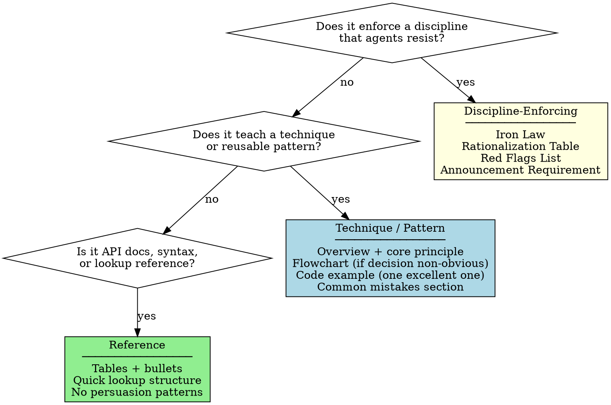
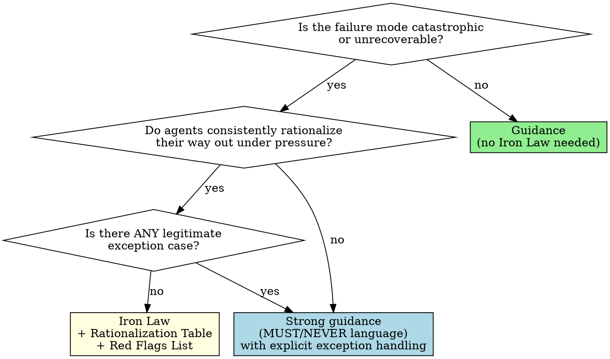

# Superpowers Philosophy

## Overview

Superpowers is a **behavior-shaping system**, not a documentation library. Its skills are code that executes in an agent's reasoning process. Its hooks bootstrap the system at session start. Its workflow is mandatory, not advisory.

This document captures the design logic behind every decision in superpowers so you can make the same decisions when building a new plugin.

**Core values:**
- **Workflow over improvisation** — Mandatory pipelines beat menus of suggestions.
- **Evidence over claims** — Prove it before you say it.
- **Rationalization prevention** — Close every loophole before agents find it.
- **Simplicity as discipline** — YAGNI and DRY are non-negotiable defaults.

---

## Core Principles

### 1. Workflow Enforcement

Skills form a mandatory pipeline. Each skill has exactly three things: a **trigger** (the description field), a **process** (the skill body), and a **handoff** (`REQUIRED SUB-SKILL` pointing to the next skill).

The superpowers pipeline:
```
brainstorming
  → using-git-worktrees
    → writing-plans
      → subagent-driven-development
          ↳ test-driven-development (per task)
          ↳ requesting-code-review (per task)
      → finishing-a-development-branch
```

Each skill assumes the prior one ran. None are optional. Design your plugin's skills the same way: **identify the full pipeline first**, then write each skill as one step in it. A skill that could be bypassed will be bypassed.

### 2. Evidence Over Claims

Three rules, no exceptions:
- **No production code without a failing test first** (TDD)
- **No fix proposals without root cause investigation first** (systematic-debugging)
- **No completion claims without running the verification command first** (verification-before-completion)

The common thread: action must be grounded in observed evidence, not confident assertion. Design discipline-enforcing skills so that the evidence requirement comes **before** the action, not after.

### 3. Rationalization Prevention

Agents are intelligent. They will find the shortest path to the answer the user wants — including rationalizing away from discipline when under pressure, when time is short, or when the task seems simple. Every discipline-enforcing skill MUST anticipate the specific excuses agents make and counter them explicitly.

The counter-measures are: **Iron Laws**, **Rationalization Tables**, **Red Flags Lists**. These are not decoration. They are the mechanism that makes discipline hold under pressure.

> **Key insight from testing:** Skills without explicit rationalization counters are violated within 3 pressure scenarios. Always baseline-test without the skill first, document the exact rationalizations, then address them in the skill body.

### 4. Context Isolation

Subagents NEVER inherit session context. The controller agent constructs exactly what each subagent needs: the task text, the relevant plan section, the file paths, and nothing else. This has two benefits:
- Subagents stay focused and don't get confused by unrelated history
- The controller's own context is preserved for coordination work

Design skills that dispatch subagents to specify this explicitly: what context to include, what to exclude, and what questions to surface before starting work.

### 5. Radical Simplicity (YAGNI/DRY)

Every skill enforces minimalism:
- Plans are bite-sized (2–5 minute tasks)
- Implementation is the minimum code to pass the test
- Skills are concise: getting-started workflows target <150 words; frequently-loaded skills target <200 words total
- No speculative abstractions, no optional features, no "while I'm here" improvements

Design your skills to enforce the same discipline. When a skill tells an agent what to build, it should also tell them what **not** to build.

### 6. Skills as Behavior Code

A skill is not documentation. It is code that executes in the agent's reasoning process. The same principles that apply to writing reliable code apply here:

- **Test before shipping** — Run pressure scenarios without the skill (RED), write the skill (GREEN), close loopholes (REFACTOR)
- **Minimal interface** — The description field is the API surface; make it precise and unambiguous
- **Separation of concerns** — One skill per job; chain skills via `REQUIRED SUB-SKILL`
- **Fail loudly** — Iron Laws make violations obvious, not silent

### 7. TDD as Meta-Pattern

RED-GREEN-REFACTOR is not just for code. Superpowers applies it to:
- **Skill creation**: baseline scenario without skill (RED) → write skill (GREEN) → close loopholes (REFACTOR)
- **Planning**: write spec → get approval → write plan → get approval → implement
- **Debugging**: find root cause → form single hypothesis → test minimally → verify fix

When designing a new plugin, ask: "What does it look like for this discipline to fail? How do I make the failure visible before writing the skill?"

### 8. The Human Partner Relationship

The agent's job is to protect the human from bad outcomes — including from their own impulses. This means:
- Pushing back on technically wrong review feedback with evidence
- Applying YAGNI when reviewers suggest unnecessary features
- Refusing to submit low-quality work even when instructed to hurry
- Confirming before destructive actions
- Investigating before deleting unexpected files or state

Design skills to reinforce this framing. The agent is a **colleague with professional standards**, not a tool that executes instructions blindly. The phrase "your human partner" (used throughout superpowers) is deliberate — it is not interchangeable with "the user."

---

## Pattern Catalog

### Pattern 1: Iron Law

**What it is:** An absolute, unconditional requirement. Format: `NO [ACTION] WITHOUT [PRECONDITION] FIRST`, followed by explicit "no exceptions" language.

**When to use:** When the failure mode is catastrophic or unrecoverable. Code written before tests cannot be trusted. Fixes applied before root cause investigation create new bugs.

**When NOT to use:** Guidance that admits legitimate exceptions. Reserve Iron Laws for the handful of things that are *always* wrong.

**Example:**
```
NO PRODUCTION CODE WITHOUT A FAILING TEST FIRST

Write code before the test? Delete it. Start over.

No exceptions:
- Don't keep it as "reference"
- Don't "adapt" it while writing tests
- Delete means delete
```

---

### Pattern 2: Rationalization Table

**What it is:** A two-column markdown table: `Excuse | Reality`. Lists every rationalization an agent might use to skip a step, with a direct counter for each.

**When to use:** Any discipline-enforcing skill. Populate it from actual baseline testing: run the scenario without the skill, document the exact rationalizations the agent used verbatim, then add them to the table.

**Format:**
```markdown
| Excuse | Reality |
|--------|---------|
| "This is too simple to need tests" | Simple code breaks. Test takes 30 seconds. |
| "I'll test after" | Tests after pass immediately. Passing immediately proves nothing. |
| "Deleting X hours of work is wasteful" | Sunk cost fallacy. Keeping unverified code is the waste. |
```

---

### Pattern 3: Red Flags List

**What it is:** A bulleted list of internal thoughts that signal the agent is about to violate a rule. Ends with: "All of these mean: [corrective action]."

**When to use:** Alongside Rationalization Tables in discipline-enforcing skills. Where the table reacts to excuses, the Red Flags list is a self-check trigger the agent runs before acting.

**Example:**
```markdown
## Red Flags — STOP and Start Over

- Code before test
- "I already manually tested it"
- "Tests after achieve the same purpose"
- "This is different because..."

**All of these mean: Delete code. Start over with TDD.**
```

---

### Pattern 4: Announcement Requirement

**What it is:** A mandatory self-declaration at the start of a skill execution: `"Announce at start: 'I'm using the [skill-name] skill to [purpose].'"`.

**When to use:** Process skills with multiple steps that can be silently skipped. The announcement creates a public commitment before the work begins.

**Why it works:** Commitment bias — once an agent declares it is using a skill, deviating from the skill's process requires actively breaking the commitment.

**Example:**
```markdown
**Announce at start:** "I'm using the writing-plans skill to create the implementation plan."
```

---

### Pattern 5: HARD-GATE

**What it is:** An explicit block that prevents the agent from proceeding to implementation until a prior phase is approved by the human.

**When to use:** Brainstorming and design skills, where premature implementation is the primary failure mode. Even for "obviously simple" projects.

**Format:**
```markdown
<HARD-GATE>
Do NOT invoke any implementation skill, write any code, scaffold any project,
or take any implementation action until you have presented a design and the
user has approved it.
</HARD-GATE>
```

---

### Pattern 6: SUBAGENT-STOP Guard

**What it is:** A block at the top of orchestrator-level skills that tells subagents to skip the skill entirely.

**When to use:** Any skill meant to be run by the coordinating agent, not by a task implementer. Without this, subagents dispatched to implement tasks will load orchestration-level skills and behave incorrectly.

**Format:**
```markdown
<SUBAGENT-STOP>
If you were dispatched as a subagent to execute a specific task, skip this skill.
</SUBAGENT-STOP>
```

---

### Pattern 7: REQUIRED SUB-SKILL

**What it is:** An explicit named handoff at the end (or in the header) of a skill, declaring which skill must be invoked next.

**When to use:** Any skill in a pipeline that has a defined next step. Without an explicit handoff, agents improvise the transition and often skip the next skill entirely.

**Formats:**
```markdown
**REQUIRED SUB-SKILL:** Use superpowers:subagent-driven-development
```

In plan document headers (for agentic workers reading the plan file directly):
```markdown
> **For agentic workers:** REQUIRED SUB-SKILL: Use superpowers:subagent-driven-development
> (recommended) or superpowers:executing-plans to implement this plan task-by-task.
```

---

### Pattern 8: CSO Description (Claude Search Optimization)

**What it is:** The frontmatter `description` field describes **only triggering conditions** — never a workflow summary.

**Why it matters:** If the description summarizes the workflow, agents may follow the description instead of reading the full skill body. Tested: a description saying "dispatches subagent per task with two-stage review" caused agents to do ONE review. Changing to "Use when executing implementation plans with independent tasks" caused agents to read the full flowchart and correctly perform two reviews.

**Rule:** Description = when to use. Workflow = skill body. Never both.

```yaml
# BAD: summarizes workflow — agent follows this instead of reading skill
description: Use when executing plans - dispatches subagent per task with code review between tasks

# GOOD: triggering conditions only
description: Use when executing implementation plans with independent tasks in the current session
```

**Format rules:**
- Start with "Use when..."
- Include specific symptoms, situations, and contexts
- Write in third person (it is injected into system prompts)
- Keep under 500 characters if possible
- Max 1024 characters total in frontmatter

---

### Pattern 9: Structured Options

**What it is:** When the agent must present choices to the human, offer exactly N numbered options. Never open-ended questions.

**When to use:** Any skill that reaches a decision point requiring human input.

**Example** (from finishing-a-development-branch):
```
Implementation complete. What would you like to do?

1. Merge back to <base-branch> locally
2. Push and create a Pull Request
3. Keep the branch as-is (I'll handle it later)
4. Discard this work

Which option?
```

**Why:** Open-ended questions create ambiguity and cognitive load. Structured options make the decision space explicit, the response parseable, and the agent's next actions deterministic.

---

### Pattern 10: Model Selection Guidance

**What it is:** Explicit guidance in orchestration skills about which model tier to use for each type of subagent task.

**When to use:** Any skill that dispatches subagents for differentiated work (subagent-driven-development, dispatching-parallel-agents).

**Formula:**
- **Mechanical tasks** (isolated function, 1–2 files, complete spec in plan) → cheapest model
- **Integration tasks** (multi-file coordination, pattern matching, debugging) → standard model
- **Architecture, design, and review tasks** → most capable model

---

### Pattern 11: Bootstrap via Hook

**What it is:** The `SessionStart` hook injects only the entry-point skill (`using-superpowers`) into the session context. That single skill bootstraps the entire system by telling the agent that it has skills, how to find them, and that it MUST use them before any action.

**Why not inject all skills:** Injecting all skills at session start would consume the majority of the context window before the user types a single word. Lazy-loading via the `Skill` tool preserves context for actual work.

**Rule:** The hook's job is to make the system **discoverable**, not to load it.

**Bootstrap chain:**
```
SessionStart hook
  → injects using-superpowers content
    → agent knows it has skills and MUST check for them
      → agent uses Skill tool when relevant situations arise
        → individual skills load on demand
```

---

### Pattern 12: Platform Abstraction in Hooks

**What it is:** Hook scripts detect which harness they are running in via environment variables and emit the appropriate JSON format for `additionalContext`.

**Detection logic:**
- `$CURSOR_PLUGIN_ROOT` is set → Cursor: `{"additional_context": "..."}`
- `$CLAUDE_PLUGIN_ROOT` set AND `$COPILOT_CLI` NOT set → Claude Code: `{"hookSpecificOutput": {"hookEventName": "SessionStart", "additionalContext": "..."}}`
- Otherwise (Copilot CLI or unknown) → SDK standard: `{"additionalContext": "..."}`

**Rule:** Never assume a single JSON format. Always detect and branch. New platforms will have new formats.

---

### Pattern 13: Polyglot Hook Wrappers

**What it is:** A single script file that is valid both as Windows CMD batch and Unix bash, using a polyglot header so each interpreter executes only its own portion.

**When to use:** Any hook that needs to run on Windows and Unix without maintaining two separate files.

**Why extensionless:** Claude Code on Windows auto-prepends `bash` to commands containing `.sh`. Extensionless filenames prevent this interference, requiring the polyglot wrapper to find and call bash explicitly via known paths (Git for Windows) or `where bash`.

**Fallback behavior:** If no bash is found on Windows, exit silently with code 0. The plugin continues to function — it just loses the hook context injection for that session.

---

## Decision Guide

### What type of skill is this?



---

### When to use an Iron Law vs. strong guidance?



---

### When to use a flowchart vs. other formats?

| Content type | Best format |
|---|---|
| Non-obvious decision with branching paths | Flowchart |
| Linear multi-step process | Numbered list |
| Lookup / comparison / quick reference | Table |
| Code patterns and examples | Code blocks |
| Rationalization counters | Two-column table (Excuse / Reality) |
| Self-check triggers | Bulleted Red Flags list |

**Never** put code inside flowchart node labels. **Never** use flowcharts for linear sequences with no branches — use numbered lists instead.

---

### Which patterns apply to each skill type?

| Pattern | Discipline-Enforcing | Technique / Pattern | Reference |
|---|---|---|---|
| Iron Law | Required | — | — |
| Rationalization Table | Required | Optional | — |
| Red Flags List | Required | Optional | — |
| Announcement Requirement | Recommended | Optional | — |
| HARD-GATE | When blocking implementation | — | — |
| SUBAGENT-STOP Guard | When orchestrator-only | — | — |
| REQUIRED SUB-SKILL | When next step is defined | When next step is defined | — |
| CSO Description | Always | Always | Always |
| Structured Options | When human choice required | When human choice required | — |
| Model Selection Guidance | When dispatching subagents | — | — |

---

## Hook Architecture

Superpowers uses a single hook type: `SessionStart`. It fires on `startup`, `clear`, and `compact` events — any time the agent's context is fresh or has been reset.

**What the hook does:**
1. Reads `skills/using-superpowers/SKILL.md` from the plugin directory at runtime
2. Wraps it in `<EXTREMELY_IMPORTANT>` tags
3. Emits it as `additionalContext` in the platform-appropriate JSON format
4. The agent receives it as part of its session system context before the user's first message

**What the hook does NOT do:**
- Load any other skills (they lazy-load on demand via the Skill tool)
- Perform file writes or state changes
- Run installation or setup logic
- Fail hard — on Windows without bash, it exits silently with code 0

**Hook file structure for a plugin:**
```
hooks/
  hooks.json          # Claude Code hook registration
  hooks-cursor.json   # Cursor hook registration (different schema)
  run-hook.cmd        # Cross-platform polyglot dispatcher (Windows + Unix)
  session-start       # The actual hook script (extensionless, bash)
```

**hooks.json format** (Claude Code):
```json
{
  "hooks": {
    "SessionStart": [
      {
        "matcher": "startup|clear|compact",
        "hooks": [
          {
            "type": "command",
            "command": "\"${CLAUDE_PLUGIN_ROOT}/hooks/run-hook.cmd\" session-start",
            "async": false
          }
        ]
      }
    ]
  }
}
```

---

## Iron Laws for Plugin Design

```
NO SKILL WITHOUT A FAILING PRESSURE TEST FIRST
```

```
NO DESCRIPTION THAT SUMMARIZES THE WORKFLOW
```

```
NO EXTERNAL DEPENDENCIES IN PLUGIN CORE
```

```
NO OPEN-ENDED QUESTION WHERE STRUCTURED OPTIONS CAN BE USED
```

```
NO SKILL THAT DOES MORE THAN ONE JOB
```

---

## Anti-Patterns

| Anti-Pattern | Why It Fails | Fix |
|---|---|---|
| Description summarizes workflow | Agent follows description instead of reading skill body | Description = triggering conditions only |
| Injecting all skills at session start | Burns context window before user types | Inject only the entry-point skill; lazy-load the rest |
| Skills without pressure testing | Untested skills always have loopholes | RED-GREEN-REFACTOR applies to skill creation too |
| Iron Laws with exception clauses | Exceptions become the default escape hatch | If exceptions exist, use strong guidance instead |
| Open-ended "what should I do?" questions | Ambiguous, high cognitive load, unparseable response | Present exactly N structured options |
| Subagent inheriting session context | Context pollution; subagent loses focus | Controller constructs precisely what subagent needs |
| Discipline skill with no Rationalization Table | Agents find the loopholes anyway | Baseline-test first; document and counter rationalizations |
| Skill description written in first person | Injected as third-party guidance into system prompt | Always write description in third person |
| Single hook script, assuming one platform | Breaks silently on other harnesses | Detect platform via env vars; branch output format |
| One monolithic skill doing many jobs | Triggers incorrectly; body too long to follow | One skill per job; chain with REQUIRED SUB-SKILL |
| Skill that can be silently bypassed | Will be bypassed under time pressure | Pipeline enforcement + REQUIRED SUB-SKILL handoffs |
| Flowchart for a linear sequence | Adds visual noise, no decision value | Use numbered list instead |
| Hardcoding platform-specific paths in hooks | Breaks on other OS or tool installations | Auto-detect; fall back gracefully; fail silently not hard |
