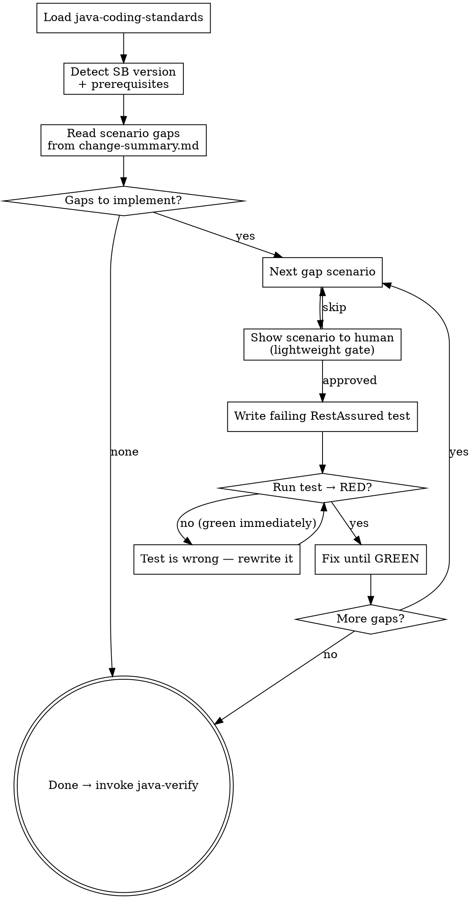
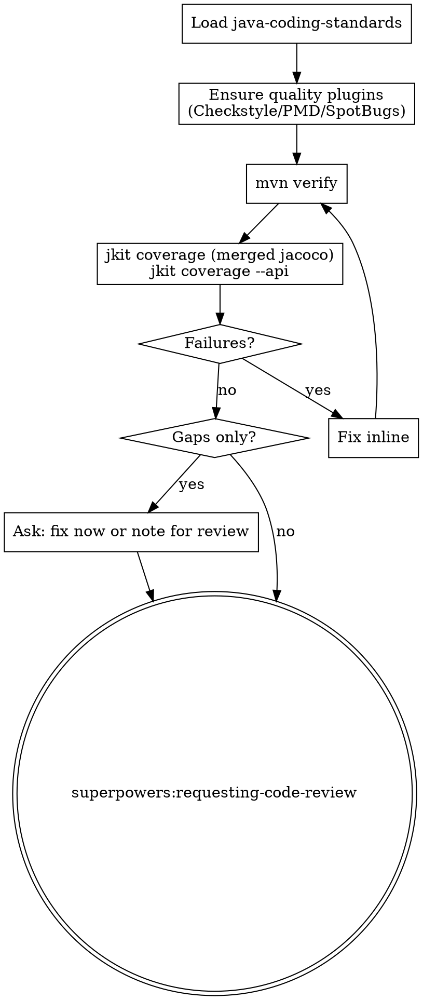

# jkit Iteration 3: Quality Layer — Implementation Plan

> **For agentic workers:** REQUIRED SUB-SKILL: Use superpowers:subagent-driven-development (recommended) or superpowers:executing-plans to implement this plan task-by-task. Steps use checkbox (`- [ ]`) syntax for tracking.

**Goal:** Implement the two skills that complete quality assurance after `java-tdd`: `scenario-tdd` (integration TDD from the gap list, one scenario at a time) and `java-verify` (quality gate: `mvn verify`, merged JaCoCo coverage, API endpoint coverage, then code review handoff).

**Architecture:** `scenario-tdd` is invoked by `java-tdd` after unit coverage is complete. It processes the gap list from `change-summary.md` one scenario at a time (RED → GREEN → next). `java-verify` is invoked by `scenario-tdd` and owns the final quality gate — it does NOT own the commit. Neither skill generates tests in batch; each enforces its own Iron Law.

**Tech Stack:** Claude Code plugin skill system (SKILL.md), YAML frontmatter, Markdown

---

## File Map

| File | Action |
|------|--------|
| `skills/scenario-tdd/SKILL.md` | Create (integration TDD: one gap scenario at a time, RED → GREEN → java-verify) |
| `skills/java-verify/SKILL.md` | Create (quality gate: mvn verify + JaCoCo merged + API coverage + code review handoff) |

---

### Task 1: Create skills/scenario-tdd/SKILL.md

**Files:**
- Create: `skills/scenario-tdd/SKILL.md`

`scenario-tdd` enforces the integration TDD Iron Law: one failing HTTP test before any production code fix. A test that passes immediately is wrong — it proves nothing. Invoked by `java-tdd`; calls `java-verify` when done.

- [ ] **Step 1: Create directory**

```bash
mkdir -p skills/scenario-tdd
```

- [ ] **Step 2: Write skills/scenario-tdd/SKILL.md**

Write `skills/scenario-tdd/SKILL.md`:

````markdown
---
name: scenario-tdd
description: Use when implementing integration test scenarios identified as gaps by scenario-gap. Reads the gap list from change-summary.md and implements each via TDD.
---

**Announcement:** At start: *"I'm using the scenario-tdd skill to implement scenario gaps for the [domain] domain via integration TDD."*

## Skill Type: Discipline-Enforcing

## Iron Law

```
NO INTEGRATION TEST WITHOUT A FAILING HTTP TEST FIRST.

Write the RestAssured assertion after the endpoint already passes? Delete it. Start over.

No exceptions:
- Don't generate multiple tests at once then fix failures
- Don't write "placeholder" tests that always pass
- One scenario → RED → GREEN → next scenario
```

## Rationalization Table

| Excuse | Reality |
|--------|---------|
| "The unit tests already cover this logic" | Unit tests mock HTTP. Integration tests verify the actual endpoint wires correctly end-to-end. |
| "I'll write all scenarios first, then run them" | Batch generation produces batch failures. You lose the signal of which scenario caused what. |
| "The happy path passes, the error cases are obvious" | Auth failures, validation edge cases, and missing headers are where bugs live. Write the test. |
| "This endpoint is simple, one test is enough" | Each scenario is a contract. Simple endpoints have the same contract obligations. |

## Checklist

- [ ] Load java-coding-standards
- [ ] Detect Spring Boot version + prerequisites
- [ ] Read scenario gaps from change-summary.md
- [ ] TDD loop: per gap scenario
- [ ] Invoke java-verify

## Process Flow



## Detailed Flow

**Step 0: Load java-coding-standards**

Read `<plugin-root>/docs/java-coding-standards.md`. Apply all rules.

**Step 1: Detect Spring Boot version + prerequisites**

Read `<parent><version>` from `pom.xml`.

| Spring Boot version | Testing strategy |
|---|---|
| 3.1+ | `@SpringBootTest(RANDOM_PORT)` + Testcontainers (`@ServiceConnection`) + RestAssured |
| < 3.1 | `docker-compose.test.yml` → RestAssured against running container |

**Spring Boot 3.1+:** Check `pom.xml` for Testcontainers, RestAssured, WireMock. If missing: add from `templates/pom-fragments/testcontainers.xml`.

**Spring Boot < 3.1:** Resolve container runtime:
1. `docker compose` / `docker-compose`
2. `podman compose`
3. Neither → stop: *"No container runtime found. Install Docker or Podman and re-run."*

Check `docker-compose.test.yml` exists. If missing: copy from `templates/docker-compose.test.yml`.

**Step 2: Read scenario gaps**

Read the **Test Scenario Gaps** section from `.jkit/<run>/change-summary.md` (passed by java-tdd). Each row is a `{domain, endpoint, scenario_id, scenario_description}` tuple — the authoritative work list for this run.

If the section is absent or empty → no scenario gaps detected; complete immediately, invoke `java-verify`.

**Step 3: TDD loop**

Process gaps in the order they appear in change-summary.md (domain order preserved from spec-delta). For each gap scenario:

**Lightweight gate** — announce before writing:
> "Next: `POST /invoices/bulk` — `happy-path`: valid list of 3 → 201 + invoice IDs. Write this test?
> A) Yes (recommended)
> B) Edit this scenario
> C) Skip"

**Write the failing test** targeting exactly this scenario. One test method, one assertion.

**Run:**
```bash
# SB 3.1+
JKIT_ENV=test direnv exec . mvn test -Dtest=<Domain>IntegrationTest#<methodName>

# SB < 3.1
<runtime> compose -f docker-compose.test.yml up -d
JKIT_ENV=test direnv exec . mvn test -Dtest=<Domain>IntegrationTest#<methodName>
```

- **RED (compilation or assertion failure):** expected — continue to fix.
- **GREEN immediately:** the test is wrong — it proves nothing. Rewrite it to actually fail.

Fix production code or test setup until GREEN. Then move to next scenario.

**Test class location:** `src/test/java/<group-path>/<service>/<domain>/<Domain>IntegrationTest.java`

**Spring Boot 3.1+ template:**

```java
@SpringBootTest(webEnvironment = SpringBootTest.WebEnvironment.RANDOM_PORT)
@Testcontainers
class BillingIntegrationTest {
    @Container @ServiceConnection
    static PostgreSQLContainer<?> postgres = new PostgreSQLContainer<>("postgres:15");

    @RegisterExtension
    static WireMockExtension externalSvc = WireMockExtension.newInstance()
        .options(wireMockConfig().dynamicPort()).build();

    @LocalServerPort int port;
    @BeforeEach void setup() { RestAssured.port = port; }

    @Test void bulkInvoice_happyPath() { /* given/when/then */ }
}
```

**Spring Boot < 3.1 template:**

```java
class BillingIntegrationTest {
    static String baseUri = System.getenv().getOrDefault("SERVICE_BASE_URI", "http://localhost:8080");
    @BeforeAll static void setup() { RestAssured.baseURI = baseUri; }

    @Test void bulkInvoice_happyPath() { /* given/when/then */ }
}
```

**Failure classification:**
- Compilation failure or wrong assertion → fix generated test. Do NOT change production code for a test bug.
- Production code fails the correct assertion → fix production code via `superpowers:systematic-debugging`.
- After one self-fix pass still failing → invoke `superpowers:systematic-debugging`.

**Step 4: Invoke java-verify**

**REQUIRED SUB-SKILL: invoke `java-verify`** after all gap scenarios are covered.

scenario-tdd does NOT own the commit. The commit is `java-tdd`'s responsibility.

## Superpowers Integration

| Superpowers skill | How used |
|---|---|
| `superpowers:systematic-debugging` | When production code fails a correct integration test after one self-fix pass |
````

- [ ] **Step 3: Validate YAML frontmatter**

```bash
python3 -c "
import yaml, re
content = open('skills/scenario-tdd/SKILL.md').read()
m = re.match(r'^---\n(.*?)\n---', content, re.DOTALL)
assert m, 'No frontmatter found'
data = yaml.safe_load(m.group(1))
assert data.get('name') == 'scenario-tdd'
assert 'description' in data
print('OK')
"
```

Expected: `OK`

---

### Task 2: Create skills/java-verify/SKILL.md

**Files:**
- Create: `skills/java-verify/SKILL.md`

`java-verify` is a pure quality gate. It does NOT generate tests or own the commit. It runs `mvn verify`, checks merged JaCoCo coverage and API endpoint coverage, then hands off to `superpowers:requesting-code-review`.

- [ ] **Step 1: Create directory**

```bash
mkdir -p skills/java-verify
```

- [ ] **Step 2: Write skills/java-verify/SKILL.md**

Write `skills/java-verify/SKILL.md`:

````markdown
---
name: java-verify
description: Use when verifying all quality gates and coverage after scenario-tdd completes, or when explicitly asked to run the full verification suite.
---

**Announcement:** At start: *"I'm using the java-verify skill to run quality gates and coverage checks."*

## Skill Type: Technique/Pattern

## Checklist

- [ ] Load java-coding-standards
- [ ] Ensure quality plugins
- [ ] Run mvn verify
- [ ] Check merged JaCoCo coverage
- [ ] Check API endpoint coverage
- [ ] Fix failures or note gaps
- [ ] Invoke requesting-code-review

## Process Flow



## Detailed Flow

**Step 0: Load java-coding-standards**

Read `<plugin-root>/docs/java-coding-standards.md`. Apply all rules.

**Step 1: Ensure quality plugins**

Check `pom.xml` for Checkstyle, PMD, SpotBugs. If missing:
> "Quality plugins not found.
> A) Add from templates/pom-fragments/quality.xml (recommended)
> B) Skip quality gate"

On A: add fragment. Note in final commit message.

**Step 2: Run mvn verify**

```bash
JKIT_ENV=test direnv exec . mvn verify
```

Runs: unit tests → quality gates → integration tests (Failsafe) → JaCoCo dump + merge + report.

Fix failures inline. Repeat until green.

**Step 3: Coverage check**

```bash
# Unit + integration combined (merged jacoco.xml)
bin/jkit coverage target/site/jacoco/jacoco.xml --summary --min-score 1.0

# API endpoint coverage: spec vs test source
bin/jkit coverage --api docs/domains/ src/test/java/
```

**Failures** (tests or quality): fix inline, re-run.

**Gaps only** (coverage below threshold or untested endpoints): ask:
> "Coverage gaps found: [list].
> A) Fix gaps now — run scenario-tdd / add unit tests (recommended)
> B) Proceed to code review — I'll note the gaps"

**Step 4: Code review handoff**

java-verify does NOT own the final commit. The commit is `java-tdd`'s responsibility.

**REQUIRED SUB-SKILL: invoke `superpowers:requesting-code-review`.**

## Superpowers Integration

| Superpowers skill | How used |
|---|---|
| `superpowers:requesting-code-review` | Always — final step after all checks pass |
````

- [ ] **Step 3: Validate YAML frontmatter**

```bash
python3 -c "
import yaml, re
content = open('skills/java-verify/SKILL.md').read()
m = re.match(r'^---\n(.*?)\n---', content, re.DOTALL)
assert m, 'No frontmatter found'
data = yaml.safe_load(m.group(1))
assert data.get('name') == 'java-verify'
assert 'description' in data
print('OK')
"
```

Expected: `OK`

---

### Task 3: Commit Iteration 3

- [ ] **Step 1: Stage and commit scenario-tdd**

```bash
git add skills/scenario-tdd/SKILL.md
git commit -m "feat: add scenario-tdd skill"
```

- [ ] **Step 2: Stage and commit java-verify**

```bash
git add skills/java-verify/SKILL.md
git commit -m "feat: add java-verify skill"
```
