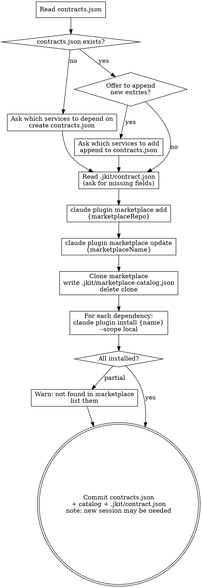
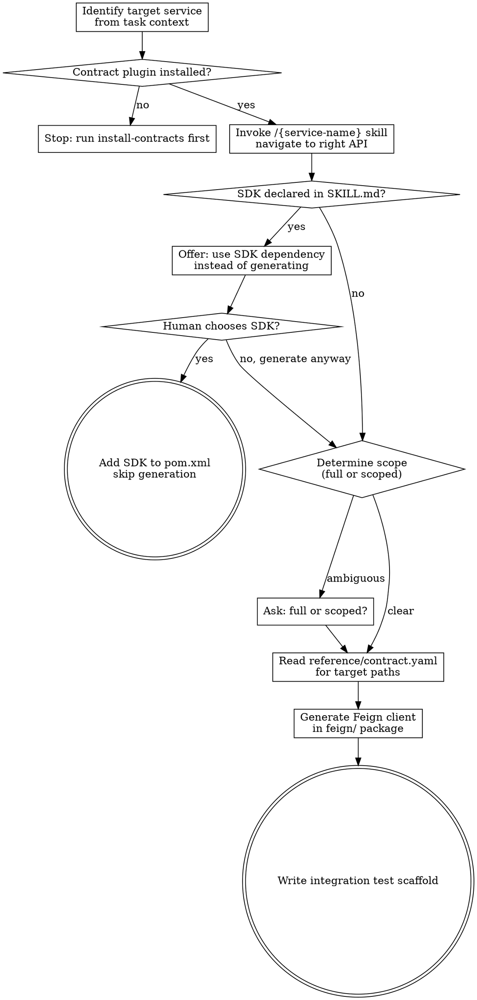
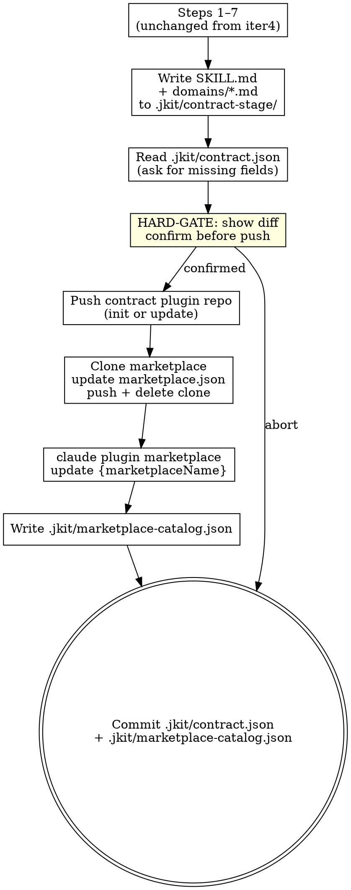

# jkit Iteration 5: Service Contract Marketplace — Implementation Plan

> **For agentic workers:** REQUIRED SUB-SKILL: Use superpowers:subagent-driven-development (recommended) or superpowers:executing-plans to implement this plan task-by-task. Steps use checkbox (`- [ ]`) syntax for tracking.

**Goal:** Extend the plugin to publish contracts as Claude Code plugin repos on GitHub, register them in an org-wide marketplace, and enable consumer-side dependency management with ambient cross-service discovery via the session-start hook.

**Architecture:** Three shell scripts (`bin/contract-push.sh`, `bin/marketplace-publish.sh`, `bin/marketplace-sync.sh`) handle all git + JSON operations. Skills invoke these with a single line. The session-start hook injects a local catalog cache (`.jkit/marketplace-catalog.json`) at zero network cost — written by both `publish-contract` and `install-contracts`. `publish-contract` is updated to write `SKILL.md` instead of `overview.md` and add the GitHub push pipeline after the existing steps 1–7. `generate-feign` replaces the previous Feign generation approach by reading installed contract plugins.

**Tech Stack:** Bash, Python 3 (JSON upsert in shell scripts), Claude Code plugin marketplace CLI (`claude plugin marketplace`), git SSH

---

## File Map

| File | Action |
|------|--------|
| `bin/contract-push.sh` | Create (git push pipeline: init or update contract plugin repo) |
| `bin/marketplace-publish.sh` | Create (clone marketplace, upsert entry, push, delete clone) |
| `bin/marketplace-sync.sh` | Create (refresh Claude Code index + write .jkit/marketplace-catalog.json) |
| `hooks/session-start` | Update (add marketplace catalog injection after existing step 4) |
| `skills/install-contracts/SKILL.md` | Create (register marketplace, install plugins, refresh catalog, commit) |
| `skills/generate-feign/SKILL.md` | Create (navigate contract plugin, check for SDK, generate Feign client) |
| `skills/publish-contract/SKILL.md` | Update (replace overview.md with SKILL.md, add push pipeline steps 8–11) |

---

### Task 1: Create bin/contract-push.sh

**Files:**
- Create: `bin/contract-push.sh`

Pushes the generated contract plugin files to a GitHub contract repo. First-run detection: if `.jkit/contract-stage/{service-name}/.git/` does not exist or the remote URL mismatches, delete and re-init. The caller (`publish-contract`) has already written SKILL.md, domains/, and reference/ into the stage dir before calling this script.

- [ ] **Step 1: Write bin/contract-push.sh**

Write `bin/contract-push.sh`:

```bash
#!/usr/bin/env bash
set -euo pipefail
SERVICE_NAME=$1
CONTRACT_REPO=$2
STAGE_DIR=".jkit/contract-stage/$SERVICE_NAME"

# Detect first run or URL mismatch — re-init if needed
if [ ! -d "$STAGE_DIR/.git" ] || \
   [ "$(git -C "$STAGE_DIR" remote get-url origin 2>/dev/null)" != "$CONTRACT_REPO" ]; then
  rm -rf "$STAGE_DIR"
  mkdir -p "$STAGE_DIR"
  # Caller has already written SKILL.md, domains/, reference/ into STAGE_DIR
  git -C "$STAGE_DIR" init
  git -C "$STAGE_DIR" remote add origin "$CONTRACT_REPO"
  git -C "$STAGE_DIR" add .
  git -C "$STAGE_DIR" commit -m "chore: publish contract for $SERVICE_NAME"
  git -C "$STAGE_DIR" push -u origin main
else
  git -C "$STAGE_DIR" pull origin main
  # Caller has already overwritten files in STAGE_DIR
  git -C "$STAGE_DIR" add .
  git -C "$STAGE_DIR" commit -m "chore: update contract for $SERVICE_NAME"
  git -C "$STAGE_DIR" push origin main
fi
```

- [ ] **Step 2: Make executable**

```bash
chmod +x bin/contract-push.sh
```

- [ ] **Step 3: Check with shellcheck**

```bash
shellcheck bin/contract-push.sh
```

Expected: no output

---

### Task 2: Create bin/marketplace-publish.sh

**Files:**
- Create: `bin/marketplace-publish.sh`

Clones the marketplace repo, upserts the contract entry in `marketplace.json` (update in-place if name matches, append if new), pushes, and deletes the clone. Uses Python 3 for JSON manipulation.

- [ ] **Step 1: Write bin/marketplace-publish.sh**

Write `bin/marketplace-publish.sh`:

```bash
#!/usr/bin/env bash
set -euo pipefail
MARKETPLACE_REPO=$1
SERVICE_NAME=$2
DESCRIPTION=$3
CONTRACT_REPO=$4
CLONE_DIR=".jkit/marketplace-clone"
MANIFEST="$CLONE_DIR/.claude-plugin/marketplace.json"

rm -rf "$CLONE_DIR"
git clone "$MARKETPLACE_REPO" "$CLONE_DIR"

python3 - <<EOF
import json, sys
with open("$MANIFEST") as f:
    data = json.load(f)
entry = {
    "name": "$SERVICE_NAME",
    "description": "$DESCRIPTION",
    "source": {"source": "url", "url": "$CONTRACT_REPO"}
}
plugins = data.get("plugins", [])
idx = next((i for i, p in enumerate(plugins) if p["name"] == "$SERVICE_NAME"), None)
if idx is not None:
    plugins[idx] = entry
else:
    plugins.append(entry)
data["plugins"] = plugins
with open("$MANIFEST", "w") as f:
    json.dump(data, f, indent=2)
EOF

git -C "$CLONE_DIR" add .claude-plugin/marketplace.json
git -C "$CLONE_DIR" commit -m "chore: register/update $SERVICE_NAME contract"
git -C "$CLONE_DIR" push origin main
rm -rf "$CLONE_DIR"
```

- [ ] **Step 2: Make executable**

```bash
chmod +x bin/marketplace-publish.sh
```

- [ ] **Step 3: Check with shellcheck**

```bash
shellcheck bin/marketplace-publish.sh
```

Expected: no output (shellcheck may warn about the heredoc variable expansion — that is intentional)

---

### Task 3: Create bin/marketplace-sync.sh

**Files:**
- Create: `bin/marketplace-sync.sh`

Refreshes Claude Code's marketplace index and writes the local `.jkit/marketplace-catalog.json` cache. Called by both `publish-contract` and `install-contracts`. The hook never writes — only reads from this cache.

- [ ] **Step 1: Write bin/marketplace-sync.sh**

Write `bin/marketplace-sync.sh`:

```bash
#!/usr/bin/env bash
set -euo pipefail
MARKETPLACE_REPO=$1
MARKETPLACE_NAME=$2
CLONE_DIR=".jkit/marketplace-clone"
MANIFEST="$CLONE_DIR/.claude-plugin/marketplace.json"

claude plugin marketplace update "$MARKETPLACE_NAME"

rm -rf "$CLONE_DIR"
git clone "$MARKETPLACE_REPO" "$CLONE_DIR"

python3 - <<EOF
import json
from datetime import datetime, timezone
with open("$MANIFEST") as f:
    data = json.load(f)
catalog = {
    "marketplaceName": "$MARKETPLACE_NAME",
    "updatedAt": datetime.now(timezone.utc).isoformat(),
    "contracts": [
        {"name": p["name"], "description": p["description"]}
        for p in data.get("plugins", [])
    ]
}
with open(".jkit/marketplace-catalog.json", "w") as f:
    json.dump(catalog, f, indent=2)
EOF

rm -rf "$CLONE_DIR"
```

- [ ] **Step 2: Make executable**

```bash
chmod +x bin/marketplace-sync.sh
```

- [ ] **Step 3: Check with shellcheck**

```bash
shellcheck bin/marketplace-sync.sh
```

Expected: no output

- [ ] **Step 4: Commit shell scripts**

```bash
git add bin/contract-push.sh bin/marketplace-publish.sh bin/marketplace-sync.sh
git commit -m "feat: add bin/contract-push.sh, bin/marketplace-publish.sh, bin/marketplace-sync.sh"
```

---

### Task 4: Update hooks/session-start

**Files:**
- Modify: `hooks/session-start`

Add a Step 5 at the end of the script (after the existing Step 4 conditional context injection). If `.jkit/marketplace-catalog.json` exists, read it and inject available contracts into session context. Zero network calls — reads only from the local cache file.

The existing script exits at the end of Step 4 (either `printf '{}' ; exit 0` for non-jkit projects, or the platform-detection block for jkit projects). The marketplace injection must be added before the platform-detection block so it is included in the injected context for jkit-managed projects.

- [ ] **Step 1: Overwrite hooks/session-start with the complete updated version**

Write `hooks/session-start`:

```bash
#!/usr/bin/env bash
set -euo pipefail

PLUGIN_ROOT="$(cd "$(dirname "$0")/.." && pwd)"

# 1. Install direnv if missing
if ! command -v direnv &>/dev/null; then
  echo "jkit: direnv not found — installing..." >&2
  curl -sfL https://direnv.net/install.sh | bash 2>/dev/null \
    || echo "jkit: direnv install failed. Install manually: https://direnv.net" >&2
fi

# 2. Allow .envrc (idempotent — keyed by .envrc hash, silent no-op when already allowed)
if command -v direnv &>/dev/null && [ -f ".envrc" ]; then
  direnv allow . 2>/dev/null || true
fi

# 3. Validate jkit CLI
if [ ! -x "${PLUGIN_ROOT}/bin/jkit" ]; then
  echo "jkit: bin/jkit missing or not executable. Run: chmod +x ~/.claude/plugins/jkit/bin/*" >&2
fi

# 4. Conditional context injection — only for jkit-managed projects
if [ ! -f ".jkit/spec-sync" ]; then
  printf '{}\n'
  exit 0
fi

CONTEXT=$(cat "${PLUGIN_ROOT}/hooks/jkit-context.md")

# 5. Append marketplace catalog if present (zero network calls — reads local cache only)
if [ -f ".jkit/marketplace-catalog.json" ]; then
  CATALOG_BLOCK=$(python3 - <<'PYEOF'
import json, sys
with open(".jkit/marketplace-catalog.json") as f:
    data = json.load(f)
contracts = data.get("contracts", [])
if not contracts:
    sys.exit(0)
lines = ["\n## Available Service Contracts\n"]
installed = set()
try:
    with open("contracts.json") as cf:
        installed = set(json.load(cf).get("dependencies", []))
except FileNotFoundError:
    pass
for c in contracts:
    name = c["name"]
    desc = c["description"]
    lines.append(f"{name} — {desc}")
installed_names = [c["name"] for c in contracts if c["name"] in installed]
not_installed_names = [c["name"] for c in contracts if c["name"] not in installed]
if installed_names:
    lines.append(f"\nInstalled in this project: {', '.join(installed_names)}")
if not_installed_names:
    lines.append(f"Not yet installed: {', '.join(not_installed_names)}")
print("\n".join(lines))
PYEOF
  )
  CONTEXT="${CONTEXT}${CATALOG_BLOCK}"
fi

# Platform detection (follows superpowers pattern)
if [ -n "${CURSOR_PLUGIN_ROOT:-}" ]; then
  # Cursor
  printf '{"additional_context": %s}\n' "$(printf '%s' "$CONTEXT" | python3 -c 'import json,sys; print(json.dumps(sys.stdin.read()))')"
elif [ -n "${CLAUDE_PLUGIN_ROOT:-}" ] && [ -z "${COPILOT_CLI:-}" ]; then
  # Claude Code
  printf '{"hookSpecificOutput": {"hookEventName": "SessionStart", "additionalContext": %s}}\n' \
    "$(printf '%s' "$CONTEXT" | python3 -c 'import json,sys; print(json.dumps(sys.stdin.read()))')"
else
  # SDK / fallback
  printf '{"additionalContext": %s}\n' "$(printf '%s' "$CONTEXT" | python3 -c 'import json,sys; print(json.dumps(sys.stdin.read()))')"
fi
exit 0
```

- [ ] **Step 2: Verify shellcheck passes**

```bash
shellcheck hooks/session-start
```

Expected: no output

- [ ] **Step 3: Smoke test — non-jkit project still outputs {}**

```bash
cd /tmp && bash /workspaces/jkit/hooks/session-start
```

Expected: `{}`

- [ ] **Step 4: Commit**

```bash
git add hooks/session-start
git commit -m "feat(session-start): inject marketplace catalog for cross-service discovery"
```

---

### Task 5: Create skills/install-contracts/SKILL.md

**Files:**
- Create: `skills/install-contracts/SKILL.md`

`install-contracts` manages consumer-side dependency declaration (`contracts.json`) and plugin installation. It registers the marketplace on first run (idempotent), installs each declared service plugin with `--scope local`, and writes `.jkit/marketplace-catalog.json` for the session-start hook.

- [ ] **Step 1: Create directory**

```bash
mkdir -p skills/install-contracts
```

- [ ] **Step 2: Write skills/install-contracts/SKILL.md**

Write `skills/install-contracts/SKILL.md`:

````markdown
---
name: install-contracts
description: Use when setting up upstream service dependencies, or when adding a new microservice dependency to the current project.
---

**Announcement:** At start: *"I'm using the install-contracts skill to install service contract dependencies."*

## Checklist

- [ ] Read `contracts.json` at repo root — if missing, ask which services to depend on, create it; if present, offer to append new entries before proceeding
- [ ] Read `.jkit/contract.json` for `marketplaceRepo`, `marketplaceName` — if missing, ask once, save
- [ ] Register marketplace if not already registered: `claude plugin marketplace add {marketplaceRepo}`
- [ ] Refresh marketplace index: `claude plugin marketplace update {marketplaceName}`
- [ ] Clone marketplace, read `.claude-plugin/marketplace.json`, write `.jkit/marketplace-catalog.json`, delete clone
- [ ] For each dependency: `claude plugin install {service-name} --scope local`
- [ ] Warn if any service name is not found in marketplace
- [ ] Confirm installed plugins are available; note that a new Claude session may be required for plugins to activate
- [ ] Commit `contracts.json` + `.jkit/marketplace-catalog.json` + `.jkit/contract.json` to the consumer repo

## Process Flow



## Commands

```bash
# Register marketplace (first time — idempotent if already registered)
claude plugin marketplace add {marketplaceRepo}

# Install and sync (delegates to shell script)
bin/marketplace-sync.sh {marketplaceRepo} {marketplaceName}

# Install one dependency
claude plugin install {service-name} --scope local
```

`--scope local` installs into the project's `.claude/settings.json`. Use `--scope user` only if the developer wants a contract globally available across all projects.

## `contracts.json` Format

Lives at the **repo root** of a consumer microservice (alongside `pom.xml`). Created by `install-contracts` on first run if absent:

```json
{
  "dependencies": ["{service-name}", "{service-name-2}"]
}
```

When `contracts.json` already exists, `install-contracts` offers to append new entries before proceeding. Committed to the service repo — treat it like `pom.xml`.

## `.jkit/contract.json` Format

Persists marketplace configuration. Created on first `install-contracts` run if not already present from `publish-contract`:

```json
{
  "contractRepo": "git@github.com:{org}/{service-name}-contract.git",
  "marketplaceRepo": "git@github.com:{org}/marketplace.git",
  "marketplaceName": "{org}-marketplace"
}
```

Ask for `marketplaceRepo` and `marketplaceName` once, then persist. `contractRepo` is only relevant for the publisher side.
````

- [ ] **Step 3: Validate YAML frontmatter**

```bash
python3 -c "
import yaml, re
content = open('skills/install-contracts/SKILL.md').read()
m = re.match(r'^---\n(.*?)\n---', content, re.DOTALL)
assert m, 'No frontmatter found'
data = yaml.safe_load(m.group(1))
assert data.get('name') == 'install-contracts'
assert 'description' in data
print('OK')
"
```

Expected: `OK`

- [ ] **Step 4: Commit**

```bash
git add skills/install-contracts/SKILL.md
git commit -m "feat: add install-contracts skill"
```

---

### Task 6: Create skills/generate-feign/SKILL.md

**Files:**
- Create: `skills/generate-feign/SKILL.md`

`generate-feign` reads from an installed contract plugin (not from a local directory). It navigates the 4-level disclosure — invoking `/{service-name}` skill to find the right API — then reads `reference/contract.yaml` and generates the Feign client. If an SDK is declared in `SKILL.md`, it offers the SDK dependency as an alternative to generation.

- [ ] **Step 1: Create directory**

```bash
mkdir -p skills/generate-feign
```

- [ ] **Step 2: Write skills/generate-feign/SKILL.md**

Write `skills/generate-feign/SKILL.md`:

````markdown
---
name: generate-feign
description: Use when you need to generate a Feign client for an upstream microservice. Requires the service's contract plugin to be installed.
---

**Announcement:** At start: *"I'm using the generate-feign skill to generate a Feign client from the {service-name} contract."*

## Checklist

- [ ] Identify target service from task context
- [ ] Confirm contract plugin is installed (`/{service-name}` skill available)
- [ ] Invoke `/{service-name}` skill to navigate to the right API (levels 1→4)
- [ ] Check SKILL.md for `## SDK` section — if present, offer SDK dependency instead of generating
- [ ] Read `reference/contract.yaml` for the target path(s)
- [ ] Determine generation scope — if not clear from task context, ask: full client or scoped to specific paths/tags?
- [ ] Generate Feign client in `feign/` package
- [ ] Write integration test scaffold

## Process Flow



## Contract Plugin Location

Installed plugins are resolved by Claude Code's plugin system. Read contract files relative to the plugin root:

```
skills/{service-name}/             ← SKILL.md (already loaded when skill is invoked)
domains/{domain-name}.md           ← Level 3 — read on demand
reference/contract.yaml            ← Level 4 — grepped for target paths
```

## Generation Rules

- Feign client goes in `src/main/java/{group-path}/feign/{ServiceName}Client.java`
- One interface per service (not one per domain)
- If SDK module exists (declared in SKILL.md `## SDK`): offer the SDK dependency first — confirm with human before generating
- Scoped generation: only include paths matching the specified prefix or tag
- Integration test scaffold goes in `src/test/java/{group-path}/feign/{ServiceName}ClientTest.java`
````

- [ ] **Step 3: Validate YAML frontmatter**

```bash
python3 -c "
import yaml, re
content = open('skills/generate-feign/SKILL.md').read()
m = re.match(r'^---\n(.*?)\n---', content, re.DOTALL)
assert m, 'No frontmatter found'
data = yaml.safe_load(m.group(1))
assert data.get('name') == 'generate-feign'
assert 'description' in data
print('OK')
"
```

Expected: `OK`

- [ ] **Step 4: Commit**

```bash
git add skills/generate-feign/SKILL.md
git commit -m "feat: add generate-feign skill"
```

---

### Task 7: Update skills/publish-contract/SKILL.md

**Files:**
- Modify: `skills/publish-contract/SKILL.md`

Steps 1–7 are unchanged from iter4. Replace Step 8 ("Write output files") and Step 9 ("Ship") with the new pipeline: write `SKILL.md` + `domains/*.md` to `.jkit/contract-stage/`, read `.jkit/contract.json`, HARD-GATE before any git push, then call the three shell scripts. The iter4 Step 10 (commit) is replaced with a new commit step that commits `.jkit/contract.json` + `.jkit/marketplace-catalog.json` + `.gitignore`.

This is a full replacement of the file (not a patch) because the checklist, process flow diagram, and steps 8–10 all change.

- [ ] **Step 1: Overwrite skills/publish-contract/SKILL.md**

Write `skills/publish-contract/SKILL.md`:

````markdown
---
name: publish-contract
description: Use when publishing the service API contract for other microservices, or after implementing new or changed API endpoints.
---

**Announcement:** At start: *"I'm using the publish-contract skill to generate the service contract for other teams."*

## Skill Type: Technique/Pattern with HARD-GATEs

## Checklist

**Unchanged from iter4:**
- [ ] Extract service metadata
- [ ] Check for existing contract
- [ ] Find and confirm controller path + jkit skel scan
- [ ] Javadoc quality check
- [ ] Map controllers to domains + HARD-GATE approval
- [ ] Structured interview (7 questions)
- [ ] Generate contract.yaml (smart-doc)

**Changed/new:**
- [ ] Add .jkit/contract-stage/ to .gitignore if not present
- [ ] Write SKILL.md + domains/*.md to .jkit/contract-stage/{service-name}/
- [ ] Read .jkit/contract.json — if missing, ask for contractRepo SSH URL, save
- [ ] Read .jkit/contract.json — if missing, ask for marketplaceRepo SSH URL, save
- [ ] Read .jkit/contract.json — if missing, ask for marketplaceName, save
- [ ] HARD-GATE: show diff of changes to be pushed, confirm before any git push
- [ ] Push contract plugin repo
- [ ] Clone marketplace, update marketplace.json, push, delete clone
- [ ] Run: claude plugin marketplace update {marketplaceName}
- [ ] Write .jkit/marketplace-catalog.json from updated marketplace.json
- [ ] Commit .jkit/contract.json + .jkit/marketplace-catalog.json in service repo

## Process Flow



## Detailed Flow — Steps 1–7 (unchanged)

**Step 1: Extract service metadata**

```bash
grep -rh "spring\.application\.name" src/main/resources/ 2>/dev/null | head -1
```

Extract the value:
- YAML: `name: value` or `spring.application.name: value`
- Properties: `spring.application.name=value`

If found → use as both `{service-name}` and registry name. Confirm:
> "Found `spring.application.name={value}`. Using as service and registry name — correct?"

If not found → read `<artifactId>` from `pom.xml` as `{service-name}`, then ask:
> "Defaulting registry name to `{service-name}`. Is that correct?"

Also extract from `pom.xml`: `<groupId>`, `<version>`, `<parent><artifactId>` (for SDK check in Step 6).

**Step 2: Check for existing contract**

If `.jkit/contract-stage/{service-name}/` exists:

Tell human: `"A staged contract for {service-name} already exists at .jkit/contract-stage/{service-name}/"`

```
A) Overwrite with regenerated version (recommended if endpoints changed)
B) Diff only — show me what changed before overwriting
C) Abort
```

<HARD-GATE>
Do NOT overwrite an existing staged contract without explicit human approval (option A or B+confirm).
</HARD-GATE>

**Step 3: Find controller path and scan**

Locate the `api` package:

```bash
find src/main/java -type d -name api
```

- Exactly one found → confirm: *"Found api package at `{path}`. Using this — correct?"*
- Multiple found → list and ask the user to choose
- None found → stop: *"Could not find an `api` package under `src/main/java/`. Please specify the controller path."*

Scan with jkit skel:

```bash
bin/jkit skel "src/main/java/${GROUP_PATH}/${SERVICE}/api/"
```

From JSON output: identify classes with `@RestController` or `@Controller` annotation, and their public methods.

**Step 4: Javadoc quality check**

For every public method, check `has_docstring` and `docstring_text`. Insufficient if any:
- `has_docstring` is false
- `docstring_text` is null or empty
- `docstring_text` only restates the method name

If ANY method has missing or insufficient Javadoc:

> "Controller Javadoc is sparse — the generated contract will have low-quality endpoint descriptions.
> A) Improve Javadoc inline — I'll update the controller comments, then re-scan (recommended)
> B) Proceed with current quality — I understand the contract will need manual editing"

On A: read each controller, fill missing/thin Javadoc, re-run `jkit skel` to confirm. Do not use pre-improvement data after re-scan.

**Step 5: Map controllers to domains**

One controller file = one domain (strip `Controller` suffix: `InvoiceController` → `invoice`).

Exception: if two files share the same domain prefix, propose merging into one domain.

Present proposed domain list and ask for confirmation.

<HARD-GATE>
Do NOT generate any output until the human confirms the domain mapping.
The confirmed domain list is the authoritative input for all output generation.
</HARD-GATE>

**Step 6: Structured interview**

Ask one at a time. Always offer a draft.

1. **`description`** — draft from class-level Javadoc
2. **`use_when`** — infer 2–4 scenarios from capability names
3. **`invariants`** — draft from Javadoc preconditions and `@throws`
4. **`keywords`** — draft from module names and prominent Javadoc nouns
5. **`not_responsible_for`** — infer what adjacent domains this service does NOT own
6. **`SDK`** — check parent `pom.xml` for `<module>` ending in `-api`
7. **`authentication`** — draft from security annotations or ask (Bearer / API key / mTLS / None)

**Step 7: Generate contract.yaml (smart-doc)**

Add smart-doc plugin to `pom.xml` if missing:

```xml
<plugin>
    <groupId>com.ly.smart-doc</groupId>
    <artifactId>smart-doc-maven-plugin</artifactId>
    <version>3.0.9</version>
    <configuration>
        <configFile>./smart-doc.json</configFile>
    </configuration>
</plugin>
```

Write `smart-doc.json` (merge if exists — preserve existing fields, update only `outPath`, `openApiAllInOne`, `sourceCodePaths`):

```json
{
  "outPath": ".jkit/contract-stage/{service-name}/reference",
  "openApiAllInOne": true,
  "packageFilters": "{package-filter}",
  "sourceCodePaths": [
    {"path": "src/main/java", "desc": "{service-name} service"}
  ]
}
```

Run:

```bash
mvn smart-doc:openapi
```

Convert JSON → YAML:

```bash
# Preferred
yq -o yaml -P .jkit/contract-stage/{service-name}/reference/openapi.json \
  > .jkit/contract-stage/{service-name}/reference/contract.yaml

# Fallback
python3 -c "
import json, yaml
with open('.jkit/contract-stage/{service-name}/reference/openapi.json') as f:
    data = json.load(f)
with open('.jkit/contract-stage/{service-name}/reference/contract.yaml', 'w') as f:
    yaml.dump(data, f, default_flow_style=False, allow_unicode=True, sort_keys=False)
"
rm .jkit/contract-stage/{service-name}/reference/openapi.json
```

If generation fails → show last 20 lines of Maven output and stop.

## Detailed Flow — Steps 8–11 (new in iter5)

**Step 8: Write SKILL.md + domains/*.md to contract-stage**

Add `.jkit/contract-stage/` to `.gitignore` if not already present.

Write `.jkit/contract-stage/{service-name}/.claude-plugin/plugin.json`:

```json
{
  "name": "{service-name}-contract",
  "description": "Service contract for {service-name}",
  "version": "1.0.0",
  "skills": [
    { "name": "{service-name}", "path": "skills/{service-name}" }
  ]
}
```

Write `.jkit/contract-stage/{service-name}/skills/{service-name}/SKILL.md`:

```markdown
---
name: {service-name}
description: Use when your task involves {use_when summary — one sentence}.
keywords: [{keyword}, ...]
---

## Overview

{2–3 sentences: service responsibility and integration context}

**Not responsible for:** {not_responsible_for list, or omit if none}

---

## Domains

### {domain-name}
{One sentence: what this domain handles.}
→ Read [`domains/{domain-name}.md`](../../domains/{domain-name}.md)

---

## How to navigate this contract

- **Find the right domain:** Read the domain summary above, then open `domains/{domain-name}.md`
- **Find the right API:** The domain file lists all APIs with intent descriptions
- **Get the schema:** Grep `reference/contract.yaml` for the path once the API is identified

## SDK

(Include only if SDK was confirmed in interview Step 6)
```xml
<dependency>
    <groupId>{group-id}</groupId>
    <artifactId>{sdk-artifact}</artifactId>
    <version>{version}</version>
</dependency>
```
```

Write `.jkit/contract-stage/{service-name}/domains/{domain-name}.md` (one per confirmed domain — same format as iter4 domains files).

**Step 9: Read .jkit/contract.json and ask for missing fields**

If `.jkit/contract.json` is missing or any field is absent, ask one at a time:
1. *"GitHub SSH URL for the contract plugin repo (e.g., `git@github.com:{org}/{service-name}-contract.git`):"*
2. *"GitHub SSH URL for the marketplace repo (e.g., `git@github.com:{org}/marketplace.git`):"*
3. *"Marketplace name (the `name` field in marketplace.json, e.g., `{org}-marketplace`):"*

Save to `.jkit/contract.json`:

```json
{
  "contractRepo": "git@github.com:{org}/{service-name}-contract.git",
  "marketplaceRepo": "git@github.com:{org}/marketplace.git",
  "marketplaceName": "{org}-marketplace"
}
```

**Step 10: HARD-GATE — diff and confirm before push**

Show what will be pushed:

```bash
# Show diff of staged contract vs current remote (or all files if first push)
git -C ".jkit/contract-stage/{service-name}" diff HEAD 2>/dev/null || \
  echo "(first push — all files are new)"
```

Ask:
```
A) Push to GitHub and update marketplace (recommended)
B) Abort — I'll review the files first
```

<HARD-GATE>
Do NOT run any git push until the human confirms.
</HARD-GATE>

On abort: still proceed to Step 11 commit (`.jkit/contract.json` is worth saving regardless).

**Step 11: Push, update marketplace, refresh catalog, commit**

On confirmed push:

```bash
# Note: GitHub repo at contractRepo must be empty (no auto-generated README/license)
# Inform the human before first push: "The remote repo must be empty — no auto-generated README or license."

bin/contract-push.sh {service-name} {contractRepo}
bin/marketplace-publish.sh {marketplaceRepo} {service-name} "{description}" {contractRepo}
bin/marketplace-sync.sh {marketplaceRepo} {marketplaceName}
```

Then commit in service repo:

```bash
# smart-doc.json if newly created this run
git add smart-doc.json pom.xml
git commit -m "chore(impl): add smart-doc configuration"

# SSH config + catalog + gitignore
git add .jkit/contract.json .jkit/marketplace-catalog.json .gitignore
git commit -m "chore(impl): publish service contract for {service-name}"
```

This commit happens whether or not the push was confirmed at the HARD-GATE. The SSH URLs and catalog are not sensitive.

## Contract Plugin Repo Structure

```
{service-name}-contract/
├── .claude-plugin/
│   └── plugin.json
├── skills/
│   └── {service-name}/
│       └── SKILL.md             ← Level 1+2
├── domains/
│   └── {domain-name}.md         ← Level 3
└── reference/
    └── contract.yaml            ← Level 4
```

## 4-Level Progressive Disclosure Map

| Level | Location | When invoked | Answers |
|---|---|---|---|
| 1 | `SKILL.md` frontmatter | Skill selected | Is this the right service? |
| 2 | `SKILL.md` body | Skill invoked | Is this the right domain? |
| 3 | `domains/{name}.md` | Domain drill-down | Is this the right API? |
| 4 | `reference/contract.yaml` | API resolution (grepped) | What are the schemas? |
````

- [ ] **Step 2: Validate YAML frontmatter**

```bash
python3 -c "
import yaml, re
content = open('skills/publish-contract/SKILL.md').read()
m = re.match(r'^---\n(.*?)\n---', content, re.DOTALL)
assert m, 'No frontmatter found'
data = yaml.safe_load(m.group(1))
assert data.get('name') == 'publish-contract'
assert 'description' in data
print('OK')
"
```

Expected: `OK`

- [ ] **Step 3: Verify HARD-GATEs are present**

```bash
grep -c "HARD-GATE" skills/publish-contract/SKILL.md
```

Expected: at least `3` (overwrite approval, domain approval, push confirmation)

- [ ] **Step 4: Update plugin.json to add install-contracts and generate-feign**

The iter5 skills must be registered. Update `.claude-plugin/plugin.json`:

```json
{
  "name": "jkit",
  "description": "Spec-driven development workflow for Java/Spring Boot SaaS microservice teams — TDD, coverage, contract testing, service contract publishing",
  "version": "0.3.0",
  "author": { "name": "honghaowu" },
  "license": "UNLICENSED",
  "keywords": ["java", "spring-boot", "microservice", "tdd", "scenario-tdd"],
  "skills": [
    { "name": "spec-delta",          "path": "skills/spec-delta" },
    { "name": "sql-migration",       "path": "skills/sql-migration" },
    { "name": "java-tdd",            "path": "skills/java-tdd" },
    { "name": "scenario-gap",        "path": "skills/scenario-gap" },
    { "name": "scenario-tdd",        "path": "skills/scenario-tdd" },
    { "name": "java-verify",         "path": "skills/java-verify" },
    { "name": "publish-contract",    "path": "skills/publish-contract" },
    { "name": "install-contracts",   "path": "skills/install-contracts" },
    { "name": "generate-feign",      "path": "skills/generate-feign" }
  ],
  "hooks": "hooks/hooks.json"
}
```

Validate:

```bash
python3 -c "import json; json.load(open('.claude-plugin/plugin.json')); print('OK')"
```

Expected: `OK`

- [ ] **Step 5: Commit**

```bash
git add skills/publish-contract/SKILL.md .claude-plugin/plugin.json
git commit -m "feat(publish-contract): add GitHub push pipeline and marketplace registration"
```
