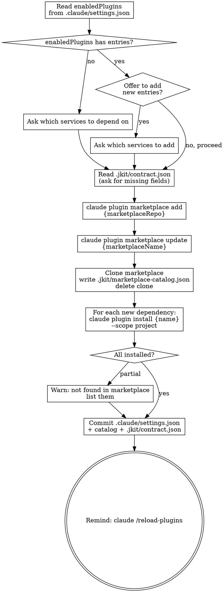

# Drop `contracts.json` Implementation Plan

> **For agentic workers:** REQUIRED SUB-SKILL: Use superpowers:subagent-driven-development (recommended) or superpowers:executing-plans to implement this plan task-by-task. Steps use checkbox (`- [ ]`) syntax for tracking.

**Goal:** Remove `contracts.json` from the install-contracts workflow and use `.claude/settings.json` `enabledPlugins` as the canonical contract dependency list.

**Architecture:** `claude plugin install --scope project` writes directly to `.claude/settings.json`, which is committed to the repo. New developers get all contracts by running marketplace add + update + `/reload-plugins` — no per-service install needed on fresh checkout. The `install-contracts` skill reads and writes `enabledPlugins` in `settings.json` instead of maintaining a separate `contracts.json`.

**Tech Stack:** Markdown skill file, Claude Code plugin CLI (`claude plugin install`, `claude plugin marketplace`)

---

### Task 1: Rewrite `skills/install-contracts/SKILL.md`

**Files:**
- Modify: `skills/install-contracts/SKILL.md`

- [ ] **Step 1: Replace the file with the new content**

Write the following content to `skills/install-contracts/SKILL.md` exactly:

```markdown
---
name: install-contracts
description: Use when setting up upstream service dependencies, or when adding a new microservice dependency to the current project.
---

**Announcement:** At start: *"I'm using the install-contracts skill to install service contract dependencies."*

## Checklist

- [ ] Read `enabledPlugins` from `.claude/settings.json` — if entries exist, offer to add more before proceeding; if absent or empty, ask which services to depend on
- [ ] Read `.jkit/contract.json` for `marketplaceRepo`, `marketplaceName` — if missing, ask once, save
- [ ] Register marketplace if not already registered: `claude plugin marketplace add {marketplaceRepo}`
- [ ] Refresh marketplace index: `claude plugin marketplace update {marketplaceName}`
- [ ] Clone marketplace, read `.claude-plugin/marketplace.json`, write `.jkit/marketplace-catalog.json`, delete clone
- [ ] For each new dependency: `claude plugin install {service-name} --scope project`
- [ ] Warn if any service name is not found in marketplace
- [ ] Commit `.claude/settings.json` + `.jkit/marketplace-catalog.json` + `.jkit/contract.json` to the consumer repo
- [ ] Remind user to run `claude /reload-plugins` to activate newly installed contracts in the current session

## Process Flow



## Commands Reference

```bash
# Register marketplace (idempotent)
claude plugin marketplace add {marketplaceRepo}

# Refresh index and fetch plugin content
claude plugin marketplace update {marketplaceName}

# Install one dependency into .claude/settings.json (committed)
claude plugin install {service-name} --scope project

# Activate plugins in the current session after install or fresh checkout
claude /reload-plugins
```

`--scope project` installs into `.claude/settings.json`, which is committed to the repo and shared across the team. Use `--scope user` only if the developer wants a contract globally available across all projects.

**New developer onboarding** (fresh checkout, `enabledPlugins` already in committed `settings.json`):

```bash
claude plugin marketplace add {marketplaceRepo}
claude plugin marketplace update {marketplaceName}
claude /reload-plugins
```

No per-service install needed — `marketplace update` fetches plugin content; `/reload-plugins` activates everything listed in `enabledPlugins`.

Note: `bin/marketplace-sync.sh` combines the `marketplace update` call + catalog write in one step. Do not call it in addition to the explicit flow steps — it would duplicate the `update` call.

## `.jkit/contract.json` Format

Persists marketplace configuration. `install-contracts` writes only `marketplaceRepo` and `marketplaceName`. `contractRepo` is written only by `publish-contract` (publisher side):

```json
{
  "marketplaceRepo": "git@github.com:{org}/marketplace.git",
  "marketplaceName": "{org}-marketplace"
}
```

Ask for these two fields once, then persist. If `publish-contract` has already run in this repo, `contractRepo` will also be present — leave it untouched.
```

- [ ] **Step 2: Verify the file looks correct**

```bash
cat skills/install-contracts/SKILL.md
```

Confirm:
- No mention of `contracts.json` anywhere
- Checklist reads `enabledPlugins` from `.claude/settings.json`
- Install command uses `--scope project`
- Commit step lists `.claude/settings.json` not `contracts.json`
- `/reload-plugins` reminder is present as the final checklist item and final flow node
- `contracts.json` Format section is gone
- `.jkit/contract.json` Format section is still present and unchanged

- [ ] **Step 3: Commit**

```bash
git add skills/install-contracts/SKILL.md
git commit -m "feat(install-contracts): drop contracts.json — use settings.json enabledPlugins as source of truth"
```

Expected: 1 file changed.
