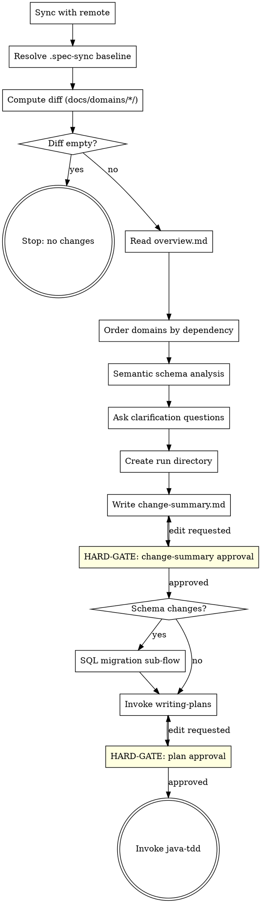
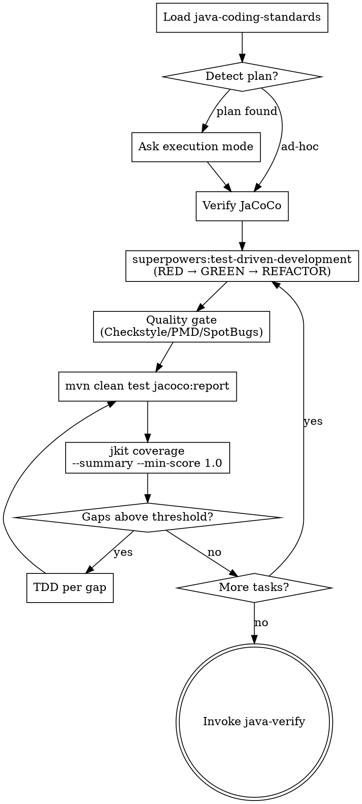

# jkit — Iteration 2: Core Loop

**Date:** 2026-04-21
**Status:** Draft
**Iteration:** 2 of 4
**Depends on:** Iteration 1 (Foundation)

---

## Overview

Implements the two skills that form the primary daily development loop:

1. **`spec-delta`** — computes the requirements delta since the last implementation, drives the full cycle from diff to approved plan, then hands off to `java-tdd`
2. **`java-tdd`** — implements each plan task via RED/GREEN/REFACTOR, extends with JaCoCo coverage gap analysis, then hands off to `java-verify`

After this iteration, the core workflow is fully operational:
```
edit docs/domains/ → commit → /spec-delta → plan approved → java-tdd → java-verify → commit
```

---

## Deliverables

| File | Purpose |
|------|---------|
| `skills/spec-delta/SKILL.md` | Spec diff → clarify → change-summary → SQL migration → plan |
| `skills/java-tdd/SKILL.md` | TDD per task + JaCoCo coverage gap loop |

---

## `spec-delta` Skill

### Frontmatter

```yaml
---
name: spec-delta
description: Use when the user runs /spec-delta, or when computing which spec changes in docs/domains/ need to be implemented since the last implementation commit.
---
```

### Skill Type: Technique/Pattern with HARD-GATEs

spec-delta is an **orchestrator**. It coordinates the entire spec-to-implementation pipeline. It must not be invoked as a task worker — if dispatched as a subagent to implement something, it would incorrectly run the full design loop.

```
<SUBAGENT-STOP>
If you were dispatched as a subagent to implement a specific task, skip this skill.
spec-delta is the orchestration entry point, not a task implementation skill.
</SUBAGENT-STOP>
```

**Announcement:** At start: *"I'm using the spec-delta skill to compute the requirements delta and drive the implementation pipeline."*

### Checklist

- [ ] Sync with remote
- [ ] Resolve .spec-sync baseline
- [ ] Compute spec diff
- [ ] Read overview.md
- [ ] Order domains by dependency
- [ ] Semantic schema analysis
- [ ] Ask clarification questions
- [ ] Create run directory
- [ ] Write change-summary.md
- [ ] Get change-summary approval
- [ ] (if schema changes) Introspect live DB schema
- [ ] (if schema changes) Write migration-preview.md
- [ ] (if schema changes) Get migration-preview approval
- [ ] (if schema changes) Generate migration SQL and get approval
- [ ] Invoke writing-plans
- [ ] Get plan approval
- [ ] Invoke java-tdd

### Process Flow



### Detailed Flow

**Step 1: Sync with remote**

```bash
git fetch
git rev-list HEAD..@{u} --count
```

- Remote not ahead → continue
- Remote ahead, working tree clean → `git pull --ff-only`
- Remote ahead, working tree dirty → ask:
  > "Remote has new commits but you have local changes. How do you want to proceed?
  > A) Stash, pull, unstash (recommended)
  > B) Continue without pulling
  > C) Abort"

**Step 2: Resolve .spec-sync baseline**

If `docs/.spec-sync` is missing:
- Run `git log --oneline -- docs/domains/*/`
- No such commits → silently init to HEAD, stop: *"No spec commits found. Initialized docs/.spec-sync to HEAD."*
- Commits found → show last 5, ask which was last fully implemented (A–E + Z=HEAD + M=manual SHA) → write chosen SHA → stop: *"Baseline set to [sha]. Run /spec-delta again to see what's pending."*

If present → read baseline SHA.

If run directory already exists (interrupted previous run) → ask:
> "Found existing run `YYYY-MM-DD-<feature>`. Resume from where it stopped?
> A) Resume (recommended)
> B) Start a fresh run"
→ On resume: read existing artifacts, continue from first incomplete step.

**Step 3: Compute diff**

```bash
git diff $(cat docs/.spec-sync) HEAD -- docs/domains/*/
```

Empty diff → stop: *"No spec changes since last implementation."*

**Step 4: Read overview.md**

- Missing → generate it: read all `docs/domains/*/` specs, draft ≤1 page overview, ask targeted questions if unclear, write `docs/overview.md` with approval.
- Present → read as background context.
- New domain added in diff → after change-summary approval, ask: *"A new domain was added. Update docs/overview.md? A) Yes (recommended) B) No"*

**Step 5: Order domains by dependency**

Within each domain: `domain-model.md → api-implement-logic.md → api-spec.yaml`

Cross-domain: if domain-A's model is referenced by domain-B's API, domain-A comes first. Ask if unclear:
> "domain-A's model appears in domain-B's API spec. Implement domain-A first?
> A) Yes (recommended)
> B) No — independent"

**Step 6: Semantic schema analysis**

Read the full diff of all changed spec docs. Reason about whether changes imply database schema changes (new tables, new/renamed/dropped columns, FK changes, new indexes). Use domain understanding — **no keyword scanning**.

**Step 7: Ask clarification questions**

One at a time. Only for genuine ambiguities. Each question:
- 2–3 labeled options (A, B, C)
- One marked `(recommended)`
- Default answerable with one keystroke

**Step 8: Create run directory**

```
docs/jkit/YYYY-MM-DD-<feature>/
```
`<feature>` = short slug from the most significant change (e.g., `billing-bulk-invoice`).

**Step 9: Write change-summary.md**

Write `docs/jkit/<run>/change-summary.md`:
```markdown
# Change Summary: <feature>

**Baseline:** `<sha>`
**Date:** YYYY-MM-DD

## Domains Changed

| Domain | Added | Modified | Removed |
|--------|-------|----------|---------|
| billing | BulkInvoice entity, POST /invoices/bulk | Invoice.status enum | — |

## Schema Change Required
Yes / No
[If yes: brief description of implied changes]

## Cross-Domain Effects
None / [description]

## Implementation Order
1. billing/domain-model (BulkInvoice entity)
2. billing/api-implement-logic (BulkInvoiceService)
3. billing/api-spec (POST /invoices/bulk)
```

Tell human: `"Written to docs/jkit/<run>/change-summary.md"`

```
A) Looks good (recommended)
B) Edit — tell me what to change
```

<HARD-GATE>
Do NOT invoke writing-plans or proceed to SQL migration until the human approves change-summary.md.
</HARD-GATE>

**Step 10: SQL migration sub-flow (if schema changes flagged)**

Triggered when Step 6 flagged schema changes, after change-summary approval.

1. **Live schema introspection** — detect DB type from `pom.xml` JDBC driver, then run read-only `information_schema` query using `$DATABASE_URL` from environment (loaded by direnv):
   ```bash
   psql "$DATABASE_URL" -t -c "SELECT column_name, data_type FROM information_schema.columns WHERE table_name = '<table>' ORDER BY ordinal_position;"
   ```
   Fallback (env vars not in environment): read `.env/local.env` directly.
   Fallback (DB unreachable): warn and continue with spec-only inference.

2. Write `docs/jkit/<run>/migration-preview.md`:
   ```markdown
   ## Migration Preview: <feature>

   | Change | Type | Detail |
   |--------|------|--------|
   | `bulk_invoice` | CREATE TABLE | id, tenant_id, status, created_at |
   | `invoice.bulk_id` | ADD COLUMN | FK to bulk_invoice(id), nullable |
   ```
   Omit columns already present in live DB.

3. Tell human: `"Written to docs/jkit/<run>/migration-preview.md"`
   ```
   A) Approve as-is (recommended)
   B) Edit preview first
   C) Skip migration
   ```

4. On approval: generate `docs/jkit/<run>/migration/V<YYYYMMDD>_NNN__<feature>.sql`

5. Tell human: `"Migration SQL written to docs/jkit/<run>/migration/<file>.sql"`
   ```
   A) Looks good — move to src/main/resources/db/migration/ (recommended)
   B) Edit the SQL first
   C) Abort
   ```

6. On approval: move SQL file to `src/main/resources/db/migration/`. The file is included in the final implementation commit.

**Step 11: Invoke writing-plans**

Invoke `superpowers:writing-plans` with:
- The full diff content
- Contents of `docs/overview.md`
- All clarification answers from Step 7

Two overrides to pass to writing-plans:
1. **Plan location:** save to `docs/jkit/<run>/plan.md` (not the superpowers default)
2. **Plan header note:** replace the agentic-worker note with:
   > `For agentic workers: REQUIRED SUB-SKILL: Use java-tdd to implement this plan (TDD workflow with JaCoCo coverage analysis and integration test scaffolding).`

**Step 12: Plan approval and handoff**

Tell human: `"Plan written to docs/jkit/<run>/plan.md"`
```
A) Looks good (recommended)
B) Edit — tell me what to change
```

<HARD-GATE>
Do NOT invoke java-tdd until the human approves plan.md.
</HARD-GATE>

On approval: **REQUIRED SUB-SKILL: invoke `java-tdd`** — java-tdd will ask execution mode (Subagent-Driven or Inline).

### Superpowers Integration

| Superpowers skill | How used |
|---|---|
| `superpowers:writing-plans` | Plan location + header note overridden |

---

## `java-tdd` Skill

### Frontmatter

```yaml
---
name: java-tdd
description: Use when implementing any Java feature or bugfix in this project. Wraps superpowers:test-driven-development with JaCoCo coverage gap analysis and quality gates.
---
```

### Skill Type: Discipline-Enforcing

**Announcement:** At start: *"I'm using the java-tdd skill to implement this plan via TDD with JaCoCo coverage analysis."*

### Iron Law

```
NO IMPLEMENTATION WITHOUT A FAILING TEST FIRST.

Write code before the test? Delete it. Start over.

No exceptions:
- Don't keep "reference" code to adapt while writing tests
- Don't "write the test right after" — tests written after passing code prove nothing
- Delete means delete
```

### Rationalization Table

| Excuse | Reality |
|--------|---------|
| "I already tested it manually in Postman" | Manual tests don't run on CI and prove nothing about regressions. Write the test. |
| "It's just a DTO / getter / record" | Record the behavior. The test takes 30 seconds and documents intent. |
| "The framework handles this, no need to test" | You're testing your configuration of the framework, not the framework itself. |
| "I'll add tests after the PR to unblock review" | Tests written after green pass immediately. That proves nothing. |
| "This is a refactor, not new code" | Refactors break things. Write tests first to pin current behavior, then refactor. |
| "The integration tests already cover this" | Integration tests cover the service boundary. Unit tests cover logic branches. Both required. |
| "This is too simple to need a test" | Simplicity is not an exemption. Simple code breaks. The test takes less time than this excuse. |

### Red Flags — STOP and Write the Test First

- "I'll write the test after I get it working"
- "Let me just implement it first, then add coverage"
- "I already verified it works"
- "This is different because..."
- "Tests for this would be trivial anyway"

**All of these mean: delete any code already written. Start with a failing test.**

### Checklist

- [ ] Load java-coding-standards
- [ ] Detect plan (latest spec-delta run)
- [ ] Choose execution mode
- [ ] Verify JaCoCo plugin
- [ ] Implement via superpowers:test-driven-development per task
- [ ] Run quality gate
- [ ] Run mvn test + jacoco:report
- [ ] Run jkit coverage
- [ ] Fill coverage gaps via TDD
- [ ] Repeat until no gaps above threshold
- [ ] Invoke java-verify
- [ ] Final commit

### Process Flow



### Detailed Flow

**Step 0: Load java-coding-standards**

Read `<plugin-root>/docs/java-coding-standards.md`. Apply all rules throughout.

**Step 1: Plan detection**

Check for the most recent spec-delta run directory under `docs/jkit/`. If `plan.md` exists and `.spec-sync` has not yet been updated to HEAD, offer:
> "Found plan `docs/jkit/<run>/plan.md`. Implement from this plan?
> A) Yes — implement per plan (recommended)
> B) No — ad-hoc TDD (I'll describe what to build)"

**Step 2: Execution mode (plan-driven only)**

Scan the plan tasks: are tasks self-contained (each adds a distinct feature with its own types) or tightly coupled (tasks share interfaces, build on each other's scaffolding)?

> "How should I implement the plan?
> 1. Subagent-Driven — one fresh subagent per task via `superpowers:subagent-driven-development`; each runs the full RED/GREEN/REFACTOR cycle + JaCoCo coverage gap analysis. Best for loosely coupled tasks.
> 2. Inline (recommended for this plan) — sequential in this session via `superpowers:executing-plans`, with TDD checkpoints and JaCoCo gap analysis after each task. Best for tightly coupled tasks that share interfaces.
>
> (Recommended: [1 or 2 based on coupling assessment])"

**Subagent model guidance (Subagent-Driven mode):**
- Isolated feature task (1–3 files, complete spec in plan) → Haiku
- Integration task (multi-file, pattern matching) → Sonnet
- Architecture or debugging task → Opus

**Step 3: Verify JaCoCo**

Check `pom.xml` for JaCoCo Maven plugin. If missing: add from `templates/pom-fragments/jacoco.xml` into `<build><plugins>`.

**Step 4: Implement via superpowers:test-driven-development**

For each plan task (or ad-hoc description): invoke `superpowers:test-driven-development`. Complete the full RED/GREEN/REFACTOR cycle before proceeding to step 5.

**Step 5: Quality gate**

Scan `pom.xml` for Checkstyle, PMD, SpotBugs plugins.

- None found: offer to add from `templates/pom-fragments/quality.xml`
  - Declined: skip quality gate, continue to step 6
  - Accepted: add fragment, then run
- Run detected tools: `mvn checkstyle:check pmd:check spotbugs:check` (only present ones)
- Fix failures inline. If new plugins were added, note them in the final commit message.

**Step 6: JaCoCo coverage loop**

```bash
mvn clean test jacoco:report
```

If command fails or `target/site/jacoco/jacoco.xml` is absent: stop and ask the human to verify the JaCoCo plugin configuration.

```bash
bin/jkit coverage target/site/jacoco/jacoco.xml --summary --min-score 1.0
```

For each method with gaps above threshold (in priority order): invoke `superpowers:test-driven-development` targeting that specific uncovered path. Repeat steps 6a–6b until no methods above threshold.

**Step 7: Resume (after interruption)**

Determine progress from durable state: `git log --oneline` for `feat(impl):`/`fix(impl):` commits since run baseline, cross-referenced against plan tasks. Continue from first task with no corresponding commit — announce which task is being resumed, no prompt.

**Step 8: Invoke java-verify**

**REQUIRED SUB-SKILL: invoke `java-verify`** after all plan tasks pass quality + coverage gates.

**Step 9: Final commit**

Commit message MUST use one of:
- `feat(impl): <description>` — new feature
- `fix(impl): <description>` — bug fix
- `chore(impl): <description>` — non-feature work

The post-commit hook will update `docs/.spec-sync` automatically.

### Superpowers Integration

| Superpowers skill | How used |
|---|---|
| `superpowers:test-driven-development` | Full RED/GREEN/REFACTOR per task and per coverage gap |
| `superpowers:subagent-driven-development` | Subagent-driven execution mode |
| `superpowers:executing-plans` | Inline execution mode |
| `superpowers:requesting-code-review` | After all tasks pass — invoked by java-verify (see Iteration 3) |

---

## Standard Project Structure (reference)

spec-delta watches `docs/domains/*/` — every microservice using jkit must follow this layout:

```
docs/
  overview.md                       ← ≤1 page, what this service does
  domains/
    billing/
      api-spec.yaml                 ← OpenAPI v3
      api-implement-logic.md
      domain-model.md
    payment/
      ...
  jkit/
    YYYY-MM-DD-<feature>/           ← one directory per spec-delta run
      change-summary.md
      plan.md
      contract-tests.md
      migration-preview.md
      migration/
  .spec-sync                        ← SHA of last fully implemented spec commit
```

---

## Commit Convention

This iteration is delivered as two commits (one per skill, or combined):

```
feat: add spec-delta skill
feat: add java-tdd skill
```
