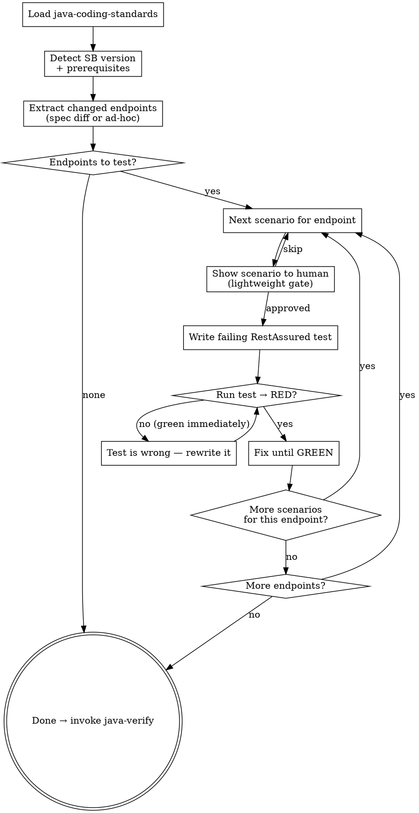
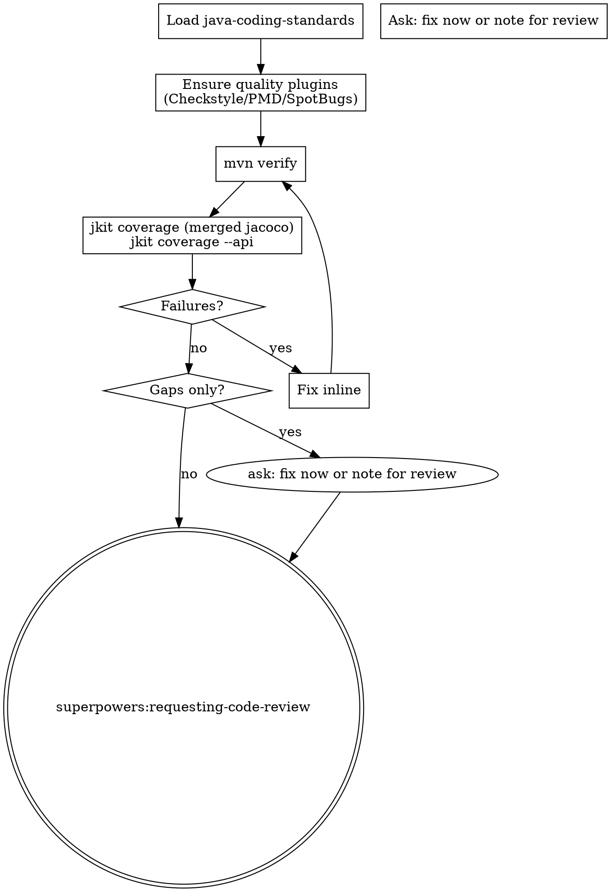

# jkit — Iteration 3: Quality Layer

**Date:** 2026-04-21
**Status:** Draft
**Iteration:** 3 of 4
**Depends on:** Iterations 1–2

---

## Overview

Implements the two skills that complete the quality assurance story after `java-tdd`:

1. **`api-scenarios`** — TDD at the HTTP boundary: one RestAssured scenario at a time, RED → GREEN → next scenario. Invoked by `java-tdd` after unit coverage is complete; also usable standalone per domain.
2. **`java-verify`** — pure quality gate: `mvn verify` (quality plugins + all tests) + merged JaCoCo coverage + API endpoint coverage check + code review handoff.

**Pipeline:**
```
java-tdd (unit TDD + JaCoCo)
  → REQUIRED SUB-SKILL: api-scenarios (integration TDD per domain)
    → REQUIRED SUB-SKILL: java-verify (quality gate + code review)
```

Each skill enforces a single concern. No skill runs twice. No test generation inside the gate.

---

## Deliverables

| File | Purpose |
|------|---------|
| `skills/api-scenarios/SKILL.md` | TDD for API endpoints: one scenario at a time, RED → GREEN |
| `skills/java-verify/SKILL.md` | Quality gate: mvn verify + coverage checks + code review handoff |

---

## `api-scenarios` Skill

### Frontmatter

```yaml
---
name: api-scenarios
description: Use when generating API scenario integration tests for a specific domain after its endpoints are implemented.
---
```

### Skill Type: Discipline-Enforcing

**Announcement:** At start: *"I'm using the api-scenarios skill to implement integration tests for the [domain] domain via TDD."*

### Iron Law

```
NO INTEGRATION TEST WITHOUT A FAILING HTTP TEST FIRST.

Write the RestAssured assertion after the endpoint already passes? Delete it. Start over.

No exceptions:
- Don't generate multiple tests at once then fix failures
- Don't write "placeholder" tests that always pass
- One scenario → RED → GREEN → next scenario
```

### Rationalization Table

| Excuse | Reality |
|--------|---------|
| "The unit tests already cover this logic" | Unit tests mock HTTP. Integration tests verify the actual endpoint wires correctly end-to-end. |
| "I'll write all scenarios first, then run them" | Batch generation produces batch failures. You lose the signal of which scenario caused what. |
| "The happy path passes, the error cases are obvious" | Auth failures, validation edge cases, and missing headers are where bugs live. Write the test. |
| "This endpoint is simple, one test is enough" | Each scenario is a contract. Simple endpoints have the same contract obligations. |

### Checklist

- [ ] Load java-coding-standards
- [ ] Detect Spring Boot version + prerequisites
- [ ] Extract changed endpoints
- [ ] TDD loop: per endpoint, per scenario
- [ ] Invoke java-verify

### Process Flow



### Detailed Flow

**Step 0: Load java-coding-standards**

Read `<plugin-root>/docs/java-coding-standards.md`. Apply all rules.

**Step 1: Detect Spring Boot version + prerequisites**

Read `<parent><version>` from `pom.xml`.

| Spring Boot version | Testing strategy |
|---|---|
| 3.1+ | `@SpringBootTest(RANDOM_PORT)` + Testcontainers (`@ServiceConnection`) + RestAssured |
| < 3.1 | `docker-compose.test.yml` → RestAssured against running container |

**Spring Boot 3.1+:** Check `pom.xml` for Testcontainers, RestAssured, WireMock. If missing: add from `templates/pom-fragments/testcontainers.xml`.

**Spring Boot < 3.1:** Resolve container runtime:
1. `docker compose` / `docker-compose`
2. `podman compose`
3. Neither → stop: *"No container runtime found. Install Docker or Podman and re-run."*

Check `docker-compose.test.yml` exists. If missing: copy from `templates/docker-compose.test.yml`.

**Step 2: Extract changed endpoints**

**Spec-delta driven (called by java-tdd):** Read changed domains from the current run's `change-summary.md`. For each changed domain:
```bash
git diff $(cat docs/.spec-sync) HEAD -- docs/domains/<domain>/api-spec.yaml
```
Extract only added or modified endpoints. Unchanged endpoints already have tests — do NOT regenerate.

**Ad-hoc (human-initiated):** Ask which domain and which endpoints to cover.

If no changed API endpoints → complete immediately, invoke `java-verify`.

**Step 3: TDD loop**

For each endpoint, determine scenarios in order:
1. Happy path
2. Input validation failures (400/422) — one per distinct validation rule
3. Auth failures (401/403) where applicable
4. Not found (404) where applicable
5. Business-specific edge cases from `api-spec.yaml`

For each scenario:

**Lightweight gate** — announce before writing:
> "Next: `POST /invoices/bulk` — happy path (valid list of 3 → 201 + invoice IDs). Write this test?
> A) Yes (recommended)
> B) Edit this scenario
> C) Skip endpoint"

**Write the failing test** targeting exactly this scenario. One test method, one assertion.

**Run:**
```bash
# SB 3.1+
JKIT_ENV=test direnv exec . mvn test -Dtest=<Domain>IntegrationTest#<methodName>

# SB < 3.1
<runtime> compose -f docker-compose.test.yml up -d
JKIT_ENV=test direnv exec . mvn test -Dtest=<Domain>IntegrationTest#<methodName>
```

- **RED (compilation or assertion failure):** expected — continue to fix.
- **GREEN immediately:** the test is wrong — it proves nothing. Rewrite it to actually fail.

Fix production code or test setup until GREEN. Then move to next scenario.

**Test class location:** `src/test/java/<group-path>/<service>/<domain>/<Domain>IntegrationTest.java`

**Spring Boot 3.1+ template:**
```java
@SpringBootTest(webEnvironment = SpringBootTest.WebEnvironment.RANDOM_PORT)
@Testcontainers
class BillingIntegrationTest {
    @Container @ServiceConnection
    static PostgreSQLContainer<?> postgres = new PostgreSQLContainer<>("postgres:15");

    @RegisterExtension
    static WireMockExtension externalSvc = WireMockExtension.newInstance()
        .options(wireMockConfig().dynamicPort()).build();

    @LocalServerPort int port;
    @BeforeEach void setup() { RestAssured.port = port; }

    @Test void bulkInvoice_happyPath() { /* given/when/then */ }
}
```

**Spring Boot < 3.1 template:**
```java
class BillingIntegrationTest {
    static String baseUri = System.getenv().getOrDefault("SERVICE_BASE_URI", "http://localhost:8080");
    @BeforeAll static void setup() { RestAssured.baseURI = baseUri; }

    @Test void bulkInvoice_happyPath() { /* given/when/then */ }
}
```

**Failure classification:**
- Compilation failure or wrong assertion → fix generated test. Do NOT change production code for a test bug.
- Production code fails the correct assertion → fix production code via `superpowers:systematic-debugging`.
- After one self-fix pass still failing → invoke `superpowers:systematic-debugging`.

**Step 4: Invoke java-verify**

**REQUIRED SUB-SKILL: invoke `java-verify`** after all changed endpoints are covered.

api-scenarios does NOT own the commit. The commit is `java-tdd`'s responsibility.

### Superpowers Integration

| Superpowers skill | How used |
|---|---|
| `superpowers:systematic-debugging` | When production code fails a correct integration test after one self-fix pass |

---

## `java-verify` Skill

### Frontmatter

```yaml
---
name: java-verify
description: Use when verifying all quality gates and coverage after api-scenarios completes, or when explicitly asked to run the full verification suite.
---
```

### Skill Type: Technique/Pattern

**Announcement:** At start: *"I'm using the java-verify skill to run quality gates and coverage checks."*

### Checklist

- [ ] Load java-coding-standards
- [ ] Ensure quality plugins
- [ ] Run mvn verify
- [ ] Check merged JaCoCo coverage
- [ ] Check API endpoint coverage
- [ ] Fix failures or note gaps
- [ ] Invoke requesting-code-review

### Process Flow



### Detailed Flow

**Step 0: Load java-coding-standards**

Read `<plugin-root>/docs/java-coding-standards.md`. Apply all rules.

**Step 1: Ensure quality plugins**

Check `pom.xml` for Checkstyle, PMD, SpotBugs. If missing:
> "Quality plugins not found.
> A) Add from templates/pom-fragments/quality.xml (recommended)
> B) Skip quality gate"

On A: add fragment. Note in final commit message.

**Step 2: Run mvn verify**

```bash
JKIT_ENV=test direnv exec . mvn verify
```

Runs: unit tests → quality gates → integration tests (Failsafe) → JaCoCo dump + merge + report.

Fix failures inline. Repeat until green.

**Step 3: Coverage check**

```bash
# Unit + integration combined (merged jacoco.xml)
bin/jkit coverage target/site/jacoco/jacoco.xml --summary --min-score 1.0

# API endpoint coverage: spec vs test source
bin/jkit coverage --api docs/domains/ src/test/java/
```

**Failures** (tests or quality): fix inline, re-run.

**Gaps only** (coverage below threshold or untested endpoints): ask:
> "Coverage gaps found: [list].
> A) Fix gaps now — run api-scenarios / add unit tests (recommended)
> B) Proceed to code review — I'll note the gaps"

**Step 4: Code review handoff**

java-verify does NOT own the final commit. The commit is `java-tdd`'s responsibility.

**REQUIRED SUB-SKILL: invoke `superpowers:requesting-code-review`.**

### Superpowers Integration

| Superpowers skill | How used |
|---|---|
| `superpowers:requesting-code-review` | Always — final step after all checks pass |

---

## Commit Convention

```
feat: add api-scenarios skill
feat: add java-verify skill
```
