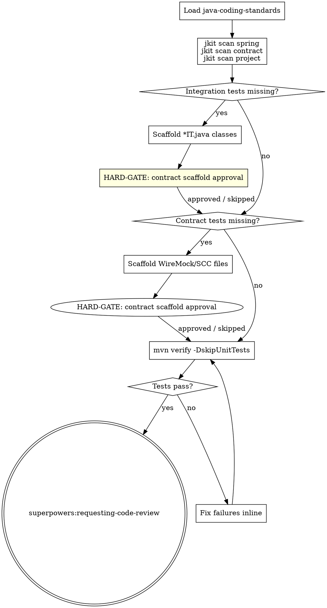
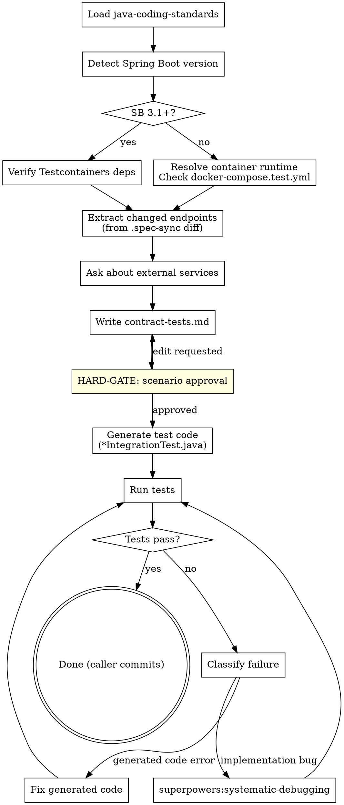

# jkit — Iteration 3: Quality Layer

**Date:** 2026-04-21
**Status:** Draft
**Iteration:** 3 of 4
**Depends on:** Iterations 1–2

---

## Overview

Implements the two skills that complete the quality assurance story after `java-tdd`:

1. **`java-verify`** — scaffolds and runs integration tests and contract tests; final step before code review
2. **`contract-testing`** — generates per-domain API scenario tests from `api-spec.yaml`. **Human-initiated and optional per domain** — invoked via `/contract-testing` after a domain's endpoints are implemented. Not automatically invoked by `java-tdd` or `java-verify`.

After this iteration, the full quality arc is: TDD → quality gate → coverage → `java-verify` (integration + contract scaffolding) → code review → (optionally) `/contract-testing` per domain for full API scenario coverage.

---

## Deliverables

| File | Purpose |
|------|---------|
| `skills/java-verify/SKILL.md` | Integration + contract test scaffolding; REQUIRED SUB-SKILL: requesting-code-review |
| `skills/contract-testing/SKILL.md` | Per-domain API scenario test generation |

---

## `java-verify` Skill

### Frontmatter

```yaml
---
name: java-verify
description: Use when verifying integration and contract test coverage after java-tdd completes, or when running /java-verify directly.
---
```

### Skill Type: Technique/Pattern with HARD-GATEs

**Announcement:** At start: *"I'm using the java-verify skill to check integration and contract test coverage."*

### Checklist

- [ ] Load java-coding-standards
- [ ] jkit scan spring
- [ ] jkit scan contract
- [ ] jkit scan project
- [ ] Scaffold integration tests (if missing)
- [ ] Scaffold contract tests (if missing)
- [ ] Run mvn verify
- [ ] Fix failures

### Process Flow



### Detailed Flow

**Step 0: Load java-coding-standards**

Read `<plugin-root>/docs/java-coding-standards.md`. Apply all rules.

**Step 1: Scan**

```bash
bin/jkit scan spring    # repositories, Feign clients, Kafka consumers/producers
bin/jkit scan contract  # API boundaries: endpoints exposed, Feign clients consumed
bin/jkit scan project   # existing test layers, maven-failsafe, Testcontainers
```

Use JSON output to determine what exists and what needs scaffolding.

**Step 2: Integration tests (if missing)**

If `has_integration_tests: false` in `jkit scan project` output:

1. Add `maven-failsafe-plugin` + Testcontainers from `templates/pom-fragments/testcontainers.xml` if absent
2. For each detected repository, Feign client, and Kafka component: scaffold an `*IT.java` class targeting that component

Scaffold style: **analyze → generate complete test file → write to path**. Not TDD-driven — the infrastructure setup is the hard part, not individual test methods.

Tell human: `"Integration test scaffolds written to src/test/java/.../"`

```
A) Looks good (recommended)
B) Edit — tell me what to change
C) Skip integration tests for now
```

<HARD-GATE>
Do NOT run mvn verify until the human reviews the scaffolded test files.
</HARD-GATE>

On C: continue to step 3.

**Step 3: Contract tests (if missing)**

If `has_contract_tests: false` in `jkit scan project` output:

1. Scaffold WireMock stubs (or Spring Cloud Contract files) for each detected Feign client boundary
2. Write scaffolded contract files

Tell human: `"Contract test scaffolds written to src/test/resources/wiremock/ (or contracts/)"`

```
A) Looks good (recommended)
B) Edit — tell me what to change
C) Skip contract tests for now
```

<HARD-GATE>
Do NOT run mvn verify until the human reviews the scaffolded contract test files.
</HARD-GATE>

On C: continue to step 4.

**Step 4: Run mvn verify**

```bash
JKIT_ENV=test direnv exec . mvn verify -DskipUnitTests
```

Fix failures inline. Repeat until green.

**Step 5: Code review handoff**

java-verify does NOT own the final commit. The commit is `java-tdd`'s responsibility.

**REQUIRED SUB-SKILL: invoke `superpowers:requesting-code-review`** after all verify tests pass.

---

## `contract-testing` Skill

### Frontmatter

```yaml
---
name: contract-testing
description: Use when generating or running API scenario integration tests for a specific domain after its endpoints are implemented.
---
```

### Skill Type: Technique/Pattern with HARD-GATE

**Announcement:** At start: *"I'm using the contract-testing skill to generate API scenario tests for the [domain] domain."*

### Checklist

- [ ] Load java-coding-standards
- [ ] Detect Spring Boot version
- [ ] Resolve container runtime (legacy path)
- [ ] Verify test dependencies
- [ ] Extract changed endpoints from api-spec diff
- [ ] Ask about external dependencies
- [ ] Write contract-tests.md
- [ ] Get scenario approval
- [ ] Generate test code
- [ ] Run tests
- [ ] Fix failures

### Process Flow



### Detailed Flow

**Step 0: Load java-coding-standards**

Read `<plugin-root>/docs/java-coding-standards.md`. Apply all rules.

**Step 1: Detect Spring Boot version**

Read `<parent><version>` from `pom.xml`.

| Spring Boot version | Testing strategy |
|---|---|
| 3.1+ | `@SpringBootTest` + Testcontainers (`@ServiceConnection`) + RestAssured |
| < 3.1 | `docker-compose.test.yml` → RestAssured against running container |

**Step 2: Prerequisites**

**Spring Boot 3.1+:** Check `pom.xml` for Testcontainers, RestAssured, WireMock test deps. If missing: add from `templates/pom-fragments/testcontainers.xml`.

**Spring Boot < 3.1:** Resolve container runtime in order:
1. `docker` (`docker compose` plugin syntax or `docker-compose` standalone)
2. `podman` (`podman compose`)
3. Neither found → stop: *"No container runtime found. Install Docker or Podman and re-run."*

Check `docker-compose.test.yml` exists. If missing: copy from `templates/docker-compose.test.yml`.

**Step 3: Extract changed endpoints**

```bash
git diff $(cat docs/.spec-sync) HEAD -- docs/domains/<name>/api-spec.yaml
```

Extract only **added or modified** endpoints. Unchanged endpoints already have tests — do NOT regenerate.

**Step 4: Ask about external services**

> "Which external services do these endpoints call?
> A) None (recommended if self-contained)
> B) [list detected Feign clients from codebase]"

Use answer to determine which services need WireMock stubs.

**Step 5: Write contract-tests.md**

Write `docs/jkit/<run>/contract-tests.md`:

```markdown
## Contract Tests: billing domain

| Endpoint | Scenario | Input | Expected |
|----------|----------|-------|----------|
| POST /invoices/bulk | happy path | valid list of 3 | 201 + list of invoice IDs |
| POST /invoices/bulk | empty list | [] | 400 validation error |
| POST /invoices/bulk | unauthenticated | no token | 401 |
| POST /invoices/bulk | missing required field | list without amount | 422 |
```

Required scenarios for each endpoint: happy path, input validation failures (400/422), auth failures (401/403), not-found (404) where applicable, business-specific edge cases.

Tell human: `"Written to docs/jkit/<run>/contract-tests.md"`

```
A) Looks good (recommended)
B) Edit — tell me what to change
```

<HARD-GATE>
Do NOT generate any test code until the human approves the scenario table in contract-tests.md.
Test code generated from an unapproved scenario table will be deleted and regenerated.
</HARD-GATE>

**Step 6: Generate test code**

Generate from the **approved** scenario table only.

**≤ ~20 total scenarios:** generate the full test class in one pass.

**> ~20 or multiple controllers:** split by controller — one `*IntegrationTest.java` per controller, sequential. Append a `## Generation Progress` checklist to `contract-tests.md` before starting:
```markdown
## Generation Progress
- [ ] InvoiceController → InvoiceIntegrationTest.java
- [ ] PaymentController → PaymentIntegrationTest.java
```
Mark each `[x]` after generating and testing. Survives context compression.

Test file location: `src/test/java/com/newland/<service>/<domain>/<Domain>IntegrationTest.java`

**Spring Boot 3.1+ test template:**
```java
@SpringBootTest(webEnvironment = SpringBootTest.WebEnvironment.RANDOM_PORT)
@Testcontainers
class BillingIntegrationTest {
    @Container
    @ServiceConnection
    static PostgreSQLContainer<?> postgres = new PostgreSQLContainer<>("postgres:15");

    @RegisterExtension
    static WireMockExtension externalSvc = WireMockExtension.newInstance()
        .options(wireMockConfig().dynamicPort()).build();

    @LocalServerPort int port;

    @BeforeEach void setup() { RestAssured.port = port; }

    @Test void bulkInvoice_happyPath() { /* given/when/then */ }
}
```

**Spring Boot < 3.1 test template:**
```java
class BillingIntegrationTest {
    static String baseUri = System.getenv().getOrDefault("SERVICE_BASE_URI", "http://localhost:8080");

    @BeforeAll static void setup() { RestAssured.baseURI = baseUri; }

    @Test void bulkInvoice_happyPath() { /* given/when/then */ }
}
```

**Step 7: Run tests**

**Spring Boot 3.1+:**
```bash
# One-shot
JKIT_ENV=test direnv exec . mvn test -Dtest=*IntegrationTest
# Per-controller (split mode)
JKIT_ENV=test direnv exec . mvn test -Dtest=<Domain>IntegrationTest
```

**Spring Boot < 3.1:**
```bash
# Start containers (first controller only — reuse for subsequent)
<runtime> compose -f docker-compose.test.yml up -d
JKIT_ENV=test direnv exec . mvn test -Dtest=*IntegrationTest
```

**Step 8: Fix failures**

Classify before acting:

- **Generated code error** (compilation failure, assertion doesn't match approved scenario): fix the generated test inline. Do NOT change the approved scenario table. Re-run.
- **Implementation bug** (test is correct per spec, production code misbehaves): invoke `superpowers:systematic-debugging` targeting the failing endpoint.
- **After one self-fix pass:** if tests still fail for any reason → always invoke `superpowers:systematic-debugging`.

**Ownership:** contract-testing does NOT own the commit. The caller (`java-tdd` via its final commit, or the human directly) is responsible.

---

## Commit Convention

This iteration is delivered as two commits (one per skill, or combined):

```
feat: add java-verify skill
feat: add contract-testing skill
```
