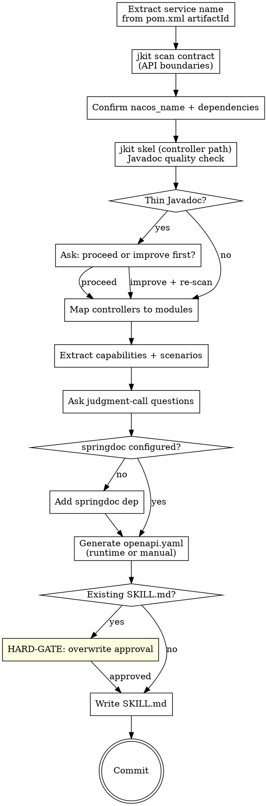

# jkit — Iteration 4: Discoverability

**Date:** 2026-04-21
**Status:** Draft
**Iteration:** 4 of 4
**Depends on:** Iterations 1–3

---

## Overview

Implements the final skill that makes a service callable by other teams:

**`publish-contract`** — generates a `SKILL.md` for this microservice (so other Claude instances working in other repos can call it correctly) and a reference `openapi.yaml`. Renamed from `publishing-service-contract` for brevity. Inline Javadoc quality check using `jkit skel` (no dependency on the removed `comment` skill).

---

## Deliverables

| File | Purpose |
|------|---------|
| `skills/publish-contract/SKILL.md` | Service SKILL.md + openapi.yaml generation |

---

## `publish-contract` Skill

### Frontmatter

```yaml
---
name: publish-contract
description: Use when the user runs /publish-contract, or after implementing new or changed API endpoints, to generate a SKILL.md and openapi.yaml so other microservices can call this one correctly.
---
```

### Skill Type: Technique/Pattern

**Announcement:** At start: *"I'm using the publish-contract skill to generate the service contract for other teams."*

### Checklist

- [ ] Extract Maven metadata
- [ ] Confirm nacos_name and dependencies
- [ ] Scan controller path
- [ ] Javadoc quality check
- [ ] Map controllers to modules
- [ ] Extract capabilities and scenarios
- [ ] Ask judgment-call questions
- [ ] Determine output structure
- [ ] Generate openapi.yaml
- [ ] Write SKILL.md

### Process Flow



### Detailed Flow

**Step 1: Extract Maven metadata**

Read from `pom.xml`:
- `<artifactId>` → service name
- `<groupId>` → group (for package path)
- `<parent><artifactId>` → parent project (for nacos context if applicable)

**Step 2: Scan contract boundaries**

```bash
bin/jkit scan contract
```

Output: exposed API endpoints + consumed Feign clients. Use this to understand what the service produces and what it depends on.

**Step 3: Confirm nacos_name and dependencies**

Ask:
> "What is the Nacos service name for this service?
> A) `<artifactId>` (recommended — derived from pom.xml)
> B) Other — tell me the name"

If the service consumes Feign clients:
> "The service calls [FeignClientA, FeignClientB]. Should these appear in the SKILL.md as dependencies?
> A) Yes — include as dependencies (recommended)
> B) No — internal detail, don't expose"

**Step 4: Javadoc quality check**

```bash
bin/jkit skel src/main/java/com/newland/<service>/api/
```

Scan the output for undocumented or thinly documented controller methods (missing `@param`, missing `@return`, placeholder comments like "TODO" or method-name restatements).

If quality is thin:
> "Controller Javadoc is sparse — the generated SKILL.md will have low-quality endpoint descriptions.
> A) Improve Javadoc first — I'll update the controller comments, then re-scan (recommended)
> B) Proceed with current quality — I understand the SKILL.md will need manual editing"

On A: read each controller, identify thin/missing Javadoc, write improved comments, re-run `jkit skel` to confirm. Do not rewrite correct comments — only fill gaps.

**Step 5: Map controllers to modules**

Group `@RestController` classes by package or URL prefix into logical modules (e.g., `InvoiceController` + `BulkInvoiceController` → `billing` module).

Ask if grouping is ambiguous:
> "Should [ControllerA] and [ControllerB] be in the same module or separate?
> A) Same module — [name] (recommended if sharing the same resource)
> B) Separate modules"

**Step 6: Extract capabilities and scenarios**

For each module: read controller methods + Javadoc + `api-implement-logic.md` → extract:
- Capability summary (what does this module do?)
- Per-endpoint: method, path, request schema, response schema, error codes
- `use_when` guidance (when should callers use this endpoint?)

**Step 7: Ask judgment-call questions**

One at a time, only for genuine ambiguities:
- Authentication mechanism (Bearer token, API key, mTLS?)
- Rate limiting, quotas, or SLAs to document?
- Any endpoints that are internal-only (not for external callers)?

**Step 8: Generate openapi.yaml**

**springdoc-openapi configured in pom.xml:**
```bash
mvn spring-boot:run &
sleep 5
curl -s http://localhost:8080/v3/api-docs -o docs/skills/<service-name>/reference/openapi.yaml
kill %1
```

**springdoc-openapi not configured:**
1. Add dependency from `templates/pom-fragments/springdoc.xml`
2. Run above command
3. Note in commit: "add springdoc-openapi for contract generation"

**If app cannot start** (missing env vars, DB not available): generate openapi.yaml manually from controller signatures + existing api-spec.yaml files in `docs/domains/*/`.

**Step 9: Write SKILL.md**

**If `docs/skills/<service-name>/SKILL.md` already exists:**

Tell human: `"A SKILL.md already exists at docs/skills/<service-name>/SKILL.md."`

```
A) Overwrite with regenerated version (recommended if endpoints changed)
B) Diff only — show me what changed before overwriting
C) Abort
```

<HARD-GATE>
Do NOT overwrite an existing SKILL.md without explicit human approval (option A or B+confirm).
</HARD-GATE>

**SKILL.md format:**

```markdown
---
name: <service-name>
description: Use when calling <service-name> from another service. [One sentence: what this service does and when to use it.]
---

# <service-name>

<One paragraph: what this service does, its primary domain, when other services should call it.>

**Nacos service name:** `<nacos_name>`
**Base URL env var:** `${<SERVICE_NAME_UPPER>_BASE_URL}`

---

## Modules

### <module-name>

<One sentence: what this module handles.>

**URL prefix:** `/api/<prefix>/`

#### POST /path/to/endpoint

**Use when:** [condition that should trigger a call to this endpoint]

**Request:**
```json
{ "field": "type — description" }
```

**Response (201):**
```json
{ "field": "type — description" }
```

**Errors:**
| Status | Condition |
|--------|-----------|
| 400 | Validation failure |
| 401 | Missing/invalid token |
| 404 | Resource not found |

---

## Authentication

[Describe: Bearer token, API key, mTLS, or none.]

## WireMock Stub (for test isolation)

```java
stubFor(post(urlEqualTo("/path/to/endpoint"))
    .willReturn(aResponse()
        .withStatus(201)
        .withHeader("Content-Type", "application/json")
        .withBody("{ ... }")));
```

## Dependencies

[List Feign clients this service calls, if any. Callers may need to stub them in tests.]
```

**Step 10: Commit**

```bash
git add docs/skills/<service-name>/
git commit -m "chore(impl): publish service contract for <service-name>"
```

The `(impl):` scope triggers the post-commit hook to update `docs/.spec-sync`.

---

## Output Location

```
docs/skills/
  <service-name>/
    SKILL.md           ← the published contract
    reference/
      openapi.yaml     ← always generated
```

This directory is committed to the service's repo so other teams can read it without installing anything.

---

## Commit Convention

```
feat: add publish-contract skill
```
