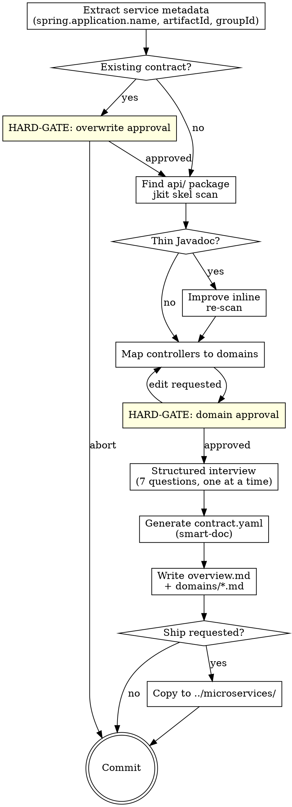

# jkit — Iteration 4: Discoverability

**Date:** 2026-04-21
**Status:** Draft
**Iteration:** 4 of 4
**Depends on:** Iterations 1–3

---

## Overview

Implements the final skill that makes a service callable by other teams:

**`publish-contract`** — generates a **4-level progressive disclosure contract** for a Java microservice so other Claude instances in other repos can route to the right service, domain, and API without loading everything at once:

| Level | File | When read | Answers |
|---|---|---|---|
| 1 | `overview.md` frontmatter | Hook-injected every session | Is this the right service? |
| 2 | `overview.md` body | When service is selected | Is this the right domain? |
| 3 | `domains/{name}.md` | When domain is selected | Is this the right API? |
| 4 | `reference/contract.yaml` | When API is selected (grepped) | What are the schemas? |

Uses **smart-doc** (static analysis) for contract.yaml generation — no need to run the app. Uses `jkit skel` for controller signature scanning. No dependency on the removed `comment` skill — Javadoc improvement is done inline.

---

## Deliverables

| File | Purpose |
|------|---------|
| `skills/publish-contract/SKILL.md` | 4-level progressive disclosure contract generation |

---

## `publish-contract` Skill

### Frontmatter

```yaml
---
name: publish-contract
description: Use when publishing the service API contract for other microservices, or after implementing new or changed API endpoints.
---
```

### Skill Type: Technique/Pattern with HARD-GATEs

**Announcement:** At start: *"I'm using the publish-contract skill to generate the service contract for other teams."*

### Checklist

- [ ] Extract service metadata
- [ ] Check for existing contract
- [ ] Find and confirm controller path
- [ ] Scan with jkit skel
- [ ] Javadoc quality check
- [ ] Map controllers to domains
- [ ] Structured interview (7 questions)
- [ ] Generate contract.yaml (smart-doc)
- [ ] Write overview.md + domains/*.md
- [ ] Optional: ship to shared location
- [ ] Commit

### Process Flow



### Detailed Flow

**Step 1: Extract service metadata**

```bash
grep -rh "spring\.application\.name" src/main/resources/ 2>/dev/null | head -1
```

Extract the value:
- YAML: `name: value` or `spring.application.name: value`
- Properties: `spring.application.name=value`

If found → use as both `{service-name}` and registry name. Confirm:
> "Found `spring.application.name={value}`. Using as service and registry name — correct?"

If not found → read `<artifactId>` from `pom.xml` as `{service-name}`, then ask:
> "Defaulting registry name to `{service-name}`. Is that correct?"

Also extract from `pom.xml`: `<groupId>`, `<version>`, `<parent><artifactId>` (for SDK check in Step 5).

**Step 2: Check for existing contract**

If `docs/contracts/{service-name}/` exists:

Tell human: `"A contract for {service-name} already exists at docs/contracts/{service-name}/"`

```
A) Overwrite with regenerated version (recommended if endpoints changed)
B) Diff only — show me what changed before overwriting
C) Abort
```

<HARD-GATE>
Do NOT overwrite an existing contract without explicit human approval (option A or B+confirm).
</HARD-GATE>

**Step 3: Find controller path and scan**

Locate the `api` package:
```bash
find src/main/java -type d -name api
```

- Exactly one found → confirm: *"Found api package at `{path}`. Using this — correct?"*
- Multiple found → list and ask the user to choose
- None found → stop: *"Could not find an `api` package under `src/main/java/`. Please specify the controller path."*

Scan with jkit skel:
```bash
bin/jkit skel "src/main/java/${GROUP_PATH}/${SERVICE}/api/"
```

From JSON output: identify classes with `@RestController` or `@Controller` annotation, and their public methods.

**Step 4: Javadoc quality check**

For every public method, check `has_docstring` and `docstring_text`. Insufficient if any:
- `has_docstring` is false
- `docstring_text` is null or empty
- `docstring_text` only restates the method name (e.g., method `getUserById`, docstring says "Gets user by id")

If ANY method has missing or insufficient Javadoc:

> "Controller Javadoc is sparse — the generated contract will have low-quality endpoint descriptions.
> A) Improve Javadoc inline — I'll update the controller comments, then re-scan (recommended)
> B) Proceed with current quality — I understand the contract will need manual editing"

On A: read each controller, identify thin/missing Javadoc, write improved comments. Do not rewrite correct comments — only fill gaps. Re-run `jkit skel` to confirm. Do not use pre-improvement signature data after re-scan.

**Step 5: Map controllers to domains**

One controller file = one domain (strip `Controller` suffix: `InvoiceController` → `invoice`).

Exception: if two files share the same domain prefix (`OrderQueryController` + `OrderCommandController`), propose merging into one `order` domain.

Present proposed domain list:
> "I'll organize this service into the following domains:
> 1. `invoice` — from InvoiceController.java
> 2. `payment` — from PaymentController.java
> Does this look correct? You can rename, merge, or split domains."

<HARD-GATE>
Do NOT generate any output until the human confirms the domain mapping.
The confirmed domain list is the authoritative input for all output generation.
</HARD-GATE>

**Step 6: Structured interview**

Ask one at a time. Always offer a draft — never ask open-ended when a draft is possible.

1. **`description`** — draft from class-level Javadoc:
   > "Draft description: '[draft]'. Does this capture what the service does?"

2. **`use_when`** — infer 2–4 scenarios from capability names:
   > "Draft scenarios for when to call this service:
   > - [scenario 1]
   > - [scenario 2]
   > Add, remove, or reword."

3. **`invariants`** — draft from Javadoc preconditions and `@throws`:
   > "Draft invariants from Javadoc:
   > - [invariant 1]
   > Are these correct? Add or remove any."
   If no basis for inference: *"What business rules always hold for this service?"*

4. **`keywords`** — draft from module names and prominent Javadoc nouns:
   > "Draft keywords: [draft list]. Correct or add?"

5. **`not_responsible_for`** — infer what adjacent domains this service name implies it does NOT own:
   > "Based on this service's scope, I'd suggest it is NOT responsible for:
   > - [domain 1]
   > Confirm, edit, or answer 'none'."

6. **`SDK`** — check parent `pom.xml` for a `<module>` entry matching `{service-name}-api` or ending in `-api`:
   - Found → *"Found Feign client module `{module}`. SDK will be `{groupId}:{module}:{version}` — correct?"*
   - Not found → *"No SDK module found. Is there a Feign client artifact, or is this service called directly via HTTP?"*

7. **`authentication`** — draft from Javadoc security annotations or ask:
   > "What authentication does this service require?
   > A) Bearer token (recommended if using Spring Security)
   > B) API key
   > C) mTLS
   > D) None / internal only"

**Step 7: Generate contract.yaml**

**Phase 1 — Add smart-doc plugin if missing:**

Check `pom.xml` for `smart-doc-maven-plugin`. If absent, add:
```xml
<plugin>
    <groupId>com.ly.smart-doc</groupId>
    <artifactId>smart-doc-maven-plugin</artifactId>
    <version>3.0.9</version>
    <configuration>
        <configFile>./smart-doc.json</configFile>
    </configuration>
</plugin>
```

**Phase 2 — Write smart-doc.json:**

Derive `{package-filter}` from the api package path (e.g., `src/main/java/com/example/myservice/api` → `com.example.myservice.api`).

If SDK module confirmed in Step 6:
```json
{
  "outPath": "docs/contracts/{service-name}/reference",
  "openApiAllInOne": true,
  "packageFilters": "{package-filter}",
  "sourceCodePaths": [
    {"path": "src/main/java", "desc": "{service-name} service"},
    {"path": "../{sdk-module}/src/main/java", "desc": "{sdk-module}"}
  ]
}
```

If no SDK module:
```json
{
  "outPath": "docs/contracts/{service-name}/reference",
  "openApiAllInOne": true,
  "packageFilters": "{package-filter}",
  "sourceCodePaths": [
    {"path": "src/main/java", "desc": "{service-name} service"}
  ]
}
```

If `smart-doc.json` already exists: merge only `outPath`, `openApiAllInOne`, `sourceCodePaths` — preserve all other fields verbatim.

**Phase 3 — Generate and convert:**

```bash
mvn smart-doc:openapi
```

Smart-doc outputs JSON. Convert to YAML:
```bash
# Preferred
yq -o yaml -P docs/contracts/{service-name}/reference/openapi.json \
  > docs/contracts/{service-name}/reference/contract.yaml

# Fallback (Python)
python3 -c "
import json, yaml
with open('docs/contracts/{service-name}/reference/openapi.json') as f:
    data = json.load(f)
with open('docs/contracts/{service-name}/reference/contract.yaml', 'w') as f:
    yaml.dump(data, f, default_flow_style=False, allow_unicode=True, sort_keys=False)
"
rm docs/contracts/{service-name}/reference/openapi.json
```

If `mvn smart-doc:openapi` fails or `contract.yaml` is absent → show last 20 lines of Maven output and stop: *"Smart-doc generation failed. Please resolve and re-run."*

**Step 8: Write output files**

**`docs/contracts/{service-name}/overview.md`:**

```markdown
---
service: {service-name}
description: {confirmed description — one sentence}

keywords:
  - {keyword}

use_when:
  - {scenario}

not_responsible_for:
  - {domain}
---

## Overview

{2–3 sentences: service responsibility and integration context}

**Registry name:** `{registry-name}`

---

## Domains

### {domain-name}
{One sentence: what this domain handles. Include "NOT for X" if another domain could be confused.}
→ Read [`domains/{domain-name}.md`](domains/{domain-name}.md)

---

## Cross-Domain Relations

{Relations drawn from Javadoc, or "N/A — single domain service."}

---

## SDK

```xml
<dependency>
    <groupId>{group-id}</groupId>
    <artifactId>{sdk-artifact}</artifactId>
    <version>{version}</version>
</dependency>
```
```

Omit `not_responsible_for` block if user answered "none". Omit `## SDK` section if no SDK exists.

**`docs/contracts/{service-name}/domains/{domain-name}.md` (one per domain):**

API entry rules:
- Mark 1–2 entries per domain with `⭐` (primary entry points — prefer state-changing methods)
- Business name = what the operation does (e.g., `create-invoice`), not the method name
- Each entry answers: **What does it do?** + **When to call?** + **When NOT to call?** (only if another API could be confused)
- Add `Requires:` only when there is a hard precondition Claude must verify before calling

```markdown
# Domain: {Domain Name}

## Summary

{2–3 sentences: what this domain handles, when to use it, and what NOT to use it for.}

## APIs

- ⭐ `{METHOD} {path}` — **{business-name}**
  {What this API does and returns, one sentence.}
  Use when {situation}. NOT for {similar situation that belongs elsewhere}.
  Requires: {hard precondition, if any}.

- `{METHOD} {path}` — **{business-name}**
  {What this API does and returns, one sentence.}
  Use when {situation}.

**API Source:** `{fully.qualified.ClassName}`

## Notes

- {invariant or precondition confirmed in interview}
```

**Step 9: Ship (optional)**

Only if the user included "ship" in their request.

```bash
cp -r docs/contracts/{service-name} ../microservices/{service-name}
```

If `../microservices/` does not exist → stop: *"Cannot ship: `../microservices/` not found. Copy manually from `docs/contracts/{service-name}/`."*

If `../microservices/{service-name}` already exists → ask:
```
A) Overwrite (recommended if contract changed)
B) Abort
```

**Step 10: Commit**

`smart-doc.json` is a build config for this microservice — commit it separately if newly created:
```bash
# If smart-doc.json was newly created this run
git add smart-doc.json pom.xml
git commit -m "chore(impl): add smart-doc configuration"
```

Commit the contract output separately:
```bash
git add docs/contracts/{service-name}/
git commit -m "chore(impl): publish service contract for {service-name}"
```

The `(impl):` scope triggers the post-commit hook to update `.jkit/spec-sync`.

---

## Output Location

**Context:** `publish-contract` runs inside a **microservice project** (not the jkit plugin repo). Output goes into that service's own repository.

```
<microservice-repo>/
  docs/contracts/
    <service-name>/
      overview.md              ← Level 1+2: hook-injected frontmatter + domain routing
      domains/
        <domain-name>.md       ← Level 3: API list per domain
      reference/
        contract.yaml          ← Level 4: full OpenAPI schemas (grepped on demand)
  smart-doc.json               ← build config, stays in microservice repo only
```

**What gets shipped to the consuming repo** (Step 9 ship, or manual copy):
```
docs/contracts/<service-name>/   ← only this directory
```

`smart-doc.json` and `pom.xml` changes stay in the microservice repo. Never shipped.

---

## Commit Convention

```
feat: add publish-contract skill
```
