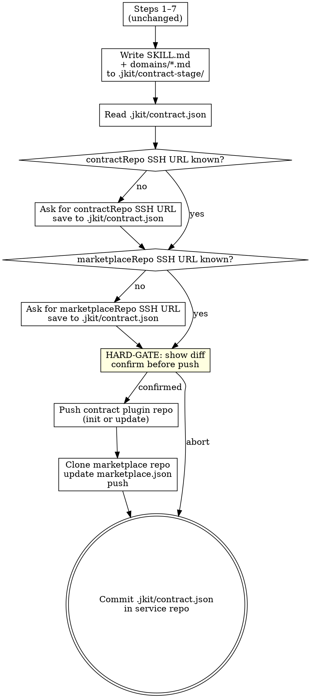
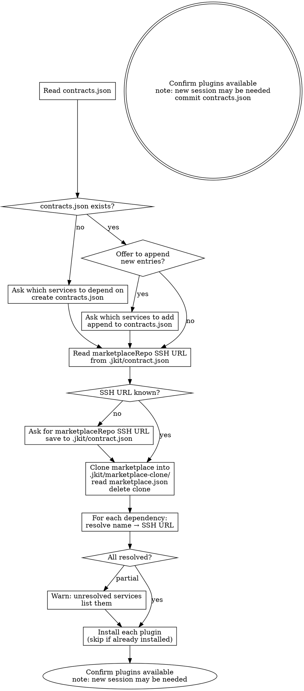
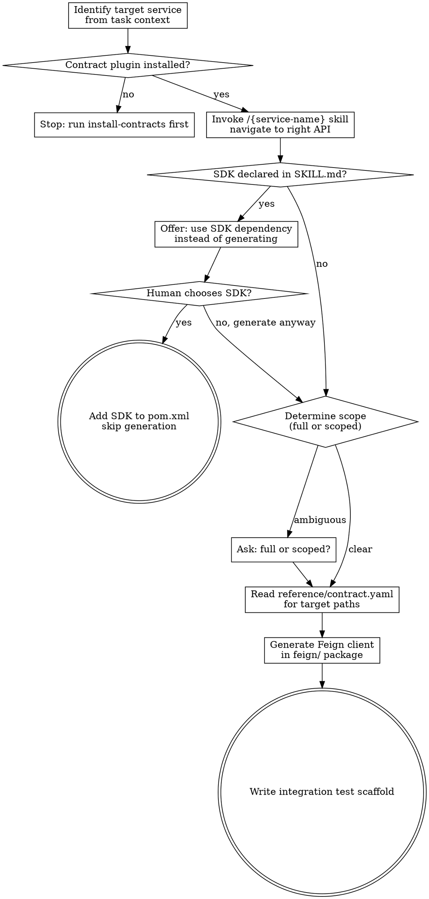

# jkit — Iteration 5: Service Contract Marketplace

**Date:** 2026-04-22
**Status:** Draft
**Iteration:** 5 of 5
**Depends on:** Iteration 4 (Discoverability)

---

## Overview

Extends `publish-contract` to publish service contracts as standard Claude Code plugin repos on GitHub and register them in an org-wide marketplace. Adds two new consumer-side skills: `install-contracts` for declaring and installing service dependencies, and `generate-feign` for generating Feign clients from installed contracts.

**Key architectural changes from Iteration 4:**

| Before (iter4) | After (iter5) |
|---|---|
| Contract files live in `docs/contracts/{service}/` | Contract files live in a dedicated GitHub plugin repo |
| `overview.md` hook-injected from local filesystem | `SKILL.md` invoked on demand via Claude Code plugin |
| Ship step copies to `../microservices/` (fragile shared dir) | Push step commits to GitHub (versioned, team-owned) |
| `ms-tool` CLI reads local `.microservice/` directory | Claude Code plugin system resolves contract skills |
| No consumer-side dependency management | `contracts.json` declares dependencies; `install-contracts` installs them |

---

## Architecture

**Publisher flow** (run once per service, then on every contract change):

```
publish-contract skill
  ├── generates SKILL.md, domains/*.md, reference/contract.yaml
  ├── reads .jkit/contract.json for SSH URLs (asks once, persists)
  ├── pushes → {service-name}-contract GitHub repo (contract plugin)
  └── updates → marketplace GitHub repo (.claude-plugin/marketplace.json)
```

**Consumer flow** (run once per upstream dependency added):

```
jkit install-contracts
  ├── reads contracts.json (dependency list)
  ├── reads marketplace repo → resolves service name → GitHub URL
  └── installs each contract as a Claude Code plugin

Claude session (per task)
  ├── invokes /{service-name} skill → navigates contract (4-level disclosure)
  └── invokes /generate-feign → produces Feign client from contract.yaml
```

---

## Deliverables

| File | Action | Purpose |
|------|--------|---------|
| `skills/publish-contract/SKILL.md` | Update | Add push pipeline; replace `overview.md` with `SKILL.md` generation |
| `skills/install-contracts/SKILL.md` | Create | Declare and install upstream service contract plugins |
| `skills/generate-feign/SKILL.md` | Create | Generate Feign client from an installed contract plugin |

---

## Contract Plugin Repo Structure

Each microservice contract is a standalone GitHub repo (`{service-name}-contract`):

```
{service-name}-contract/
├── .claude-plugin/
│   └── plugin.json              ← Claude Code plugin registration (one skill)
├── skills/
│   └── {service-name}/
│       └── SKILL.md             ← Level 1+2: overview + navigation (replaces overview.md)
├── domains/
│   └── {domain-name}.md         ← Level 3: domain detail (unchanged)
└── reference/
    └── contract.yaml            ← Level 4: full OpenAPI spec (unchanged)
```

**`.claude-plugin/plugin.json`:**

```json
{
  "name": "{service-name}-contract",
  "description": "Service contract for {service-name}",
  "version": "1.0.0",
  "skills": [
    { "name": "{service-name}", "path": "skills/{service-name}" }
  ]
}
```

**`skills/{service-name}/SKILL.md`** (generated by `publish-contract`, replaces `overview.md`):

````markdown
---
name: {service-name}
description: Use when your task involves {use_when summary — one sentence}.
keywords: [{keyword}, ...]
---

## Overview

{2–3 sentences: service responsibility and integration context}

**Not responsible for:** {not_responsible_for list, or omit if none}

---

## Domains

### {domain-name}
{One sentence: what this domain handles.}
→ Read [`domains/{domain-name}.md`](../../domains/{domain-name}.md)

---

## How to navigate this contract

- **Find the right domain:** Read the domain summary above, then open `domains/{domain-name}.md`
- **Find the right API:** The domain file lists all APIs with intent descriptions
- **Get the schema:** Grep `reference/contract.yaml` for the path once the API is identified

## SDK

```xml
<dependency>
    <groupId>{group-id}</groupId>
    <artifactId>{sdk-artifact}</artifactId>
    <version>{version}</version>
</dependency>
```

Omit `## SDK` section if no SDK module exists.
````

**`keywords` field:** Sourced from the structured interview step 4 (keywords confirmed by user). Use domain names and prominent Javadoc nouns as the draft; use exactly the confirmed list from the interview.

**4-level progressive disclosure map:**

| Level | Location | When invoked | Answers |
|---|---|---|---|
| 1 | `SKILL.md` frontmatter | Skill selected | Is this the right service? |
| 2 | `SKILL.md` body | Skill invoked | Is this the right domain? |
| 3 | `domains/{name}.md` | Domain drill-down | Is this the right API? |
| 4 | `reference/contract.yaml` | API resolution (grepped) | What are the schemas? |

---

## Marketplace Repo Structure

One GitHub repo shared across the org:

```
marketplace/
└── .claude-plugin/
    └── marketplace.json         ← registry of all contract plugins
```

**`.claude-plugin/marketplace.json`:**

```json
{
  "name": "{org}-marketplace",
  "description": "Service contract registry for {org} microservices",
  "plugins": [
    {
      "name": "{service-name}",
      "description": "{one-sentence service description}",
      "source": {
        "source": "url",
        "url": "git@github.com:{org}/{service-name}-contract.git"
      }
    }
  ]
}
```

`publish-contract` appends or updates the entry for the current service. The marketplace repo SSH URL is stored once in `.jkit/contract.json`.

---

## `.jkit/contract.json` — SSH URL Persistence

Lives in the microservice repo. Created on first `publish-contract` run; never shipped to the contract plugin repo.

```json
{
  "contractRepo": "git@github.com:{org}/{service-name}-contract.git",
  "marketplaceRepo": "git@github.com:{org}/marketplace.git"
}
```

Both SSH URLs are asked once (one at a time) and persisted. Subsequent `publish-contract` runs read from this file without prompting.

---

## `contracts.json` — Consumer Dependency Declaration

Lives at the **repo root** of a consumer microservice (alongside `pom.xml`). Declares which upstream services this service depends on.

```json
{
  "dependencies": ["{service-name}", "{service-name-2}"]
}
```

Created by `install-contracts` on first run if absent. When `contracts.json` already exists, `install-contracts` offers to append new entries before resolving.

---

## Updated `publish-contract` Skill

### Changes from Iteration 4

Steps 1–7 are unchanged (extract metadata, scan, Javadoc check, domain mapping, structured interview, generate `contract.yaml`).

**Step 8 replaces "Write output files":**

Write `SKILL.md` instead of `overview.md`. `domains/*.md` generation is unchanged.

Output location changes from `docs/contracts/{service-name}/` to a local staging directory `.jkit/contract-stage/{service-name}/` used as the working copy of the contract plugin repo. This directory is **not committed to the service repo** — it is the local git clone of the contract plugin. Add `.jkit/contract-stage/` to `.gitignore` on first run if not already present.

**Steps 9–10 replace "Ship" and "Commit":**

### Updated Checklist

```
Unchanged:
- [ ] Extract service metadata
- [ ] Check for existing contract
- [ ] Find and confirm controller path + jkit skel scan
- [ ] Javadoc quality check
- [ ] Map controllers to domains + HARD-GATE approval
- [ ] Structured interview (7 questions)
- [ ] Generate contract.yaml (smart-doc)

Changed/new:
- [ ] Add .jkit/contract-stage/ to .gitignore if not present
- [ ] Write SKILL.md + domains/*.md to .jkit/contract-stage/{service-name}/
- [ ] Read .jkit/contract.json — if missing, ask for contractRepo SSH URL, save
- [ ] Read .jkit/contract.json — if missing, ask for marketplaceRepo SSH URL, save
- [ ] HARD-GATE: show diff of changes to be pushed, confirm before any git push
- [ ] Push contract plugin repo
- [ ] Push marketplace update
- [ ] Commit .jkit/contract.json in service repo (even if push was aborted at HARD-GATE — SSH URLs are not sensitive)
```

### Updated Process Flow



### Detailed Push Steps

**Push contract plugin repo:**

**First-run detection rule:** If `.jkit/contract-stage/{service-name}/.git/` does not exist, treat as first run. If `.git/` exists but `git -C .jkit/contract-stage/{service-name} remote get-url origin` does not match `contractRepo` in `.jkit/contract.json`, delete the directory entirely and treat as first run. Otherwise treat as subsequent run.

**Remote repo prerequisite:** The GitHub repo at `contractRepo` must be created **empty** (no auto-generated README, license, or `.gitignore`). Before the first push, inform the human: *"The remote repo must be empty — no auto-generated README or license. If you initialized it with files on GitHub, please delete and recreate it without any initial files."*

```bash
# First run: clean init
rm -rf .jkit/contract-stage/{service-name}   # ensure clean state (also handles URL-mismatch case)
mkdir -p .jkit/contract-stage/{service-name}
cd .jkit/contract-stage/{service-name}
git init
git remote add origin {contractRepo}
git add .
git commit -m "chore: publish contract for {service-name}"
git push -u origin main

# Subsequent runs: update
cd .jkit/contract-stage/{service-name}
git pull origin main
# (overwrite with newly generated files)
git add .
git commit -m "chore: update contract for {service-name}"
git push origin main
```

**Update marketplace:**

Use `.jkit/marketplace-clone/` as a stable working directory (consistent with the rest of `.jkit/`):

```bash
# Re-clone each time to avoid stale state
rm -rf .jkit/marketplace-clone
git clone {marketplaceRepo} .jkit/marketplace-clone
cd .jkit/marketplace-clone
# Read .claude-plugin/marketplace.json
# Append or update entry for {service-name}
# Write back
git add .claude-plugin/marketplace.json
git commit -m "chore: register/update {service-name} contract"
git push origin main
```

If the marketplace entry already exists → update `description` and `url` in place. Never duplicate entries. `.jkit/marketplace-clone/` is a temporary clone and must be in `.gitignore`.

**Commit in service repo:**

`.jkit/contract-stage/` and `.jkit/marketplace-clone/` are local working directories — they are **not committed**. Only `.jkit/contract.json` (SSH URLs) and `.gitignore` are committed.

```bash
# smart-doc.json if newly created this run
git add smart-doc.json pom.xml
git commit -m "chore(impl): add smart-doc configuration"

# SSH config + gitignore
git add .jkit/contract.json .gitignore
git commit -m "chore(impl): publish service contract for {service-name}"
```

This commit happens whether or not the push was confirmed at the HARD-GATE. The SSH URLs recorded in `.jkit/contract.json` are not sensitive and are worth preserving regardless.

---

## `install-contracts` Skill

### Frontmatter

```yaml
---
name: install-contracts
description: Use when setting up upstream service dependencies, or when adding a new microservice dependency to the current project.
---
```

### Checklist

- [ ] Read `contracts.json` at repo root — if missing, ask which services to depend on, create it; if present, offer to append new entries before proceeding
- [ ] Read `.jkit/contract.json` for `marketplaceRepo` SSH URL — if missing, ask once, save
- [ ] Clone marketplace into `.jkit/marketplace-clone/`, read `.claude-plugin/marketplace.json`, then delete `.jkit/marketplace-clone/` (read-only use — no stable working copy needed)
- [ ] For each dependency: resolve name → SSH URL → install plugin via Claude Code
- [ ] Warn if any service name is not found in marketplace
- [ ] Confirm installed plugins are available; note that a new Claude session may be required for plugins to activate
- [ ] Commit `contracts.json` to the consumer repo (developer's responsibility — treat it like `pom.xml`)

### Process Flow



### Install Command

```bash
claude plugin install {SSH URL}
```

If a plugin for this service is already installed → skip with a note: *"`{service-name}` already installed — skipping."*

---

## `generate-feign` Skill

### Frontmatter

```yaml
---
name: generate-feign
description: Use when you need to generate a Feign client for an upstream microservice. Requires the service's contract plugin to be installed.
---
```

This skill replaces `generate-openapi` from the previous plugin version. It reads from an installed contract plugin rather than a local `.microservice/` directory.

### Checklist

- [ ] Identify target service from task context
- [ ] Confirm contract plugin is installed (`/{service-name}` skill available)
- [ ] Invoke `/{service-name}` skill to navigate to the right API (levels 1→4)
- [ ] Check SKILL.md for `## SDK` section — if present, offer SDK dependency instead of generating
- [ ] Read `reference/contract.yaml` for the target path(s)
- [ ] Determine generation scope — if not clear from task context, ask: full client or scoped to specific paths/tags?
- [ ] Generate Feign client in `feign/` package
- [ ] Write integration test scaffold

### Process Flow



### Contract Plugin Location

Installed plugins are resolved by Claude Code's plugin system. The skill reads contract files relative to the plugin root:

```
skills/{service-name}/             ← SKILL.md (already loaded)
domains/{domain-name}.md           ← Level 3 — read on demand
reference/contract.yaml            ← Level 4 — grepped for target paths
```

### Generation Rules

- Feign client goes in `src/main/java/{group-path}/feign/{ServiceName}Client.java`
- One interface per service (not one per domain)
- If SDK module exists (declared in SKILL.md `## SDK`): use the SDK dependency instead of generating — confirm with human first
- Scoped generation: only include paths matching the specified prefix or tag
- Integration test scaffold goes in `src/test/java/{group-path}/feign/{ServiceName}ClientTest.java`

---

## End-to-End Workflow

**Publisher side (payment-service team, once):**

```
1. /publish-contract
   → generates SKILL.md, domains/, contract.yaml
   → asks for contractRepo + marketplaceRepo SSH URLs (first time only)
   → pushes payment-service-contract repo
   → updates marketplace.json
```

**Consumer side (order-service team, once per dependency):**

```
2. /install-contracts
   → reads/creates contracts.json: ["payment-service"]
   → resolves payment-service → git@github.com:org/payment-service-contract.git
   → installs plugin

3. /payment-service  (Claude navigates contract)
   → Level 1: is this the right service? ✓
   → Level 2: which domain? → payments
   → Level 3: which API? → POST /api/v1/payments/charge
   → Level 4: grep contract.yaml for schema

4. /generate-feign
   → reads contract.yaml for POST /api/v1/payments/charge
   → generates PaymentServiceClient.java in feign/
   → generates PaymentServiceClientTest.java
```

---

## Commit Convention

```
feat: add install-contracts skill
feat: add generate-feign skill
feat(publish-contract): add GitHub push pipeline and marketplace registration
```
