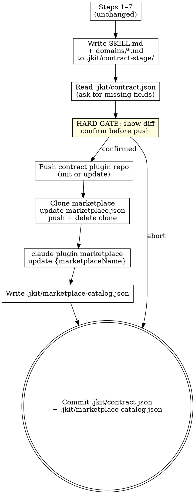
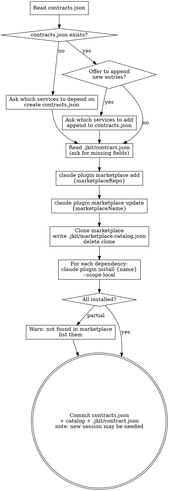
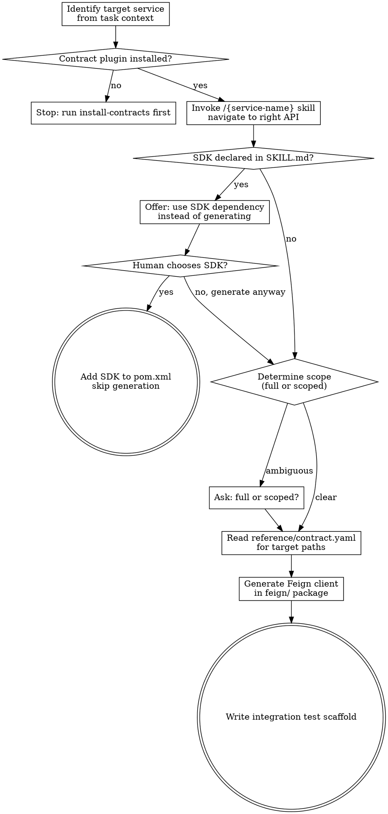

# jkit — Iteration 5: Service Contract Marketplace

**Date:** 2026-04-22
**Status:** Draft
**Iteration:** 5 of 5
**Depends on:** Iteration 4 (Discoverability)

---

## Overview

Extends `publish-contract` to publish service contracts as standard Claude Code plugin repos on GitHub and register them in an org-wide marketplace. Adds two new consumer-side skills: `install-contracts` for declaring and installing service dependencies, and `generate-feign` for generating Feign clients from installed contracts. Extends the session-start hook to inject a marketplace catalog for ambient cross-service discovery.

**Key architectural changes from Iteration 4:**

| Before (iter4) | After (iter5) |
|---|---|
| Contract files live in `docs/contracts/{service}/` | Contract files live in a dedicated GitHub plugin repo |
| `overview.md` hook-injected from local filesystem | `SKILL.md` invoked on demand via Claude Code plugin |
| Ship step copies to `../microservices/` (fragile shared dir) | Push step commits to GitHub (versioned, team-owned) |
| `ms-tool` CLI reads local `.microservice/` directory | Claude Code native plugin commands manage contracts |
| No consumer-side dependency management | `contracts.json` declares dependencies; `install-contracts` installs them |
| No cross-service discovery | Session-start hook injects marketplace catalog for ambient awareness |

---

## Architecture

**Publisher flow** (run once per service, then on every contract change):

```
publish-contract skill
  ├── generates SKILL.md, domains/*.md, reference/contract.yaml
  ├── reads .jkit/contract.json for SSH URLs + marketplace name (asks once, persists)
  ├── pushes → {service-name}-contract GitHub repo (contract plugin)
  ├── updates → marketplace GitHub repo (.claude-plugin/marketplace.json)
  ├── runs: claude plugin marketplace update {marketplaceName}
  └── writes → .jkit/marketplace-catalog.json (session-start hook cache)
```

**Consumer flow** (run once per upstream dependency added):

```
install-contracts skill
  ├── registers marketplace (first time): claude plugin marketplace add {marketplaceRepo}
  ├── reads contracts.json (dependency list)
  ├── refreshes index: claude plugin marketplace update {marketplaceName}
  ├── installs each plugin: claude plugin install {service-name} --scope local
  └── writes → .jkit/marketplace-catalog.json (session-start hook cache)

session-start hook (every session, zero network calls)
  └── reads .jkit/marketplace-catalog.json → injects available contracts into context

Claude session (per task)
  ├── sees injected catalog → spec-delta / any skill can suggest installs
  ├── invokes /{service-name} skill → navigates contract (4-level disclosure)
  └── invokes /generate-feign → produces Feign client from contract.yaml
```

---

## Deliverables

| File | Action | Purpose |
|------|--------|---------|
| `skills/publish-contract/SKILL.md` | Update | Add push pipeline; replace `overview.md` with `SKILL.md` generation; refresh catalog |
| `skills/install-contracts/SKILL.md` | Create | Register marketplace, install contract plugins, refresh catalog |
| `skills/generate-feign/SKILL.md` | Create | Generate Feign client from an installed contract plugin |
| `hooks/session-start` | Update | Inject marketplace catalog from `.jkit/marketplace-catalog.json` |

---

## Contract Plugin Repo Structure

Each microservice contract is a standalone GitHub repo (`{service-name}-contract`):

```
{service-name}-contract/
├── .claude-plugin/
│   └── plugin.json              ← Claude Code plugin registration (one skill)
├── skills/
│   └── {service-name}/
│       └── SKILL.md             ← Level 1+2: overview + navigation (replaces overview.md)
├── domains/
│   └── {domain-name}.md         ← Level 3: domain detail (unchanged)
└── reference/
    └── contract.yaml            ← Level 4: full OpenAPI spec (unchanged)
```

**`.claude-plugin/plugin.json`:**

```json
{
  "name": "{service-name}-contract",
  "description": "Service contract for {service-name}",
  "version": "1.0.0",
  "skills": [
    { "name": "{service-name}", "path": "skills/{service-name}" }
  ]
}
```

**`skills/{service-name}/SKILL.md`** (generated by `publish-contract`, replaces `overview.md`):

````markdown
---
name: {service-name}
description: Use when your task involves {use_when summary — one sentence}.
keywords: [{keyword}, ...]
---

## Overview

{2–3 sentences: service responsibility and integration context}

**Not responsible for:** {not_responsible_for list, or omit if none}

---

## Domains

### {domain-name}
{One sentence: what this domain handles.}
→ Read [`domains/{domain-name}.md`](../../domains/{domain-name}.md)

---

## How to navigate this contract

- **Find the right domain:** Read the domain summary above, then open `domains/{domain-name}.md`
- **Find the right API:** The domain file lists all APIs with intent descriptions
- **Get the schema:** Grep `reference/contract.yaml` for the path once the API is identified

## SDK

```xml
<dependency>
    <groupId>{group-id}</groupId>
    <artifactId>{sdk-artifact}</artifactId>
    <version>{version}</version>
</dependency>
```

Omit `## SDK` section if no SDK module exists.
````

**`keywords` field:** Sourced from the structured interview step 4 (keywords confirmed by user). Use domain names and prominent Javadoc nouns as the draft; use exactly the confirmed list from the interview.

**4-level progressive disclosure map:**

| Level | Location | When invoked | Answers |
|---|---|---|---|
| 1 | `SKILL.md` frontmatter | Skill selected | Is this the right service? |
| 2 | `SKILL.md` body | Skill invoked | Is this the right domain? |
| 3 | `domains/{name}.md` | Domain drill-down | Is this the right API? |
| 4 | `reference/contract.yaml` | API resolution (grepped) | What are the schemas? |

---

## Marketplace Repo Structure

One GitHub repo shared across the org:

```
marketplace/
└── .claude-plugin/
    └── marketplace.json         ← registry of all contract plugins
```

**`.claude-plugin/marketplace.json`:**

```json
{
  "name": "{org}-marketplace",
  "description": "Service contract registry for {org} microservices",
  "plugins": [
    {
      "name": "{service-name}",
      "description": "{one-sentence service description}",
      "source": {
        "source": "url",
        "url": "git@github.com:{org}/{service-name}-contract.git"
      }
    }
  ]
}
```

`publish-contract` appends or updates the entry for the current service. If the entry already exists → update `description` and `url` in place. Never duplicate entries.

---

## `.jkit/contract.json` — Config Persistence

Lives in the microservice repo. Created on first `publish-contract` run; never shipped to the contract plugin repo.

```json
{
  "contractRepo": "git@github.com:{org}/{service-name}-contract.git",
  "marketplaceRepo": "git@github.com:{org}/marketplace.git",
  "marketplaceName": "{org}-marketplace"
}
```

All three fields are asked once (one at a time) and persisted. `marketplaceName` is the name field from `marketplace.json` — used for `claude plugin marketplace update {marketplaceName}`. Subsequent runs read from this file without prompting.

---

## `.jkit/marketplace-catalog.json` — Session-Start Hook Cache

A local cache of the marketplace catalog written by both `publish-contract` and `install-contracts`. Read by the session-start hook at zero network cost. Committed to the service repo so all team members share the same known-contracts state.

```json
{
  "marketplaceName": "{org}-marketplace",
  "updatedAt": "2026-04-22T10:00:00Z",
  "contracts": [
    {
      "name": "payment-service",
      "description": "Use when your task involves payment processing, billing, or subscription data.",
      "keywords": ["billing", "charge", "subscription", "invoice"]
    },
    {
      "name": "user-service",
      "description": "Use when your task involves user profiles, authentication, or permissions.",
      "keywords": ["user", "auth", "profile", "permission"]
    }
  ]
}
```

**How it stays current:** Written (not read) by `publish-contract` after pushing, and by `install-contracts` after updating the marketplace index. The hook never writes — only reads.

---

## `contracts.json` — Consumer Dependency Declaration

Lives at the **repo root** of a consumer microservice (alongside `pom.xml`). Declares which upstream services this service depends on.

```json
{
  "dependencies": ["{service-name}", "{service-name-2}"]
}
```

Created by `install-contracts` on first run if absent. When `contracts.json` already exists, `install-contracts` offers to append new entries before proceeding. Committed to the service repo — treat it like `pom.xml`.

---

## Session-Start Hook Extension

The existing `hooks/session-start` is extended with one additional step at the end:

```
if .jkit/marketplace-catalog.json exists:
    read catalog
    read contracts.json (installed list, if present)
    inject into session context
```

**Injected context format:**

```
## Available Service Contracts

payment-service — Payment processing, billing, subscriptions
  keywords: billing, charge, subscription, invoice
user-service    — User profiles, authentication
  keywords: user, auth, profile, permission

Installed in this project: payment-service
Not yet installed: user-service
```

**Design principles:**
- **Zero network calls** — reads only from local `.jkit/marketplace-catalog.json`
- **Always injected** — any skill can use this context, not just `spec-delta`
- **Silent on missing catalog** — if `.jkit/marketplace-catalog.json` does not exist, skip without error
- **`spec-delta` uses it for discovery** — scans the spec delta for domain terms, matches against injected keywords, suggests installs before planning

---

## Updated `publish-contract` Skill

### Changes from Iteration 4

Steps 1–7 are unchanged (extract metadata, scan, Javadoc check, domain mapping, structured interview, generate `contract.yaml`).

**Step 8 replaces "Write output files":**

Write `SKILL.md` instead of `overview.md`. `domains/*.md` generation is unchanged.

Output location changes from `docs/contracts/{service-name}/` to a local staging directory `.jkit/contract-stage/{service-name}/` used as the working copy of the contract plugin repo. This directory is **not committed to the service repo** — add `.jkit/contract-stage/` to `.gitignore` on first run if not already present.

**Steps 9–11 replace "Ship" and "Commit":**

### Updated Checklist

```
Unchanged:
- [ ] Extract service metadata
- [ ] Check for existing contract
- [ ] Find and confirm controller path + jkit skel scan
- [ ] Javadoc quality check
- [ ] Map controllers to domains + HARD-GATE approval
- [ ] Structured interview (7 questions)
- [ ] Generate contract.yaml (smart-doc)

Changed/new:
- [ ] Add .jkit/contract-stage/ to .gitignore if not present
- [ ] Write SKILL.md + domains/*.md to .jkit/contract-stage/{service-name}/
- [ ] Read .jkit/contract.json — if missing, ask for contractRepo SSH URL, save
- [ ] Read .jkit/contract.json — if missing, ask for marketplaceRepo SSH URL, save
- [ ] Read .jkit/contract.json — if missing, ask for marketplaceName, save
- [ ] HARD-GATE: show diff of changes to be pushed, confirm before any git push
- [ ] Push contract plugin repo
- [ ] Clone marketplace, update marketplace.json, push, delete clone
- [ ] Run: claude plugin marketplace update {marketplaceName}
- [ ] Write .jkit/marketplace-catalog.json from updated marketplace.json
- [ ] Commit .jkit/contract.json + .jkit/marketplace-catalog.json in service repo
```

### Updated Process Flow



### Detailed Push Steps

**Push contract plugin repo:**

**First-run detection rule:** If `.jkit/contract-stage/{service-name}/.git/` does not exist, treat as first run. If `.git/` exists but `git -C .jkit/contract-stage/{service-name} remote get-url origin` does not match `contractRepo` in `.jkit/contract.json`, delete the directory entirely and treat as first run. Otherwise treat as subsequent run.

**Remote repo prerequisite:** The GitHub repo at `contractRepo` must be created **empty** (no auto-generated README, license, or `.gitignore`). Before the first push, inform the human: *"The remote repo must be empty — no auto-generated README or license. If you initialized it with files on GitHub, please delete and recreate it without any initial files."*

```bash
# First run: clean init
rm -rf .jkit/contract-stage/{service-name}   # ensure clean state (also handles URL-mismatch case)
mkdir -p .jkit/contract-stage/{service-name}
cd .jkit/contract-stage/{service-name}
git init
git remote add origin {contractRepo}
git add .
git commit -m "chore: publish contract for {service-name}"
git push -u origin main

# Subsequent runs: update
cd .jkit/contract-stage/{service-name}
git pull origin main
# (overwrite with newly generated files)
git add .
git commit -m "chore: update contract for {service-name}"
git push origin main
```

**Update marketplace:**

```bash
rm -rf .jkit/marketplace-clone
git clone {marketplaceRepo} .jkit/marketplace-clone
# Read .jkit/marketplace-clone/.claude-plugin/marketplace.json
# Append or update entry for {service-name} (never duplicate)
# Write back
cd .jkit/marketplace-clone
git add .claude-plugin/marketplace.json
git commit -m "chore: register/update {service-name} contract"
git push origin main
cd -
rm -rf .jkit/marketplace-clone
```

**Refresh Claude Code index and write local catalog:**

```bash
claude plugin marketplace update {marketplaceName}
```

Then write `.jkit/marketplace-catalog.json` from the updated `marketplace.json` content — extract `name`, `description`, and `keywords` (read from each contract plugin's SKILL.md frontmatter if available, otherwise use marketplace entry `description` only).

**Commit in service repo:**

`.jkit/contract-stage/` and `.jkit/marketplace-clone/` are local working directories — not committed. Only `.jkit/contract.json`, `.jkit/marketplace-catalog.json`, and `.gitignore` are committed.

```bash
# smart-doc.json if newly created this run
git add smart-doc.json pom.xml
git commit -m "chore(impl): add smart-doc configuration"

# SSH config + catalog + gitignore
git add .jkit/contract.json .jkit/marketplace-catalog.json .gitignore
git commit -m "chore(impl): publish service contract for {service-name}"
```

This commit happens whether or not the push was confirmed at the HARD-GATE. The SSH URLs and catalog recorded in `.jkit/` are not sensitive and are worth preserving regardless.

---

## `install-contracts` Skill

### Frontmatter

```yaml
---
name: install-contracts
description: Use when setting up upstream service dependencies, or when adding a new microservice dependency to the current project.
---
```

### Checklist

- [ ] Read `contracts.json` at repo root — if missing, ask which services to depend on, create it; if present, offer to append new entries before proceeding
- [ ] Read `.jkit/contract.json` for `marketplaceRepo`, `marketplaceName` — if missing, ask once, save
- [ ] Register marketplace if not already registered: `claude plugin marketplace add {marketplaceRepo}`
- [ ] Refresh marketplace index: `claude plugin marketplace update {marketplaceName}`
- [ ] Clone marketplace, read `.claude-plugin/marketplace.json`, write `.jkit/marketplace-catalog.json`, delete clone
- [ ] For each dependency: `claude plugin install {service-name} --scope local`
- [ ] Warn if any service name is not found in marketplace
- [ ] Confirm installed plugins are available; note that a new Claude session may be required for plugins to activate
- [ ] Commit `contracts.json` + `.jkit/marketplace-catalog.json` + `.jkit/contract.json` to the consumer repo

### Process Flow



### Commands

```bash
# Register marketplace (first time — idempotent if already registered)
claude plugin marketplace add {marketplaceRepo}

# Refresh marketplace index
claude plugin marketplace update {marketplaceName}

# Install a contract plugin (project-scoped)
claude plugin install {service-name} --scope local
```

`--scope local` installs into the project's `.claude/settings.json`. Use `--scope user` only if the developer wants a contract globally available across all projects.

---

## `generate-feign` Skill

### Frontmatter

```yaml
---
name: generate-feign
description: Use when you need to generate a Feign client for an upstream microservice. Requires the service's contract plugin to be installed.
---
```

This skill replaces `generate-openapi` from the previous plugin version. It reads from an installed contract plugin rather than a local `.microservice/` directory.

### Checklist

- [ ] Identify target service from task context
- [ ] Confirm contract plugin is installed (`/{service-name}` skill available)
- [ ] Invoke `/{service-name}` skill to navigate to the right API (levels 1→4)
- [ ] Check SKILL.md for `## SDK` section — if present, offer SDK dependency instead of generating
- [ ] Read `reference/contract.yaml` for the target path(s)
- [ ] Determine generation scope — if not clear from task context, ask: full client or scoped to specific paths/tags?
- [ ] Generate Feign client in `feign/` package
- [ ] Write integration test scaffold

### Process Flow



### Contract Plugin Location

Installed plugins are resolved by Claude Code's plugin system. The skill reads contract files relative to the plugin root:

```
skills/{service-name}/             ← SKILL.md (already loaded)
domains/{domain-name}.md           ← Level 3 — read on demand
reference/contract.yaml            ← Level 4 — grepped for target paths
```

### Generation Rules

- Feign client goes in `src/main/java/{group-path}/feign/{ServiceName}Client.java`
- One interface per service (not one per domain)
- If SDK module exists (declared in SKILL.md `## SDK`): use the SDK dependency instead of generating — confirm with human first
- Scoped generation: only include paths matching the specified prefix or tag
- Integration test scaffold goes in `src/test/java/{group-path}/feign/{ServiceName}ClientTest.java`

---

## End-to-End Workflow

**Publisher side (payment-service team, once):**

```
1. /publish-contract
   → generates SKILL.md, domains/, contract.yaml
   → asks for contractRepo + marketplaceRepo SSH URLs + marketplaceName (first time only)
   → pushes payment-service-contract repo
   → updates marketplace.json + runs: claude plugin marketplace update org-marketplace
   → writes .jkit/marketplace-catalog.json
   → commits .jkit/contract.json + .jkit/marketplace-catalog.json
```

**Consumer side (order-service team, once per dependency):**

```
2. /install-contracts
   → reads/creates contracts.json: ["payment-service"]
   → runs: claude plugin marketplace add {marketplaceRepo}  (first time)
   → runs: claude plugin marketplace update org-marketplace
   → runs: claude plugin install payment-service --scope local
   → writes .jkit/marketplace-catalog.json
   → commits contracts.json + .jkit/marketplace-catalog.json

3. Next session start (automatic, zero network)
   → hook reads .jkit/marketplace-catalog.json
   → injects: "payment-service available and installed / user-service available, not installed"

4. /spec-delta  (planning a new feature)
   → sees injected catalog, notices spec mentions "user authentication"
   → suggests: "user-service is in the marketplace but not installed — install before planning?"
   → developer confirms → /install-contracts adds user-service

5. /payment-service  (Claude navigates contract mid-task)
   → Level 1: is this the right service? ✓
   → Level 2: which domain? → payments
   → Level 3: which API? → POST /api/v1/payments/charge
   → Level 4: grep contract.yaml for schema

6. /generate-feign
   → reads contract.yaml for POST /api/v1/payments/charge
   → generates PaymentServiceClient.java in feign/
   → generates PaymentServiceClientTest.java
```

---

## Commit Convention

```
feat: add install-contracts skill
feat: add generate-feign skill
feat(publish-contract): add GitHub push pipeline and marketplace registration
feat(session-start): inject marketplace catalog for cross-service discovery
```
