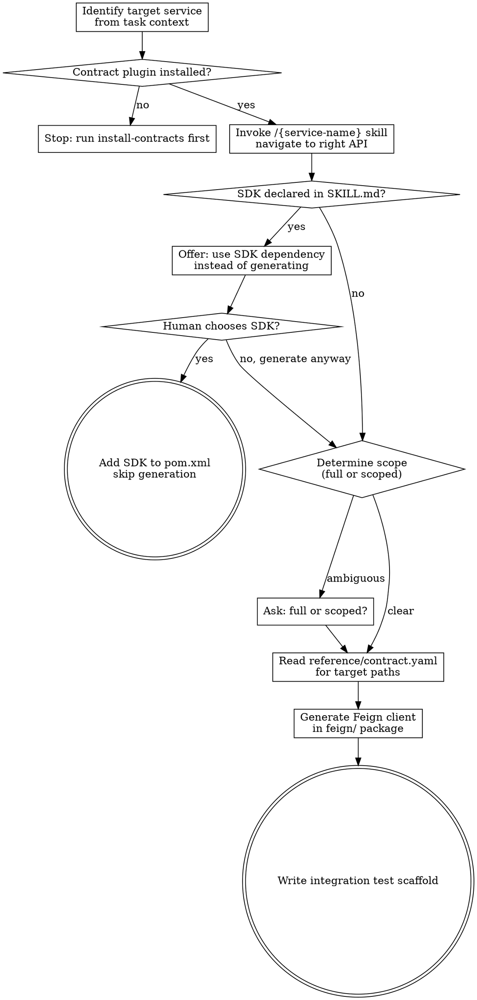

**Announcement:** At start: *"I'm using the generate-feign skill to generate a Feign client from the {service-name} contract."*

## Checklist

- [ ] Identify target service from task context
- [ ] Confirm contract plugin is installed (`/{service-name}` skill available)
- [ ] Invoke `/{service-name}` skill to navigate to the right API (levels 1→4)
- [ ] Check SKILL.md for `## SDK` section — if present, offer SDK dependency instead of generating
- [ ] Read `reference/contract.yaml` for the target path(s)
- [ ] Determine generation scope — if not clear from task context, ask: full client or scoped to specific paths/tags?
- [ ] Generate Feign client in `feign/` package
- [ ] Write integration test scaffold

## Process Flow



## Contract Plugin Location

Installed plugins are resolved by Claude Code's plugin system. Read contract files relative to the plugin root:

```
skills/{service-name}/             ← SKILL.md (already loaded when skill is invoked)
domains/{domain-name}.md           ← Level 3 — read on demand
reference/contract.yaml            ← Level 4 — grepped for target paths
```

## Generation Rules

- Feign client goes in `src/main/java/{group-path}/feign/{ServiceName}Client.java`
- One interface per service (not one per domain)
- If SDK module exists (declared in SKILL.md `## SDK`): offer the SDK dependency first — confirm with human before generating
- Scoped generation: only include paths matching the specified prefix or tag
- Integration test scaffold goes in `src/test/java/{group-path}/feign/{ServiceName}ClientTest.java`
