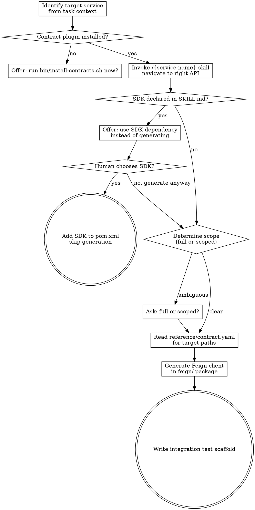

**Announcement:** At start: *"I'm using the generate-feign skill to generate a Feign client from the {service-name} contract."*

## Checklist

- [ ] Identify target service from task context
- [ ] Confirm contract plugin is installed (`/{service-name}` skill available)
- [ ] Invoke `/{service-name}` skill to navigate to the right API (levels 1→4)
- [ ] Check SKILL.md for `## SDK` section — if present, offer SDK dependency instead of generating
- [ ] Read `reference/contract.yaml` for the target path(s)
- [ ] Determine generation scope — if not clear from task context, ask: full client or scoped to specific paths/tags?
- [ ] Generate Feign client in `feign/` package
- [ ] Write integration test scaffold

## Process Flow



## Detailed Flow

**Step 1: Identify target service**

Read the task context to determine which upstream service is needed. If ambiguous, ask: *"Which service do you need a Feign client for?"*

**Step 2: Confirm contract plugin is installed**

Check whether `/{service-name}` skill is available (the contract plugin is installed). If not:

> "Contract plugin for `{service-name}` not found.
> A) Run `install-contracts.sh` now to add it (recommended)
> B) Abort"

On A: run `install-contracts.sh` in the terminal, then continue from Step 3.

**Step 3: Navigate the contract**

**REQUIRED SUB-SKILL: invoke `/{service-name}`** to load the contract. Navigate from SKILL.md (Level 1–2) → `domains/{domain-name}.md` (Level 3) to find the right API. Once identified, grep `reference/contract.yaml` for the path (Level 4) to get request/response schemas.

**Step 4: Check for SDK**

If the contract SKILL.md has a `## SDK` section, offer:
> "An SDK is available: `{groupId}:{artifactId}:{version}`. Add this dependency instead of generating a Feign client?
> A) Use SDK (recommended — fewer files to maintain)
> B) Generate Feign client anyway"

On A: add the dependency to `pom.xml` and stop.

**Step 5: Determine generation scope**

If the task context specifies which endpoints are needed, use that. Otherwise ask:
> "Generate:
> A) Full client — all endpoints in the contract
> B) Scoped — specific path prefix or tag (tell me which)"

**Step 6: Generate Feign client**

Write `src/main/java/{group-path}/feign/{ServiceName}Client.java`:
- One `@FeignClient` interface per service
- Method per endpoint from the identified paths in `reference/contract.yaml`
- Request/response types derived from the contract schemas — create DTOs in `feign/dto/` if no shared types exist

**Step 7: Write integration test scaffold**

Write `src/test/java/{group-path}/feign/{ServiceName}ClientTest.java`:
- One test method per generated client method
- Use WireMock to stub the upstream — stub URLs from `reference/contract.yaml`
- Tests should fail until WireMock stubs are properly configured (RED by default)

## Contract Plugin Location

Installed plugins are resolved by Claude Code's plugin system. Read contract files relative to the plugin root:

```
skills/{service-name}/             ← SKILL.md (already loaded when skill is invoked)
domains/{domain-name}.md           ← Level 3 — read on demand
reference/contract.yaml            ← Level 4 — grepped for target paths
```

## Generation Rules

- Feign client goes in `src/main/java/{group-path}/feign/{ServiceName}Client.java`
- One interface per service (not one per domain)
- If SDK module exists (declared in SKILL.md `## SDK`): offer the SDK dependency first — confirm with human before generating
- Scoped generation: only include paths matching the specified prefix or tag
- Integration test scaffold goes in `src/test/java/{group-path}/feign/{ServiceName}ClientTest.java`
