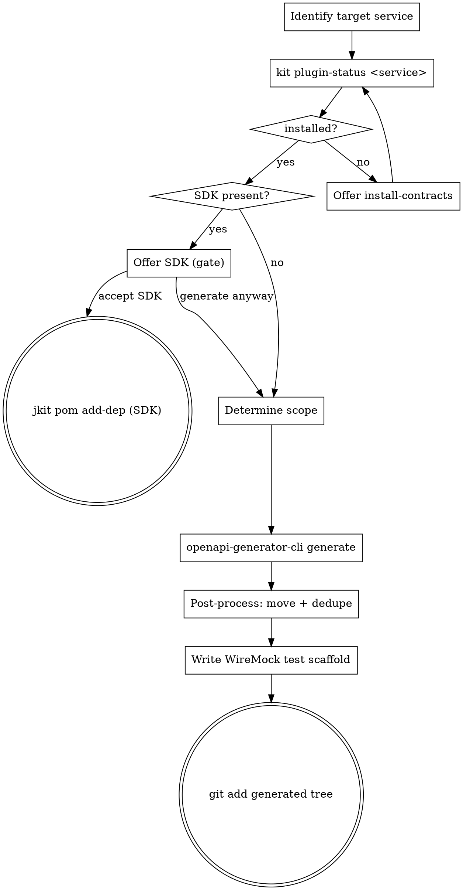

**Announcement:** At start: *"I'm using the generate-feign skill to generate a Feign client from the {service} contract."*

## Iron Law

Generated Feign clients are **regenerable artefacts, not source**. Never hand-edit a generated client — re-running this skill clobbers it. If the output is wrong: fix the upstream contract, fix the generation flags, or pin the contract version. Hand edits will be lost.

## Rationalization Table

| Excuse | Reality |
|--------|---------|
| "I'll just tweak the generated client by hand" | Lost on next regen. Patch the contract or the generator config instead. |
| "Skip the SDK check — generate the Feign client anyway" | If the upstream ships an SDK, you're now maintaining a parallel client that will drift from theirs. Use the SDK. |
| "Re-generation will be fine, the diff will be small" | Re-generation is silent overwrite. There's no merge step. Treat the file as untouchable post-generation. |
| "Auth interceptor isn't part of the contract — skip it" | The generated client won't talk to a secured upstream. Wire the interceptor in the same go. |

## Checklist

- [ ] Identify target service from task context
- [ ] `kit plugin-status <service>` → confirm install + read SDK / contract path
- [ ] If SDK present: offer SDK and short-circuit (gate)
- [ ] Determine generation scope (full / scoped — confirm with human if ambiguous)
- [ ] Run `openapi-generator-cli` with Feign template
- [ ] Post-process for project conventions (move into `feign/`, dedupe DTOs)
- [ ] Write WireMock-based integration test scaffold (RED-by-default)
- [ ] `git add` the generated tree

## Process Flow



## Detailed Flow

**Step 0 — Identify target service.** From the task context, determine which upstream service is needed. Ambiguous → ask: *"Which service do you need a Feign client for?"*

**Step 1 — Plugin status.**

```bash
kit plugin-status <service>
```

Read the JSON. Branch:

- `installed: false` → offer:
  > "Contract plugin for `<service>` not installed.
  > A) Run `bin/install-contracts.sh` now (recommended)
  > B) Abort"

  On A: run the script, re-run `kit plugin-status`. On B: stop.
- `installed: true, contract_yaml_path: null` → stop and report (`"plugin installed but reference/contract.yaml missing — contract was published incomplete"`).
- `installed: true, contract_yaml_path: <path>` → continue. Note `sdk` for Step 2.

**Step 2 — SDK gate (early).** If `sdk.present: true`:

> "An SDK is available: `{group_id}:{artifact_id}:{version}`. Add this dependency instead of generating a Feign client?
> A) Use SDK (recommended — fewer files to maintain)
> B) Generate Feign client anyway (e.g. SDK is incompatible / restrictive license / version-locked)"

On A:

```bash
jkit pom add-dep \
  --group-id <group_id> --artifact-id <artifact_id> --version <version> \
  --apply
```

Announce `actions_taken`. Stop — no Feign client generated.

On B: continue to Step 3. Record the human's reason for skipping the SDK in the task context (the choice should be deliberate).

**Step 3 — Determine scope.** Default: full client (every path in the contract). If the task context names specific endpoints, paths, or tags, scope to those. If unclear, ask:

> "Generate:
> A) Full client (recommended unless the contract is large)
> B) Scoped — give me a path prefix (e.g. `/invoices`) or a tag"

**Step 4 — Generate.** Use `openapi-generator-cli` with the `java` generator and `feign` library. Confirm the tool is on PATH:

```bash
command -v openapi-generator-cli >/dev/null \
  || { echo "openapi-generator-cli not installed; install via 'npm i -g @openapitools/openapi-generator-cli' or brew"; exit 1; }
```

Run:

```bash
openapi-generator-cli generate \
  -i <contract_yaml_path> \
  -g java \
  --library feign \
  --additional-properties=\
apiPackage=<group-path>.feign,\
modelPackage=<group-path>.feign.dto,\
dateLibrary=java8,\
useBeanValidation=true,\
hideGenerationTimestamp=true \
  --global-property=apis<scope-filter>,models<scope-filter> \
  -o /tmp/feign-gen-<service>
```

`<scope-filter>`:
- Full: omit (`apis,models`).
- Scoped by tag: `apis=Tag1:Tag2`.
- Scoped by path prefix: post-filter in Step 5 (openapi-generator's path filtering is limited; easier to delete unwanted files after generation).

Failure → surface the last 20 lines of the tool's output and stop.

**Step 5 — Post-process.** Move generated output into project structure:

1. Move `/tmp/feign-gen-<service>/src/main/java/<group-path>/feign/*` → `src/main/java/<group-path>/feign/`.
2. DTO de-dup: for each generated class under `feign/dto/`, run `find src/main/java -name '<ClassName>.java'` to find a project class with the same simple name. If a match exists and has the same shape, delete the generated copy and rewrite the client's import. (When in doubt, keep the generated one — collisions are surfaced at compile-time, which is recoverable.)
3. If `--scope` was a path prefix in Step 3: delete generated `*Api.java` files whose `@RequestMapping` paths don't match.
4. Add a Feign config class (`<group-path>/feign/<Service>FeignConfig.java`) with placeholders for:
   - `RequestInterceptor` for auth (Bearer / API key / mTLS — derive from contract security schemes if present, else leave a `// TODO: wire auth` and warn the human).
   - Error decoder pointing at the project's error model.
5. Annotate the `@FeignClient` interface with `name = "<service>"` (URL/discovery resolution is the consumer's choice — leave it as a config property).

**Step 6 — Integration test scaffold.** Write `src/test/java/<group-path>/feign/<Service>ClientIntegrationTest.java`:

- One test method per generated client method.
- WireMock setup boilerplate (server stub, base URL injection).
- Each test: stub setup placeholder, client invocation, assertion `// TODO`.
- **RED by default** — assertions are intentionally TODO so the developer must wire stubs and expectations before the test passes. Mark each TODO clearly.

**Step 7 — Stage.**

```bash
git add src/main/java/<group-path>/feign/ src/test/java/<group-path>/feign/
git add pom.xml   # only if jkit pom was invoked in Step 2 (rare — Step 2's "use SDK" path stops the skill)
```

Announce the file list. The caller commits.

## Re-invocation

Re-running this skill for the same service **silently overwrites** the generated tree. Before re-generating, confirm with the human if local hand-edits exist (they shouldn't, per the Iron Law — but verify). If the contract version is pinned and unchanged, regeneration is a no-op functionally; if the contract has moved, regeneration reflects the new shape. Do not attempt to merge — let git history be the diff.
