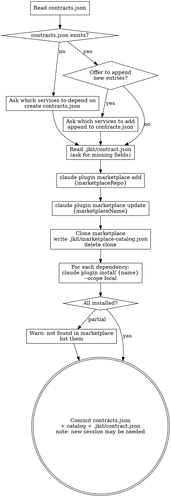

**Announcement:** At start: *"I'm using the install-contracts skill to install service contract dependencies."*

## Checklist

- [ ] Read `contracts.json` at repo root — if missing, ask which services to depend on, create it; if present, offer to append new entries before proceeding
- [ ] Read `.jkit/contract.json` for `marketplaceRepo`, `marketplaceName` — if missing, ask once, save
- [ ] Register marketplace if not already registered: `claude plugin marketplace add {marketplaceRepo}`
- [ ] Refresh marketplace index: `claude plugin marketplace update {marketplaceName}`
- [ ] Clone marketplace, read `.claude-plugin/marketplace.json`, write `.jkit/marketplace-catalog.json`, delete clone
- [ ] For each dependency: `claude plugin install {service-name} --scope local`
- [ ] Warn if any service name is not found in marketplace
- [ ] Confirm installed plugins are available; note that a new Claude session may be required for plugins to activate
- [ ] Commit `contracts.json` + `.jkit/marketplace-catalog.json` + `.jkit/contract.json` to the consumer repo

## Process Flow



## Commands

```bash
# Register marketplace (first time — idempotent if already registered)
claude plugin marketplace add {marketplaceRepo}

# Install and sync (delegates to shell script)
bin/marketplace-sync.sh {marketplaceRepo} {marketplaceName}

# Install one dependency
claude plugin install {service-name} --scope local
```

`--scope local` installs into the project's `.claude/settings.json`. Use `--scope user` only if the developer wants a contract globally available across all projects.

## `contracts.json` Format

Lives at the **repo root** of a consumer microservice (alongside `pom.xml`). Created by `install-contracts` on first run if absent:

```json
{
  "dependencies": ["{service-name}", "{service-name-2}"]
}
```

When `contracts.json` already exists, `install-contracts` offers to append new entries before proceeding. Committed to the service repo — treat it like `pom.xml`.

## `.jkit/contract.json` Format

Persists marketplace configuration. Created on first `install-contracts` run if not already present from `publish-contract`:

```json
{
  "contractRepo": "git@github.com:{org}/{service-name}-contract.git",
  "marketplaceRepo": "git@github.com:{org}/marketplace.git",
  "marketplaceName": "{org}-marketplace"
}
```

Ask for `marketplaceRepo` and `marketplaceName` once, then persist. `contractRepo` is only relevant for the publisher side.
