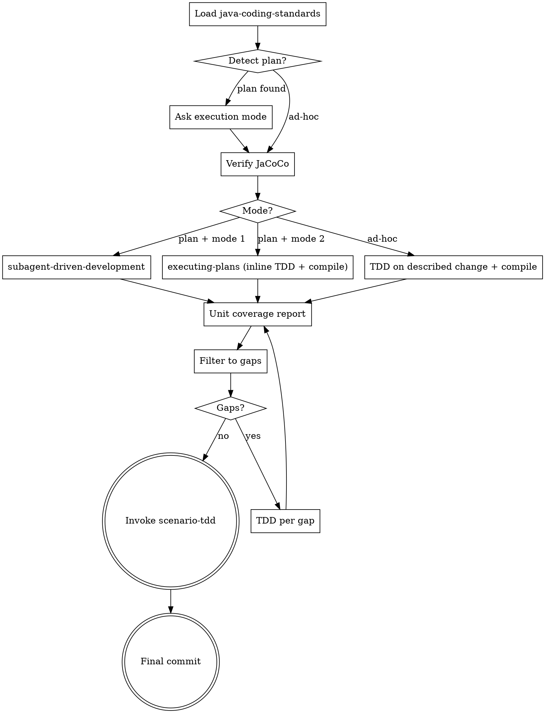

**Announcement:** At start: *"I'm using the java-tdd skill to implement this plan via TDD with JaCoCo coverage analysis."*

## Iron Law

`superpowers:test-driven-development` owns the TDD discipline (RED → GREEN → REFACTOR, no code before a failing test). This skill adds the Java-specific gates: compile-check, JaCoCo coverage loop, scenario-tdd handoff.

## Java-Specific Rationalizations

| Excuse | Reality |
|--------|---------|
| "It's a record / DTO / getter" | Record the behavior. 30 seconds, documents intent. |
| "Spring Boot handles this" | You're testing your configuration of Spring, not Spring itself. |
| "Integration tests already cover this" | Integration tests cover the HTTP boundary (scenario-tdd). Unit tests cover logic branches. Both required. |
| "JaCoCo shows 100%, skip scenarios" | Line coverage ≠ behavior coverage. scenario-tdd covers HTTP contracts JaCoCo can't see. |

## Checklist

- [ ] Load java-coding-standards
- [ ] Detect plan (latest spec-delta run)
- [ ] Choose execution mode
- [ ] Verify JaCoCo plugin
- [ ] Implement per Step 2 mode (subagent-driven / inline / ad-hoc)
- [ ] Compile check after each task (mode 1: inside subagent spec; mode 2 / ad-hoc: parent flow; max 3 retries)
- [ ] Run mvn test + jacoco:report
- [ ] Run jacoco-filter
- [ ] Fill unit coverage gaps via TDD (max 2 no-progress passes, then stop)
- [ ] Invoke scenario-tdd
- [ ] Final commit

## Process Flow



## Detailed Flow

**Step 0 — Load java-coding-standards.** Read `<plugin-root>/docs/java-coding-standards.md`. Apply throughout.

**Step 1 — Plan detection.** Check for the most recent `.jkit/<run>/plan.md`. If present and `.jkit/spec-sync` is behind HEAD:

> "Found plan `.jkit/<run>/plan.md`. Implement from this plan?
> A) Yes — implement per plan (recommended)
> B) No — ad-hoc TDD (I'll describe what to build)"

**Step 2 — Execution mode (plan-driven only).** Assess task coupling (self-contained vs sharing interfaces), then:

> "How should I implement the plan?
> 1. Subagent-Driven — one fresh subagent per task via `superpowers:subagent-driven-development`. Best for loosely coupled tasks.
> 2. Inline — sequential via `superpowers:executing-plans`, TDD + JaCoCo checkpoints after each task. Best for tightly coupled tasks sharing interfaces.
>
> (Recommended: [1 or 2 based on coupling])"

Subagent model selection (mode 1 only):

| Task shape | Model |
|---|---|
| Isolated feature (1–3 files, complete spec) | Haiku |
| Integration (multi-file, pattern matching) | Sonnet |
| Architecture or debugging | Opus |

**Step 3 — Verify JaCoCo.** Check `pom.xml` for the JaCoCo Maven plugin. If missing, add from `templates/pom-fragments/jacoco.xml` into `<build><plugins>`.

**Step 4 — Implement.** Route by the Step 2 selection:

- **Plan + Mode 1 (Subagent-Driven):** invoke `superpowers:subagent-driven-development` with the plan path and the model tier chosen from the table in Step 2. Each subagent task spec MUST embed (a) the java-coding-standards reference and (b) the Step 4.5 compile-check as an acceptance gate before the subagent reports done. The parent flow does not run Step 4.5 itself in this mode.
- **Plan + Mode 2 (Inline):** invoke `superpowers:executing-plans`. For each task it drives, use `superpowers:test-driven-development` for RED/GREEN/REFACTOR, then run Step 4.5 before advancing to the next task.
- **Ad-hoc (no plan, from Step 1 branch):** invoke `superpowers:test-driven-development` directly on the described change, then run Step 4.5.

**Step 4.5 — Compile check (per task, inline / ad-hoc / inside subagent spec):**
```bash
mvn compile test-compile -q
```
On failure: analyze, fix generated code, retry. Max 3 attempts. If still failing: stop and report root cause — do not proceed.

**Step 5 — Unit coverage loop:**
```bash
mvn clean test jacoco:report
jacoco-filter target/site/jacoco/jacoco.xml --summary --min-score 1.0
```
(Run `jacoco-filter --help` for the output schema.)

If `mvn` fails or `target/site/jacoco/jacoco.xml` is absent: stop and ask the human to verify JaCoCo plugin configuration.

For each entry in `methods[]` (in order), invoke `superpowers:test-driven-development` targeting that method and its `missed_lines`. Re-run after each batch until `methods[]` is empty.

**Iteration bound:** if two consecutive passes produce no decrease in missed lines, report residual gaps and stop. Further iteration will not improve coverage (e.g., private utility constructors, unreachable defensive branches).

**Step 6 — Invoke scenario-tdd.** **REQUIRED SUB-SKILL:** invoke `scenario-tdd` after all plan tasks pass unit coverage gates. Pass the current run directory — scenario-tdd reads affected domains from `change-summary.md` and runs `scenarios gap` itself. scenario-tdd calls `java-verify` when done.

**Step 7 — Final commit.** Commit message MUST use one of:
- `feat(impl): <description>` — new feature
- `fix(impl): <description>` — bug fix
- `chore(impl): <description>` — non-feature work

The post-commit hook updates `.jkit/spec-sync` automatically.

**Resume (after interruption):** determine progress from `git log --oneline` for `feat(impl)`/`fix(impl)` commits since run baseline, cross-referenced against plan tasks. Continue from the first task with no commit — announce which task is being resumed, no prompt.
