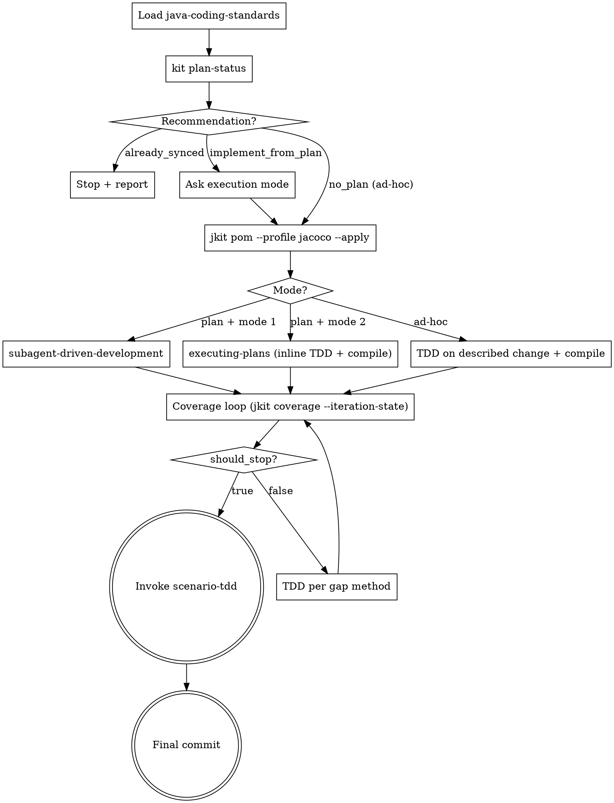

**Announcement:** At start: *"I'm using the java-tdd skill to implement via TDD with JaCoCo coverage analysis."*

## Iron Law

`superpowers:test-driven-development` owns RED → GREEN → REFACTOR. This skill adds the Java-specific gates: plan routing, prerequisites bootstrap, compile-check, JaCoCo coverage loop with plateau detection, scenario-tdd handoff.

## Java-Specific Rationalizations

| Excuse | Reality |
|--------|---------|
| "It's a record / DTO / getter" | Record the behavior. 30 seconds, documents intent. |
| "Spring Boot handles this" | You're testing your configuration of Spring, not Spring itself. |
| "Integration tests already cover this" | Integration tests cover the HTTP boundary (scenario-tdd). Unit tests cover logic branches. Both required. |
| "JaCoCo shows 100%, skip scenarios" | Line coverage ≠ behavior coverage. scenario-tdd covers HTTP contracts JaCoCo can't see. |

## Checklist

- [ ] Load java-coding-standards
- [ ] Run `kit plan-status` (route by `recommendation`)
- [ ] Choose execution mode (plan-driven only)
- [ ] Run `jkit pom prereqs --profile jacoco --apply`
- [ ] Implement per Step 2 mode (subagent-driven / inline / ad-hoc)
- [ ] Compile check after each task (mode 1: inside subagent spec; mode 2 / ad-hoc: parent flow; max 3 retries)
- [ ] Coverage loop with `--iteration-state` until `should_stop: true`
- [ ] Invoke scenario-tdd
- [ ] Final commit

## Process Flow



## Detailed Flow

**Step 0 — Load java-coding-standards.** Read `<plugin-root>/docs/java-coding-standards.md`.

**Step 1 — Plan status.**

```bash
kit plan-status
```

Route by `recommendation`:

- `"no_plan"` → ad-hoc mode. Skip Step 2. Ask the human what to build.
- `"already_synced"` → every plan task has a matching `(impl):` commit. Stop and report (`"all plan tasks already implemented; nothing to do"`).
- `"implement_from_plan"` → continue. Read `plan_path` and `next_pending_task_index`. If `next_pending_task_index > 0`, announce that work is resuming from that task — no prompt.

**Step 2 — Execution mode** (plan-driven only). Assess task coupling (self-contained vs sharing interfaces), then ask:

> "How should I implement the plan?
> 1. Subagent-Driven — one fresh subagent per task via `superpowers:subagent-driven-development`. Best for loosely coupled tasks.
> 2. Inline — sequential via `superpowers:executing-plans`, TDD + JaCoCo checkpoints after each task. Best for tightly coupled tasks sharing interfaces.
>
> (Recommended: [1 or 2 based on coupling])"

Subagent model selection (mode 1 only):

| Task shape | Model |
|---|---|
| Isolated feature (1–3 files, complete spec) | Haiku |
| Integration (multi-file, pattern matching) | Sonnet |
| Architecture or debugging | Opus |

**Step 3 — Prerequisites.**

```bash
jkit pom prereqs --profile jacoco --apply
```

Announce non-empty `actions_taken`. If `ready: false` or `blocking_errors` is non-empty → stop and report.

**Step 4 — Implement.** Route by Step 2 selection:

- **Plan + Mode 1 (Subagent-Driven):** invoke `superpowers:subagent-driven-development` with `plan_path` and the model tier chosen in Step 2. Each subagent task spec MUST embed (a) the java-coding-standards reference and (b) the Step 4.5 compile-check as an acceptance gate before reporting done. Parent flow does not run Step 4.5 in this mode.
- **Plan + Mode 2 (Inline):** invoke `superpowers:executing-plans`. For each task it drives, use `superpowers:test-driven-development` for RED/GREEN/REFACTOR, then run Step 4.5 before advancing.
- **Ad-hoc (no plan):** invoke `superpowers:test-driven-development` directly on the described change, then run Step 4.5.

**Step 4.5 — Compile check** (per task, inline / ad-hoc / inside subagent spec):

```bash
mvn compile test-compile -q
```

On failure: analyze, fix generated code, retry. Max 3 attempts. If still failing: stop and report root cause.

**Step 5 — Unit coverage loop.**

```bash
mvn clean test jacoco:report
jkit coverage target/site/jacoco/jacoco.xml --summary --min-score 1.0 \
  --iteration-state <run>/coverage-state.json
```

`<run>` = `run_dir` from Step 1. **Ad-hoc mode (no run dir):** omit `--iteration-state`; bound the loop manually at max 2 no-progress passes.

If `mvn` fails or `target/site/jacoco/jacoco.xml` is absent → stop and ask the human to verify JaCoCo plugin configuration.

For each entry in `methods[]` (in order), invoke `superpowers:test-driven-development` targeting that method and its `missed_lines`. Re-run the coverage loop after each batch.

Stop when `should_stop: true` (plateau detected). Report residual gaps from the last `methods[]` output — further iteration will not improve coverage (e.g. private utility constructors, unreachable defensive branches).

**Step 6 — Invoke scenario-tdd.** **REQUIRED SUB-SKILL** once Step 5 stops. Pass the run directory — scenario-tdd reads affected domains from `change-summary.md` and runs `jkit scenarios gap --run <dir>` itself. scenario-tdd invokes `java-verify` when done.

**Step 7 — Final commit + run completion.** Commit message MUST use one of:

- `feat(impl): <description>` — new feature
- `fix(impl): <description>` — bug fix
- `chore(impl): <description>` — non-feature work

After committing, if this completes the plan (re-run `kit plan-status` and check that `recommendation == "already_synced"`, or you know this was the last task), close the run:

```bash
jkit changes complete --run <run>
```

This moves the change files referenced by this run from `docs/changes/pending/` to `docs/changes/done/`, archives the run dir to `.jkit/done/<run>`, stages those changes, and amends HEAD. **Ad-hoc mode** (no run dir from Step 1): skip — there is nothing to complete.

**Resume after interruption.** Re-run Step 1. `next_pending_task_index` is the resume point — continue from there, no prompt, no git-log archaeology.
