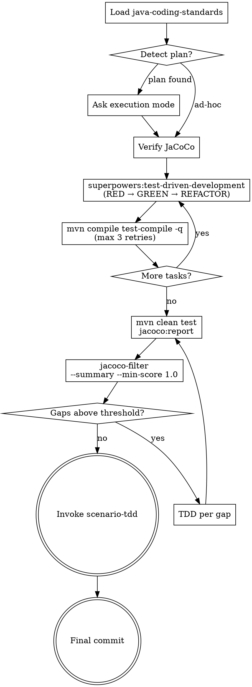

**Announcement:** At start: *"I'm using the java-tdd skill to implement this plan via TDD with JaCoCo coverage analysis."*

## Iron Law

```
NO IMPLEMENTATION WITHOUT A FAILING TEST FIRST.

Write code before the test? Delete it. Start over.

No exceptions:
- Don't keep "reference" code to adapt while writing tests
- Don't "write the test right after" — tests written after passing code prove nothing
- Delete means delete
```

## Rationalization Table

| Excuse | Reality |
|--------|---------|
| "I already tested it manually in Postman" | Manual tests don't run on CI and prove nothing about regressions. Write the test. |
| "It's just a DTO / getter / record" | Record the behavior. The test takes 30 seconds and documents intent. |
| "The framework handles this, no need to test" | You're testing your configuration of the framework, not the framework itself. |
| "I'll add tests after the PR to unblock review" | Tests written after green pass immediately. That proves nothing. |
| "This is a refactor, not new code" | Refactors break things. Write tests first to pin current behavior, then refactor. |
| "The integration tests already cover this" | Integration tests cover the service boundary. Unit tests cover logic branches. Both required. |
| "This is too simple to need a test" | Simplicity is not an exemption. Simple code breaks. The test takes less time than this excuse. |

## Red Flags — STOP and Write the Test First

- "I'll write the test after I get it working"
- "Let me just implement it first, then add coverage"
- "I already verified it works"
- "This is different because..."
- "Tests for this would be trivial anyway"

**All of these mean: delete any code already written. Start with a failing test.**

## Checklist

- [ ] Load java-coding-standards
- [ ] Detect plan (latest spec-delta run)
- [ ] Choose execution mode
- [ ] Verify JaCoCo plugin
- [ ] Implement via superpowers:test-driven-development per task
- [ ] Compile check after each task (max 3 retries)
- [ ] Run mvn test + jacoco:report
- [ ] Run jacoco-filter
- [ ] Fill unit coverage gaps via TDD
- [ ] Repeat until no gaps above threshold
- [ ] Invoke scenario-tdd
- [ ] Final commit

## Process Flow



## Detailed Flow

**Step 0: Load java-coding-standards**

Read `<plugin-root>/docs/java-coding-standards.md`. Apply all rules throughout.

**Step 1: Plan detection**

Check for the most recent spec-delta run directory under `.jkit/`. If `plan.md` exists and `.jkit/spec-sync` has not yet been updated to HEAD, offer:
> "Found plan `.jkit/<run>/plan.md`. Implement from this plan?
> A) Yes — implement per plan (recommended)
> B) No — ad-hoc TDD (I'll describe what to build)"

**Step 2: Execution mode (plan-driven only)**

Scan the plan tasks: are tasks self-contained (each adds a distinct feature with its own types) or tightly coupled (tasks share interfaces, build on each other's scaffolding)?

> "How should I implement the plan?
> 1. Subagent-Driven — one fresh subagent per task via `superpowers:subagent-driven-development`; each runs the full RED/GREEN/REFACTOR cycle + JaCoCo coverage gap analysis. Best for loosely coupled tasks.
> 2. Inline (recommended for this plan) — sequential in this session via `superpowers:executing-plans`, with TDD checkpoints and JaCoCo gap analysis after each task. Best for tightly coupled tasks that share interfaces.
>
> (Recommended: [1 or 2 based on coupling assessment])"

**Subagent model guidance (Subagent-Driven mode):**
- Isolated feature task (1–3 files, complete spec in plan) → Haiku
- Integration task (multi-file, pattern matching) → Sonnet
- Architecture or debugging task → Opus

**Step 3: Verify JaCoCo**

Check `pom.xml` for JaCoCo Maven plugin. If missing: add from `templates/pom-fragments/jacoco.xml` into `<build><plugins>`.

**Step 4: Implement via superpowers:test-driven-development**

For each plan task (or ad-hoc description): invoke `superpowers:test-driven-development`. Complete the full RED/GREEN/REFACTOR cycle, then run the compile check before moving to the next task.

**Step 4.5: Compile check (per task)**

```bash
mvn compile test-compile -q
```

On failure: analyze the error, fix the generated code, retry. Max 3 attempts. If still failing after 3: stop and report the root cause — do not proceed to the next task.

**Step 5: JaCoCo unit coverage loop**

```bash
mvn clean test jacoco:report
```

If command fails or `target/site/jacoco/jacoco.xml` is absent: stop and ask the human to verify the JaCoCo plugin configuration.

```bash
jacoco-filter target/site/jacoco/jacoco.xml --summary --min-score 1.0
```

Output: `{"summary": {"line_coverage_pct": ..., "lines_covered": ..., "lines_missed": ..., "by_class": [...]}, "methods": [...]}`.
Each `methods[]` entry: `{"class": "com.example.InvoiceService", "source_file": "InvoiceService.java", "method": "calculateDiscount", "score": 4.5, "missed_lines": [42, 43, 47]}`.
`method` is the bare method name; `class` is the fully-qualified class name; `missed_lines` are the uncovered line numbers. `methods[]` is sorted by score descending. `by_class` is sorted ascending by `line_coverage_pct` (worst-covered class first). Default output is capped at top-5 methods.

For each entry in `methods[]` (in order): invoke `superpowers:test-driven-development` targeting that specific method and its `missed_lines`. Re-run after each batch until `methods[]` is empty.

**Resume (after interruption — not a sequential step)**

Determine progress from durable state: `git log --oneline` for `feat(impl):`/`fix(impl):` commits since run baseline, cross-referenced against plan tasks. Continue from first task with no corresponding commit — announce which task is being resumed, no prompt.

**Step 6: Invoke scenario-tdd**

**REQUIRED SUB-SKILL: invoke `scenario-tdd`** after all plan tasks pass unit coverage gates. Pass the current run directory and the scenario gap list from `change-summary.md`. scenario-tdd will call `java-verify` when done.

**Step 7: Final commit**

Commit message MUST use one of:
- `feat(impl): <description>` — new feature
- `fix(impl): <description>` — bug fix
- `chore(impl): <description>` — non-feature work

The post-commit hook will update `.jkit/spec-sync` automatically.

