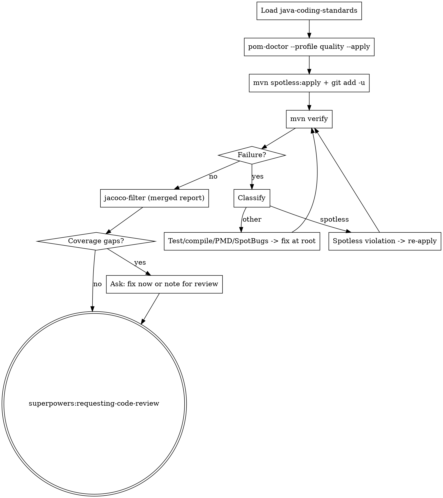

**Announcement:** At start: *"I'm using the java-verify skill to run quality gates and coverage checks."*

## Iron Law

Quality gates are non-negotiable. If Spotless / PMD / SpotBugs / JaCoCo are not installed, install them — never skip. If a verification step fails, classify the failure and fix at root cause; do not bypass.

## Checklist

- [ ] Load java-coding-standards
- [ ] `pom-doctor prereqs --profile quality --apply`
- [ ] `mvn spotless:apply` (auto-fix formatting before verify)
- [ ] `mvn verify` — classify failures, fix at root, repeat (max 3 attempts)
- [ ] Coverage check via `jacoco-filter`
- [ ] Invoke `superpowers:requesting-code-review`

## Process Flow



## Detailed Flow

**Step 0 — Load java-coding-standards.** Read `<plugin-root>/docs/java-coding-standards.md`.

**Step 1 — Quality plugin prerequisites.**

```bash
pom-doctor prereqs --profile quality --apply
```

Installs Spotless, PMD, SpotBugs if missing. Announce non-empty `actions_taken`. If `ready: false` or `blocking_errors` is non-empty → stop and report.

If JaCoCo is also missing (rare at this point — `java-tdd` Step 3 should have installed it): also run `pom-doctor prereqs --profile jacoco --apply`.

**Step 2 — Auto-fix formatting.**

```bash
JKIT_ENV=test direnv exec . mvn spotless:apply
git add -u
```

Spotless rewrites Java sources to google-java-format. **Always run this before `mvn verify`** — Spotless's check phase in `verify` will fail any unformatted file, and hand-fixing formatting issues is wasted effort.

**Step 3 — Run mvn verify.**

```bash
JKIT_ENV=test direnv exec . mvn verify
```

Runs unit tests → Spotless check + PMD + SpotBugs → integration tests (Failsafe) → JaCoCo dump + merge + report.

**On failure, classify before fixing.** Routing rule:

| Failure type | Remediation |
|---|---|
| Spotless violation | Re-run `mvn spotless:apply`, stage, retry. (Should be impossible if Step 2 ran cleanly — if it isn't, check whether a generated file is being written after Step 2.) |
| Compile error | Fix the source. Treat as a mistake from the implementation step that fed in here. |
| Unit test failure | Apply `superpowers:systematic-debugging`. Distinguish test bug (fix test) vs production bug (fix code). |
| PMD / SpotBugs finding | Fix at root — do not suppress without a documented reason. |
| Failsafe (integration) failure | Apply `superpowers:systematic-debugging`. Likely points back at scenario-tdd's tests. |

Repeat until green. Max 3 fix attempts; if still failing, stop and report the root cause to the human.

**Step 4 — Coverage check.**

```bash
jacoco-filter target/site/jacoco/jacoco.xml --summary --min-score 1.0
```

(Run `jacoco-filter --help` for the output schema.)

`methods[]` non-empty → coverage gaps remain. Ask:

> "Coverage gaps found: [N methods, lowest class: X at Y%].
> A) Fix gaps now — invoke scenario-tdd or add unit tests (recommended)
> B) Proceed to code review — note the gaps in the review request"

**Step 5 — Code review.**

**REQUIRED SUB-SKILL:** invoke `superpowers:requesting-code-review`. java-verify does **not** own the final commit — that returns to `java-tdd` Step 7.

If code review surfaces blocking issues: fix them and re-run from Step 3 (mvn verify). If informative-only, control returns to the caller chain.
