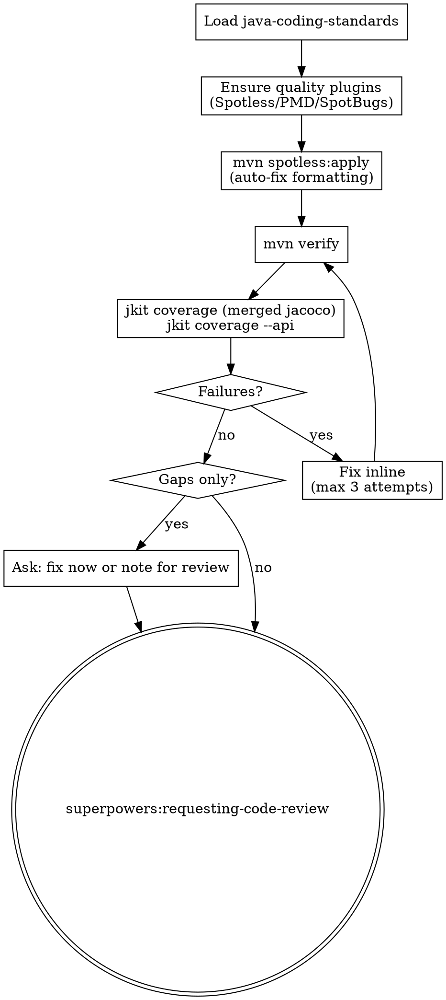

**Announcement:** At start: *"I'm using the java-verify skill to run quality gates and coverage checks."*

## Checklist

- [ ] Load java-coding-standards
- [ ] Ensure quality plugins
- [ ] Run mvn verify
- [ ] Check merged JaCoCo coverage
- [ ] Check API endpoint coverage
- [ ] Fix failures or note gaps
- [ ] Invoke requesting-code-review

## Process Flow



## Detailed Flow

**Step 0: Load java-coding-standards**

Read `<plugin-root>/docs/java-coding-standards.md`. Apply all rules.

**Step 1: Ensure quality plugins**

Check `pom.xml` for Spotless, PMD, SpotBugs. If missing:
> "Quality plugins not found.
> A) Add from templates/pom-fragments/quality.xml (recommended)
> B) Skip quality gate"

On A: add fragment. Note in final commit message.

**Step 1.5: Auto-fix formatting**

```bash
JKIT_ENV=test direnv exec . mvn spotless:apply
```

Applies google-java-format to all Java sources. Run this before `mvn verify` so the Spotless check phase always passes. Stage any changed files:

```bash
git add -u
```

**Step 2: Run mvn verify**

```bash
JKIT_ENV=test direnv exec . mvn verify
```

Runs: unit tests → Spotless check + PMD + SpotBugs → integration tests (Failsafe) → JaCoCo dump + merge + report.

Fix failures inline. Repeat until green. After 3 failed fix attempts: stop, report the root cause to the human, and do not continue.

**Step 3: Coverage check**

```bash
# Unit + integration combined (merged jacoco.xml)
bin/jkit coverage target/site/jacoco/jacoco.xml --summary --min-score 1.0

# API endpoint coverage: spec vs test source
bin/jkit coverage --api docs/domains/ src/test/java/
```

**Failures** (tests or quality): fix inline, re-run.

**Gaps only** (coverage below threshold or untested endpoints): ask:
> "Coverage gaps found: [list].
> A) Fix gaps now — run scenario-tdd / add unit tests (recommended)
> B) Proceed to code review — I'll note the gaps"

**Step 4: Code review handoff**

java-verify does NOT own the final commit. The commit is `java-tdd`'s responsibility.

**REQUIRED SUB-SKILL: invoke `superpowers:requesting-code-review`.** After code review completes, return control to `java-tdd` Step 7 (Final commit).

