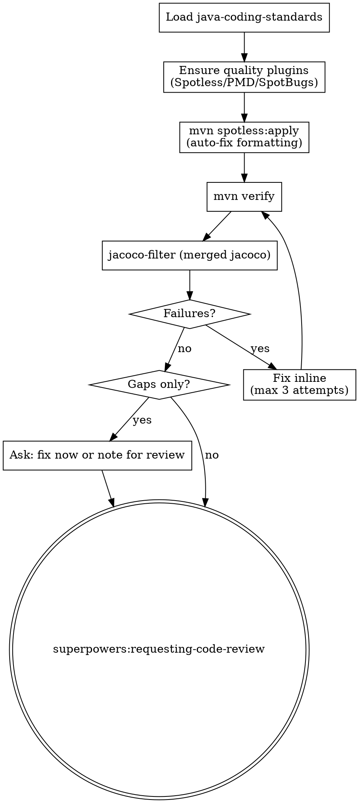

**Announcement:** At start: *"I'm using the java-verify skill to run quality gates and coverage checks."*

## Checklist

- [ ] Load java-coding-standards
- [ ] Ensure quality plugins
- [ ] Run mvn verify
- [ ] Check merged JaCoCo coverage
- [ ] Fix failures or note gaps
- [ ] Invoke requesting-code-review

## Process Flow



## Detailed Flow

**Step 0: Load java-coding-standards**

Read `<plugin-root>/docs/java-coding-standards.md`. Apply all rules.

**Step 1: Ensure quality plugins**

Check `pom.xml` for Spotless, PMD, SpotBugs. If missing:
> "Quality plugins not found.
> A) Add quality plugins now (recommended)
> B) Skip quality gate"

On A:
```bash
bin/pom-add.sh quality        # jacoco if also missing: bin/pom-add.sh jacoco
```
Note in final commit message.

**Step 1.5: Auto-fix formatting**

```bash
JKIT_ENV=test direnv exec . mvn spotless:apply
```

Applies google-java-format to all Java sources. Run this before `mvn verify` so the Spotless check phase always passes. Stage any changed files:

```bash
git add -u
```

**Step 2: Run mvn verify**

```bash
JKIT_ENV=test direnv exec . mvn verify
```

Runs: unit tests → Spotless check + PMD + SpotBugs → integration tests (Failsafe) → JaCoCo dump + merge + report.

Fix failures inline. Repeat until green. After 3 failed fix attempts: stop, report the root cause to the human, and do not continue.

**Step 3: Coverage check**

```bash
# Unit + integration combined (merged jacoco.xml)
jacoco-filter target/site/jacoco/jacoco.xml --summary --min-score 1.0 --top-k 0
```

Output shape:
```json
{
  "summary": {
    "line_coverage_pct": 72.4,
    "lines_covered": 842,
    "lines_missed": 321,
    "by_class": [{"class": "...", "source_file": "...", "line_coverage_pct": 45.0, "lines_covered": 9, "lines_missed": 11}]
  },
  "methods": [
    {"class": "com.example.InvoiceService", "source_file": "InvoiceService.java", "method": "calculateDiscount", "score": 4.5, "missed_lines": [42, 43, 47]}
  ]
}
```

`methods[]` is sorted by score descending. `method` is the bare method name; `class` is the fully-qualified class name; `missed_lines` are the uncovered line numbers. `by_class` is sorted ascending by `line_coverage_pct` (worst-covered class first). Overall coverage is `summary.line_coverage_pct`. `--top-k 0` disables the default top-5 cap so all gaps above the score threshold are returned in one pass.

> **Note:** API endpoint coverage (`codeskel api-coverage`) is not yet implemented. Endpoint gap analysis is skipped until that subcommand is available.

**Failures** (tests or quality): fix inline, re-run.

**Gaps only** (coverage below threshold): ask:
> "Coverage gaps found: [list].
> A) Fix gaps now — run scenario-tdd / add unit tests (recommended)
> B) Proceed to code review — I'll note the gaps"

**Step 4: Code review handoff**

java-verify does NOT own the final commit. The commit is `java-tdd`'s responsibility.

**REQUIRED SUB-SKILL: invoke `superpowers:requesting-code-review`.** After code review completes, return control to `java-tdd` Step 7 (Final commit).

