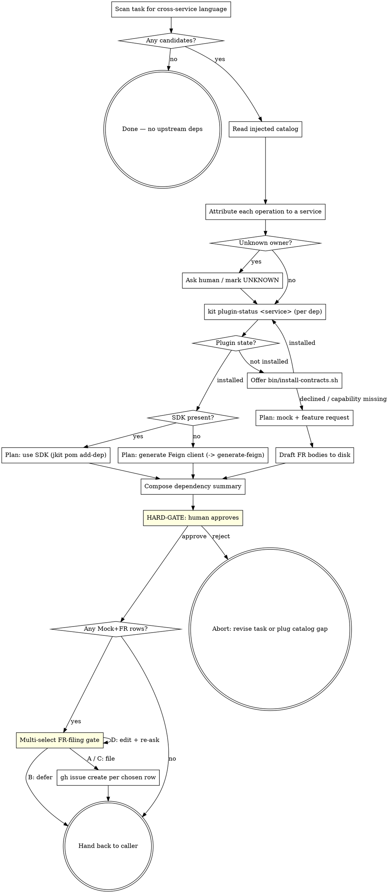

**Announcement:** At start: *"I'm using the plan-upstream-deps skill to scan for cross-service dependencies and produce an upfront plan."*

## Iron Law

**No implementation code before the dependency summary is produced and approved.** Late-discovered cross-service dependencies produce half-written features that are harder to fix than upfront planning. If a dependency is identified mid-coding, stop, restart this skill, and revise the plan before continuing.

## Rationalization Table

| Excuse | Reality |
|--------|---------|
| "I'll figure out the upstream call when I get to that line" | Mid-implementation discovery means a Feign client / mock / config rework after the fact. Cheaper to plan upfront. |
| "It's just one external call, no need to plan" | One call still requires: owning-service identification, plugin install, SDK-vs-Feign decision, auth wiring. That's a plan. |
| "I'll just stub the upstream and circle back" | Untracked stubs become permanent. If you must mock, the mock + feature request is a deliberate plan output, not a TODO. |
| "The task description didn't mention another service" | Task descriptions are written in domain language ("verify device", "charge user", "send email"). Attribution is *your* job, not the writer's. |
| "The catalog doesn't list a service for this — must be local" | Could be a missing plugin, not absent capability. Confirm with the human before assuming local ownership. |

## Checklist

- [ ] Scan task scope for cross-service language (verbs/nouns suggesting another service's responsibility)
- [ ] Read the injected `## Available Service Contracts` block (session-start context)
- [ ] For each candidate operation: attribute to an owning service (or flag as unknown)
- [ ] For each owning service: run `kit plugin-status <service>`
- [ ] Decide per dep: SDK / Feign / install-then-decide / mock + feature request
- [ ] For each Mock+FR row: draft an issue body to `.jkit/feature-requests/<run>/<service>-<slug>.md`
- [ ] Produce dependency summary table (announce to human)
- [ ] HARD-GATE: human approves the summary before coding starts
- [ ] Multi-select gate: file which Mock+FR drafts via `gh issue create`? (All / None / Pick / Edit)
- [ ] Hand off — caller (e.g. java-tdd) resumes; per-dep execution delegates to `generate-feign` or `jkit pom add-dep`

## Process Flow



## Detailed Flow

**Step 1 — Scan task scope.** Read the full task description (plan task, change file, ad-hoc request). Extract every operation that *might* belong to another service. Heuristics — verbs/nouns like:

- "verify / check / authorize <something owned by domain X>"
- "charge / refund / bill / invoice"
- "send email / notification / SMS"
- "fetch / lookup <entity owned by domain X>"
- "publish / emit <event consumed by domain X>"

If the task is purely local (CRUD on a table this service owns, pure computation, no external IO besides the DB) — nothing to do. Announce *"no upstream deps detected"* and return.

**Step 2 — Read injected catalog.** Locate the `## Available Service Contracts` block in the session context (emitted by `hooks/session-start` from `.jkit/marketplace-catalog.json`). It contains:

- The full universe of known service contracts (`name — description` per line).
- An `Installed in this project:` line.
- A `Not yet installed:` line.

If the catalog block is absent (no marketplace catalog cached, or fresh project) — stop and surface: *"no marketplace catalog injected; run `bin/install-contracts.sh --refresh-catalog` or confirm there are no upstream deps."*

**Step 3 — Attribute each candidate to a service.** For each candidate from Step 1, match against the catalog descriptions. Outcomes:

- **Confident match** — record `(operation, service)`.
- **Multiple plausible owners** — list both, ask the human which.
- **No plausible match** — mark as `UNKNOWN`. Ask the human:
  > "Operation `<op>` doesn't match any service in the catalog. Options:
  > A) Local — this service owns it (drop from plan)
  > B) Owned by `<service>` — catalog description is too sparse, fix later
  > C) Owned by a service not yet in the marketplace — defer with a TODO"

Don't guess. An unattributed dep is a planning failure, not a coding problem to discover later.

**Step 4 — Per-dep plugin status.** For each unique owning service from Step 3:

```bash
kit plugin-status <service>
```

Branch on JSON:

| State | Plan |
|-------|------|
| `installed: false` | Offer `bin/install-contracts.sh <service>`. On accept: re-run `kit plugin-status`. On decline: mark dep as **mock + feature request** and continue. |
| `installed: true, contract_yaml_path: null` | Stop and report (`"plugin installed but contract.yaml missing — broken publish, contact owner"`). |
| `installed: true, sdk.present: true` | Plan: **use SDK**. Record `group_id:artifact_id:version` for `jkit pom add-dep` at execution time. |
| `installed: true, sdk.present: false, contract_yaml_path: <path>` | Plan: **generate Feign client**. Record contract path; execution delegated to `generate-feign`. |

For every dep, also record `repo_url` and `issues_url` from the `kit plugin-status` JSON (added as of 2026-04-25). These are the targets for FR filing in Step 6. If both are absent for a Mock+FR row, surface it: *"plugin manifest is missing `repository`/`bugs` — FR target unknown, owner needs to fix `plugin.json`."*

**Step 5 — Draft FR bodies for Mock+FR rows.** For each dep that landed on **Mock + FR** in Step 4, write a draft issue body to disk **before** showing the summary table:

- Path: `.jkit/feature-requests/<run>/<service>-<short-slug>.md` (`<run>` = run dir from `kit plan-status`, or the current ISO date for ad-hoc mode; `<short-slug>` is a kebab-case noun phrase derived from the operation, e.g. `send-activation-email`).
- Body shape:

  ```markdown
  ## Capability needed

  <Operation in one sentence — e.g. "Send activation email to a newly-registered user.">

  ## Why we need it

  <Caller context: which service, which feature/change, what user-visible behavior depends on it.>

  ## Current workaround

  Mocking via `<MockClassName>` in the consumer service. This will be removed once the upstream capability ships.

  ## Suggested shape

  <If a clear API shape is implied by the caller's needs, sketch it (path, request, response). Otherwise omit — let the owner design.>

  ---
  Filed by `plan-upstream-deps` from `<consumer-service>` on <YYYY-MM-DD>.
  ```

If `repo_url` / `issues_url` is missing for the dep, still write the draft, but mark it with `# TODO: target repo unknown — plugin manifest missing repository/bugs` at the top.

**Step 6 — Compose the dependency summary.** Announce a table to the human:

```
Cross-service dependency plan:

| #  | Operation                | Service      | Decision      | Action at impl time                                | FR target                            |
|----|--------------------------|--------------|---------------|----------------------------------------------------|--------------------------------------|
| 1  | verify device access     | management   | SDK           | jkit pom add-dep com.example:management-sdk        | —                                    |
| 2  | charge customer          | billing      | Feign         | invoke /generate-feign for `billing`               | —                                    |
| 3  | send activation email    | notification | Mock + FR     | mock class + draft at <draft-path>                 | github.com/acme/notification/issues  |
| 4  | publish stock-low event  | <UNKNOWN>    | Deferred TODO | revisit when owner is identified                   | —                                    |
```

Each row should be defensible from Steps 3–4. Number rows so the multi-select gate can reference them.

**Step 7 — HARD-GATE: human approval.**

> "Approve this dependency plan?
> A) Approve — proceed
> B) Revise — edit a row (which one, what change?)
> C) Abort — task scope needs rework"

On A: continue to Step 8.
On B: re-run the relevant step with the human's correction.
On C: stop. Caller decides next step.

**Step 8 — Multi-select FR-filing gate.** If there are zero Mock+FR rows: skip this step. Otherwise:

> "N feature requests drafted in `.jkit/feature-requests/<run>/`. File which?
> A) All — open every drafted issue now
> B) None — leave drafts on disk; file later
> C) Pick — give row numbers (e.g. `3,5`)
> D) Edit drafts first — I'll pause; re-ask when you're done"

For each chosen row, run:

```bash
gh issue create \
  --repo <issues_url-stripped-of-/issues-suffix> \
  --title "<Capability needed: ${operation}>" \
  --body-file <draft-path>
```

Skip rows whose draft is marked `target repo unknown` — surface them and ask the human to fill the target manually before re-trying.

If `gh` is not on PATH or `gh auth status` fails, downgrade to **B** automatically and report: *"`gh` not authenticated — drafts kept at `.jkit/feature-requests/<run>/`; file manually with `gh issue create -F <path> --repo <target>`."*

Record `gh issue create` URLs in the run notes (or surface them in the handoff message) so post-merge readers can audit.

**Step 9 — Handoff.** Per-dep execution happens in the calling skill's flow:

- **SDK** rows → caller (or `generate-feign`'s SDK gate) runs `jkit pom add-dep --group-id ... --artifact-id ... --version ... --apply`.
- **Feign** rows → caller invokes `generate-feign` per service.
- **Mock + FR** rows → caller writes a mock class per project conventions. The issue is already filed (or queued for later — drafts persist on disk).
- **Deferred TODO** rows → caller leaves a marked TODO and surfaces them in the final commit body.

This skill returns the table + FR-filing outcomes, not the impl artefacts.

## Re-invocation

Re-running this skill on the same task is **idempotent in spirit** — re-scanning the same scope should produce the same table. If it doesn't, the catalog moved (a service was installed / a contract was published) — that's expected; the new table supersedes the old. Existing FR drafts under `.jkit/feature-requests/<run>/` are preserved across re-runs; only new Mock+FR rows produce fresh drafts. If invoked from a paused implementation (i.e. mid-coding discovered a missed dep), the Iron Law applies: stop coding, re-plan, then resume.

## Notes

- This skill never edits `pom.xml`, never invokes `openapi-generator-cli`, never writes mocks. It produces a plan and (optionally) files feature-request issues; everything else is delegated.
- The catalog's quality (specifically, the `description` field per contract in `marketplace-catalog.json`) is the bottleneck for Step 3 attribution. If attribution keeps failing, the fix is upstream — encourage contract owners to publish richer descriptions via `/publish-contract`.
- FR-filing depends on `kit plugin-status` returning `repo_url` / `issues_url`. Those come from the upstream plugin's `.claude-plugin/plugin.json` (`repository` and optional `bugs` fields). Plugins published before 2026-04-25 may not carry them — encourage owners to add and re-publish.
- Keep the dep table in scope for the rest of the implementation session — paste it into the change-summary or run notes if useful, so post-merge readers can see the deliberate decisions.
