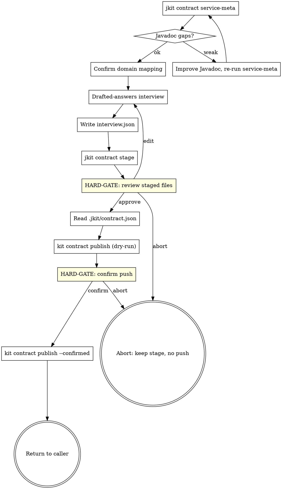

**Announcement:** At start: *"I'm using the publish-contract skill to generate the service contract for other teams."*

## Iron Law

`kit contract publish` performs irreversible network operations (push to contract repo, marketplace update). Never invoke it without `--confirmed`, and never pass `--confirmed` without explicit human approval at the post-stage gate. The default `dry-run` output is what the human reviews.

## Rationalization Table

| Excuse | Reality |
|--------|---------|
| "Just push, the marketplace can be fixed later" | A bad contract is consumed by every dependent service the moment it lands. Re-pushing won't unbreak running consumers. |
| "Skip the Javadoc check, contract is fine without descriptions" | The generated `contract.yaml` carries those descriptions verbatim. Sparse Javadoc = useless contract. Fix at source. |
| "One controller, one domain, obvious mapping" | Multi-class files, abstract base controllers, and shared-prefix names break this. Trust `service-meta`, not the filename. |
| "I'll edit the staged files by hand" | Staged files are regenerated on rerun. Edit the source (Javadoc, interview answers), not the output. |

## Checklist

- [ ] `jkit contract service-meta` → read JSON
- [ ] Confirm domain mapping (gate)
- [ ] Drafted-answers interview (one prompt, 7 fields)
- [ ] Write interview answers to `.jkit/contract-stage/<service>/interview.json`
- [ ] `jkit contract stage` → bundle generated
- [ ] HARD-GATE: review staged files
- [ ] Read `.jkit/contract.json`; ask for missing fields
- [ ] `kit contract publish --confirmed`
- [ ] Return

## Process Flow



## Detailed Flow

**Step 0 — Existing stage check.** If `.jkit/contract-stage/<service>/` already exists from a prior run, ask:

> A) Overwrite (recommended if endpoints changed) — pass `--force` to `stage`
> B) Diff first — show me what would change
> C) Abort

<HARD-GATE>Do not pass `--force` to `stage` without explicit approval.</HARD-GATE>

**Step 1 — Service metadata.**

```bash
jkit contract service-meta
```

Read the JSON. Note the `service_name`, `controllers[]` (each with its `domain_slug`), `javadoc_quality`, `sdk`, `interview_drafts`, and any `warnings`.

**Step 2 — Javadoc gate.** If `javadoc_quality.score < 0.9` or `missing[] / thin[]` is non-empty:

> "Controller Javadoc is sparse — the generated contract will have low-quality endpoint descriptions.
> Weak methods: [list from JSON]
> A) Improve Javadoc inline (recommended) — I'll update the controllers, then re-run service-meta
> B) Proceed with current quality"

On A: fix Javadoc, re-run `service-meta`, re-check the score.

**Step 3 — Confirm domain mapping.** Show the human the proposed domain list (from `controllers[].domain_slug`), highlighting any `warnings` (multi-class files, slug collisions). Ask for the confirmed subset.

<HARD-GATE>Do NOT proceed to stage until the human confirms the domain list. The confirmed list is what gets passed to `--domains`.</HARD-GATE>

**Step 4 — Drafted-answers interview.** Show all seven interview fields with drafts from `interview_drafts` in one prompt:

```
1. description: <draft>
2. use_when: <draft>
3. invariants: <draft>
4. keywords: <draft>
5. not_responsible_for: <draft>
6. sdk: <draft from service-meta>
7. authentication: <draft from authentication_hint>

A) Approve all
B) Edit specific items (say which)
C) Restart
```

Loop on B until A. Write the final answers to `.jkit/contract-stage/<service>/interview.json`.

**Step 5 — Stage.**

```bash
jkit contract stage \
  --service <service> \
  --interview .jkit/contract-stage/<service>/interview.json \
  --domains <slug,slug,...>
```

Read the JSON. Announce `files_written`. If `pom_status.actions_taken` is non-empty (smart-doc plugin or smart-doc.json was added), note it for the commit message at publish time.

**Step 6 — HARD-GATE: review staged files.**

```bash
ls -R .jkit/contract-stage/<service>/
```

Show the file list. Ask:

> A) Files look right — proceed to publish
> B) Edit interview answers and re-stage
> C) Abort (keep stage, no push)

<HARD-GATE>Do NOT proceed to publish without explicit approval.</HARD-GATE>

**Step 7 — Contract config.** Read `.jkit/contract.json`. If missing or any field absent, ask one at a time and write:

```json
{
  "contractRepo": "git@github.com:<org>/<service>-contract.git",
  "marketplaceRepo": "git@github.com:<org>/marketplace.git",
  "marketplaceName": "<org>-marketplace"
}
```

**Step 8 — Publish dry-run.**

```bash
kit contract publish --service <service>
```

(No `--confirmed` — this is the dry-run that surfaces what will happen.) Read `would_push_files`, `would_run`, `would_commit`. Show the human:

> [dry-run output]
>
> A) Push to GitHub and update marketplace (recommended)
> B) Abort — keep stage and contract.json, no push

<HARD-GATE>Do NOT pass `--confirmed` to `publish` without explicit approval.</HARD-GATE>

On B: stop. The stage and `.jkit/contract.json` are preserved for a future re-run. Inform the human, return.

**Step 9 — Publish (confirmed).**

```bash
kit contract publish --service <service> --confirmed
```

The binary handles push, marketplace sync, catalog write, and the two `chore(contract):` commits. Announce the resulting commit SHAs and the contract repo URL.

**Step 10 — Return.** Done. Contract publication is not implementation work — do not call `jkit changes complete` and do not move anything in `docs/changes/`. The `chore(contract):` prefix exists to make this commit easy to grep out of impl history.

## Contract Plugin Repo Structure (reference)

```
<service>-contract/
├── .claude-plugin/plugin.json
├── skills/<service>/SKILL.md             ← Level 1+2
├── domains/<slug>.md                     ← Level 3
└── reference/contract.yaml               ← Level 4
```

Generated via `jkit contract stage` from bundled templates. See `docs/jkit-contract-prd.md` for the template surface.
