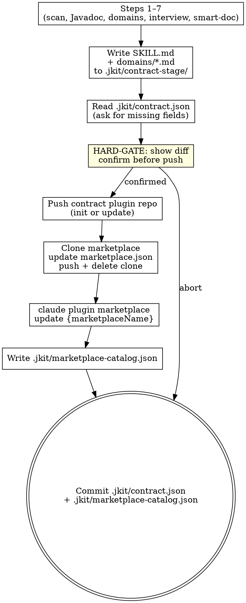

**Announcement:** At start: *"I'm using the publish-contract skill to generate the service contract for other teams."*

## Checklist

- [ ] Extract service metadata
- [ ] Check for existing staged contract
- [ ] Find and confirm controller path + jkit skel scan
- [ ] Javadoc quality check
- [ ] Map controllers to domains + HARD-GATE approval
- [ ] Structured interview (7 questions)
- [ ] Generate contract.yaml (smart-doc)
- [ ] Add .jkit/contract-stage/ to .gitignore if not present
- [ ] Write SKILL.md + domains/*.md to .jkit/contract-stage/{service-name}/
- [ ] Read .jkit/contract.json — if missing, ask for contractRepo, marketplaceRepo, marketplaceName
- [ ] HARD-GATE: show files to be pushed, confirm before any git push
- [ ] Push contract plugin repo
- [ ] Clone marketplace, update marketplace.json, push, delete clone
- [ ] Run: claude plugin marketplace update {marketplaceName}
- [ ] Write .jkit/marketplace-catalog.json
- [ ] Commit .jkit/contract.json + .gitignore (+ .jkit/marketplace-catalog.json if push confirmed)

## Process Flow



## Detailed Flow

**Step 1: Extract service metadata**

```bash
grep -rh "spring\.application\.name" src/main/resources/ 2>/dev/null | head -1
```

Extract the value:
- YAML: `name: value` or `spring.application.name: value`
- Properties: `spring.application.name=value`

If found → use as both `{service-name}` and registry name. Confirm:
> "Found `spring.application.name={value}`. Using as service and registry name — correct?"

If not found → read `<artifactId>` from `pom.xml` as `{service-name}`, then ask:
> "Defaulting registry name to `{service-name}`. Is that correct?"

Also extract from `pom.xml`: `<groupId>`, `<version>`, `<parent><artifactId>` (for SDK check in Step 6).

**Step 2: Check for existing contract**

If `.jkit/contract-stage/{service-name}/` exists:

Tell human: `"A staged contract for {service-name} already exists at .jkit/contract-stage/{service-name}/"`

```
A) Overwrite with regenerated version (recommended if endpoints changed)
B) Diff only — show me what changed before overwriting
C) Abort
```

<HARD-GATE>
Do NOT overwrite an existing staged contract without explicit human approval (option A or B+confirm).
</HARD-GATE>

**Step 3: Find controller path and scan**

Locate the `api` package:

```bash
find src/main/java -type d -name api
```

- Exactly one found → confirm: *"Found api package at `{path}`. Using this — correct?"*
- Multiple found → list and ask the user to choose
- None found → stop: *"Could not find an `api` package under `src/main/java/`. Please specify the controller path."*

Scan with jkit skel:

```bash
bin/jkit skel "src/main/java/${GROUP_PATH}/${SERVICE}/api/"
```

From JSON output: identify classes with `@RestController` or `@Controller` annotation, and their public methods.

**Step 4: Javadoc quality check**

For every public method, check `has_docstring` and `docstring_text`. Insufficient if any:
- `has_docstring` is false
- `docstring_text` is null or empty
- `docstring_text` only restates the method name

If ANY method has missing or insufficient Javadoc:

> "Controller Javadoc is sparse — the generated contract will have low-quality endpoint descriptions.
> A) Improve Javadoc inline — I'll update the controller comments, then re-scan (recommended)
> B) Proceed with current quality — I understand the contract will need manual editing"

On A: read each controller, fill missing/thin Javadoc, re-run `jkit skel` to confirm. Do not use pre-improvement data after re-scan.

**Step 5: Map controllers to domains**

One controller file = one domain (strip `Controller` suffix: `InvoiceController` → `invoice`).

Exception: if two files share the same domain prefix, propose merging into one domain.

Present proposed domain list and ask for confirmation.

<HARD-GATE>
Do NOT generate any output until the human confirms the domain mapping.
The confirmed domain list is the authoritative input for all output generation.
</HARD-GATE>

**Step 6: Structured interview**

Ask one at a time. Always offer a draft.

1. **`description`** — draft from class-level Javadoc
2. **`use_when`** — infer 2–4 scenarios from capability names
3. **`invariants`** — draft from Javadoc preconditions and `@throws`
4. **`keywords`** — draft from module names and prominent Javadoc nouns
5. **`not_responsible_for`** — infer what adjacent domains this service does NOT own
6. **`SDK`** — check parent `pom.xml` for `<module>` ending in `-api`
7. **`authentication`** — draft from security annotations or ask (Bearer / API key / mTLS / None)

**Step 7: Generate contract.yaml (smart-doc)**

Add smart-doc plugin to `pom.xml` if missing:

```xml
<plugin>
    <groupId>com.ly.smart-doc</groupId>
    <artifactId>smart-doc-maven-plugin</artifactId>
    <version>3.0.9</version>
    <configuration>
        <configFile>./smart-doc.json</configFile>
    </configuration>
</plugin>
```

Write `smart-doc.json` (merge if exists — preserve existing fields, update only `outPath`, `openApiAllInOne`, `sourceCodePaths`):

```json
{
  "outPath": ".jkit/contract-stage/{service-name}/reference",
  "openApiAllInOne": true,
  "packageFilters": "{package-filter}",
  "sourceCodePaths": [
    {"path": "src/main/java", "desc": "{service-name} service"}
  ]
}
```

Run:

```bash
mvn smart-doc:openapi
```

Convert JSON → YAML:

```bash
# Preferred
yq -o yaml -P .jkit/contract-stage/{service-name}/reference/openapi.json \
  > .jkit/contract-stage/{service-name}/reference/contract.yaml

# Fallback
python3 -c "
import json, yaml
with open('.jkit/contract-stage/{service-name}/reference/openapi.json') as f:
    data = json.load(f)
with open('.jkit/contract-stage/{service-name}/reference/contract.yaml', 'w') as f:
    yaml.dump(data, f, default_flow_style=False, allow_unicode=True, sort_keys=False)
"
rm .jkit/contract-stage/{service-name}/reference/openapi.json
```

If generation fails → show last 20 lines of Maven output and stop.

## Steps 8–11: Contract Stage and Push

**Step 8: Write SKILL.md + domains/*.md to contract-stage**

Add `.jkit/contract-stage/` to `.gitignore` if not already present.

Write `.jkit/contract-stage/{service-name}/.claude-plugin/plugin.json`:

```json
{
  "name": "{service-name}-contract",
  "description": "Service contract for {service-name}",
  "version": "1.0.0",
  "skills": [
    { "name": "{service-name}", "path": "skills/{service-name}" }
  ]
}
```

Write `.jkit/contract-stage/{service-name}/skills/{service-name}/SKILL.md`:

```markdown
---
name: {service-name}
description: Use when your task involves {use_when summary — one sentence}.
keywords: [{keyword}, ...]
---

## Overview

{2–3 sentences: service responsibility and integration context}

**Not responsible for:** {not_responsible_for list, or omit if none}

---

## Domains

### {domain-name}
{One sentence: what this domain handles.}
→ Read [`domains/{domain-name}.md`](../../domains/{domain-name}.md)

---

## How to navigate this contract

- **Find the right domain:** Read the domain summary above, then open `domains/{domain-name}.md`
- **Find the right API:** The domain file lists all APIs with intent descriptions
- **Get the schema:** Grep `reference/contract.yaml` for the path once the API is identified

## SDK

(Include only if SDK was confirmed in interview Step 6)
```xml
<dependency>
    <groupId>{group-id}</groupId>
    <artifactId>{sdk-artifact}</artifactId>
    <version>{version}</version>
</dependency>
```
```

Write `.jkit/contract-stage/{service-name}/domains/{domain-name}.md` (one per confirmed domain):

API entry rules:
- Mark 1–2 entries per domain with `⭐` (primary entry points — prefer state-changing methods)
- Business name = what the operation does (e.g., `create-invoice`), not the method name
- Each entry answers: **What does it do?** + **When to call?** + **When NOT to call?** (only if another API could be confused)
- Add `Requires:` only when there is a hard precondition Claude must verify before calling

```markdown
# Domain: {Domain Name}

## Summary

{2–3 sentences: what this domain handles, when to use it, and what NOT to use it for.}

## APIs

- ⭐ `{METHOD} {path}` — **{business-name}**
  {What this API does and returns, one sentence.}
  Use when {situation}. NOT for {similar situation that belongs elsewhere}.
  Requires: {hard precondition, if any}.

- `{METHOD} {path}` — **{business-name}**
  {What this API does and returns, one sentence.}
  Use when {situation}.

**API Source:** `{fully.qualified.ClassName}`

## Notes

- {invariant or precondition confirmed in interview}
```

**Step 9: Read .jkit/contract.json and ask for missing fields**

If `.jkit/contract.json` is missing or any field is absent, ask one at a time:
1. *"GitHub SSH URL for the contract plugin repo (e.g., `git@github.com:{org}/{service-name}-contract.git`):"*
2. *"GitHub SSH URL for the marketplace repo (e.g., `git@github.com:{org}/marketplace.git`):"*
3. *"Marketplace name (the `name` field in marketplace.json, e.g., `{org}-marketplace`):"*

Save to `.jkit/contract.json`:

```json
{
  "contractRepo": "git@github.com:{org}/{service-name}-contract.git",
  "marketplaceRepo": "git@github.com:{org}/marketplace.git",
  "marketplaceName": "{org}-marketplace"
}
```

**Step 10: HARD-GATE — show files and confirm before push**

Show what will be pushed. On first push the stage directory is not a git repo yet, so list files directly:

```bash
# Subsequent pushes
git -C ".jkit/contract-stage/{service-name}" diff HEAD 2>/dev/null \
  || find ".jkit/contract-stage/{service-name}" -type f | sort
```

Ask:
```
A) Push to GitHub and update marketplace (recommended)
B) Abort — I'll review the files first
```

<HARD-GATE>
Do NOT run any git push until the human confirms.
</HARD-GATE>

On abort: skip the push/marketplace steps; proceed to the commit in Step 11 (`.jkit/contract.json` and `.gitignore` are still worth saving).

**Step 11: Push, update marketplace, refresh catalog, commit**

On confirmed push:

```bash
# Inform the human before first push: "The remote repo must be empty — no auto-generated README or license."
bin/contract-push.sh {service-name} {contractRepo}
bin/marketplace-publish.sh {marketplaceRepo} {service-name} "{description}" {contractRepo}
bin/marketplace-sync.sh {marketplaceRepo} {marketplaceName}
```

Commit in service repo. Use `chore(contract):` — not `chore(impl):` — so the post-commit hook does not advance `.jkit/spec-sync`.

```bash
# smart-doc.json only if it was newly created this run
git diff --quiet smart-doc.json pom.xml 2>/dev/null || \
  (git add smart-doc.json pom.xml && git commit -m "chore(contract): add smart-doc configuration")

# contract config + gitignore; add catalog only if push was confirmed
git add .jkit/contract.json .gitignore
git diff --cached --quiet .jkit/marketplace-catalog.json 2>/dev/null || git add .jkit/marketplace-catalog.json
git commit -m "chore(contract): publish service contract for {service-name}"
```

## Contract Plugin Repo Structure

```
{service-name}-contract/
├── .claude-plugin/
│   └── plugin.json
├── skills/
│   └── {service-name}/
│       └── SKILL.md             ← Level 1+2
├── domains/
│   └── {domain-name}.md         ← Level 3
└── reference/
    └── contract.yaml            ← Level 4
```

## 4-Level Progressive Disclosure Map

| Level | Location | When invoked | Answers |
|---|---|---|---|
| 1 | `SKILL.md` frontmatter | Skill selected | Is this the right service? |
| 2 | `SKILL.md` body | Skill invoked | Is this the right domain? |
| 3 | `domains/{name}.md` | Domain drill-down | Is this the right API? |
| 4 | `reference/contract.yaml` | API resolution (grepped) | What are the schemas? |
