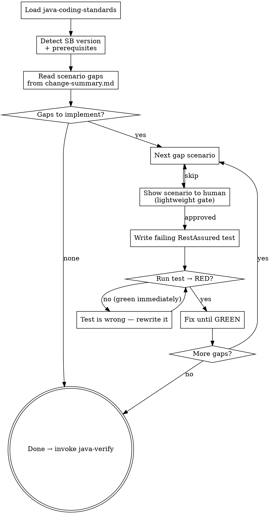

**Announcement:** At start: *"I'm using the scenario-tdd skill to implement scenario gaps for the [domain] domain via integration TDD."*

## Iron Law

```
NO INTEGRATION TEST WITHOUT A FAILING HTTP TEST FIRST.

Write the RestAssured assertion after the endpoint already passes? Delete it. Start over.

No exceptions:
- Don't generate multiple tests at once then fix failures
- Don't write "placeholder" tests that always pass
- One scenario → RED → GREEN → next scenario
```

## Rationalization Table

| Excuse | Reality |
|--------|---------|
| "The unit tests already cover this logic" | Unit tests mock HTTP. Integration tests verify the actual endpoint wires correctly end-to-end. |
| "I'll write all scenarios first, then run them" | Batch generation produces batch failures. You lose the signal of which scenario caused what. |
| "The happy path passes, the error cases are obvious" | Auth failures, validation edge cases, and missing headers are where bugs live. Write the test. |
| "This endpoint is simple, one test is enough" | Each scenario is a contract. Simple endpoints have the same contract obligations. |

## Checklist

- [ ] Load java-coding-standards
- [ ] Detect Spring Boot version + prerequisites
- [ ] Read scenario gaps from change-summary.md
- [ ] TDD loop: per gap scenario
- [ ] Invoke java-verify

## Process Flow



## Detailed Flow

**Step 0: Load java-coding-standards**

Read `<plugin-root>/docs/java-coding-standards.md`. Apply all rules.

**Step 1: Detect Spring Boot version + prerequisites**

Read `<parent><version>` from `pom.xml`.

| Spring Boot version | Testing strategy |
|---|---|
| 3.1+ | `@SpringBootTest(RANDOM_PORT)` + Testcontainers (`@ServiceConnection`) + RestAssured |
| < 3.1 | `docker-compose.test.yml` → RestAssured against running container |

**Spring Boot 3.1+:** Check `pom.xml` for Testcontainers, RestAssured, WireMock. If missing: add from `templates/pom-fragments/testcontainers.xml`.

**Spring Boot < 3.1:** Resolve container runtime:
1. `docker compose` / `docker-compose`
2. `podman compose`
3. Neither → stop: *"No container runtime found. Install Docker or Podman and re-run."*

Check `docker-compose.test.yml` exists. If missing: copy from `templates/docker-compose.test.yml`.

**Step 2: Read scenario gaps**

Read the **Test Scenario Gaps** section from `.jkit/<run>/change-summary.md` (passed by java-tdd). Each row is a `{domain, endpoint, scenario_id, scenario_description}` tuple — the authoritative work list for this run.

If the section is absent or empty → no scenario gaps detected; complete immediately, invoke `java-verify`.

**Step 3: TDD loop**

Process gaps in the order they appear in change-summary.md (domain order preserved from spec-delta). For each gap scenario:

**Lightweight gate** — announce before writing:
> "Next: `POST /invoices/bulk` — `happy-path`: valid list of 3 → 201 + invoice IDs. Write this test?
> A) Yes (recommended)
> B) Edit this scenario
> C) Skip"

**Write the failing test** targeting exactly this scenario. One test method, one assertion.

**Run:**
```bash
# SB 3.1+
JKIT_ENV=test direnv exec . mvn test -Dtest=<Domain>IntegrationTest#<methodName>

# SB < 3.1
<runtime> compose -f docker-compose.test.yml up -d
JKIT_ENV=test direnv exec . mvn test -Dtest=<Domain>IntegrationTest#<methodName>
```

- **RED (compilation or assertion failure):** expected — continue to fix.
- **GREEN immediately:** the test is wrong — it proves nothing. Rewrite it to actually fail.

Fix production code or test setup until GREEN. Then move to next scenario.

**Test class location:** `src/test/java/<group-path>/<service>/<domain>/<Domain>IntegrationTest.java`

**Spring Boot 3.1+ template:**

```java
@SpringBootTest(webEnvironment = SpringBootTest.WebEnvironment.RANDOM_PORT)
@Testcontainers
class BillingIntegrationTest {
    @Container @ServiceConnection
    static PostgreSQLContainer<?> postgres = new PostgreSQLContainer<>("postgres:15");

    @RegisterExtension
    static WireMockExtension externalSvc = WireMockExtension.newInstance()
        .options(wireMockConfig().dynamicPort()).build();

    @LocalServerPort int port;
    @BeforeEach void setup() { RestAssured.port = port; }

    @Test void bulkInvoice_happyPath() { /* given/when/then */ }
}
```

**Spring Boot < 3.1 template:**

```java
class BillingIntegrationTest {
    static String baseUri = System.getenv().getOrDefault("SERVICE_BASE_URI", "http://localhost:8080");
    @BeforeAll static void setup() { RestAssured.baseURI = baseUri; }

    @Test void bulkInvoice_happyPath() { /* given/when/then */ }
}
```

**Failure classification:**
- Compilation failure or wrong assertion → fix generated test. Do NOT change production code for a test bug.
- Production code fails the correct assertion → fix production code via `superpowers:systematic-debugging`.
- After one self-fix pass still failing → invoke `superpowers:systematic-debugging`.

**Step 4: Invoke java-verify**

**REQUIRED SUB-SKILL: invoke `java-verify`** after all gap scenarios are covered.

scenario-tdd does NOT own the commit. The commit is `java-tdd`'s responsibility.

