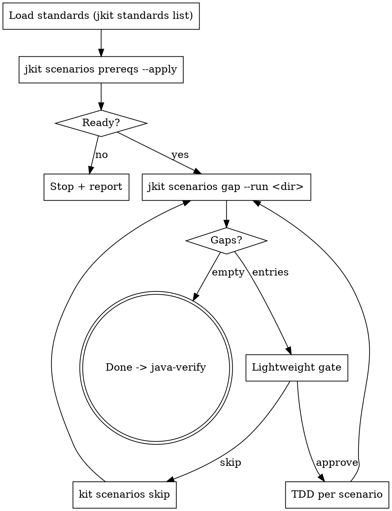

**Announcement:** At start: *"I'm using the scenario-tdd skill to implement integration test scenario gaps via TDD."*

## Iron Law

`superpowers:test-driven-development` owns RED → GREEN → REFACTOR. This skill adds the integration-test-specific gates: prerequisites bootstrap, scenario-driven gap loop, per-gap RED-first discipline.

**One scenario → one failing HTTP test → GREEN → next scenario.** No batch generation. No placeholder tests.

## Rationalization Table

| Excuse | Reality |
|--------|---------|
| "Unit tests already cover this logic" | Unit tests mock HTTP. Integration tests verify the endpoint wires end-to-end. |
| "I'll write all scenarios first, then run them" | Batch generation hides which scenario broke what. |
| "Happy path passes, error cases are obvious" | Auth, validation edges, missing headers — that's where bugs live. |
| "Endpoint is simple, one test is enough" | Each scenario is a contract. |

## Checklist

- [ ] Load standards (run `jkit standards list`, read every file printed)
- [ ] Run `jkit scenarios prereqs --apply`
- [ ] Run `jkit scenarios gap --run <dir>`
- [ ] Per gap: lightweight gate → `superpowers:test-driven-development` (or `kit scenarios skip`)
- [ ] Invoke java-verify

## Process Flow



## Detailed Flow

**Step 0 — Load standards.** Run `jkit standards list` from the project root and read every file it prints. Apply all rules. (If the command errors with a missing-config message, run `jkit standards init` first to create `docs/project-info.yaml`.)

**Step 1 — Prerequisites.**

```bash
jkit scenarios prereqs --apply
```

Read the JSON. Announce non-empty `actions_taken`. Record `runtime` and `testing_strategy` for Step 3. If `ready: false` or `blocking_errors` is non-empty → stop and report verbatim (e.g. *"no container runtime found — install Docker or Podman and re-run"*).

**Step 2 — Fetch gap work list.** The run directory is passed by `java-tdd`. If invoked ad-hoc without one → stop and ask the human for the run dir.

```bash
jkit scenarios gap --run <dir>
```

Output is the authoritative ordered work list. `[]` → no gaps; jump to Step 4.

**Step 3 — TDD loop.** Process entries in array order. For each entry:

**Lightweight gate** — announce before writing:

> "Next: `<endpoint>` — `<id>`: `<description>`. Write this test?
> A) Yes (recommended)  B) Edit scenario  C) Skip"

- **Edit scenario:** human edits `test-scenarios.yaml`; re-run `jkit scenarios gap --run <dir>` and resume.
- **Skip:** record it, continue.

  ```bash
  kit scenarios skip --run <dir> <domain> <id>
  ```

- **Approve:** delegate the RED → GREEN cycle to `superpowers:test-driven-development`, scoped to:

  | TDD input | Source |
  |---|---|
  | Test class path | `test_class_path` from the gap entry (if `null`, compute from `pom.xml` + domain — but binary should not have emitted `null`; treat as a bug) |
  | Test method name | `test_method_name` from the gap entry |
  | Assertion target | `description` from the gap entry |
  | Class scaffolding (new test class only) | `templates/integration-test-sb31.java` if `testing_strategy=testcontainers`, else `templates/integration-test-sb-legacy.java` |
  | Runner command | See below |

**Runner command** (TDD skill executes between RED and GREEN):

```bash
# testcontainers strategy
JKIT_ENV=test direnv exec . mvn test -Dtest=<TestClass>#<methodName>

# compose strategy ($RUNTIME from prereqs JSON)
$RUNTIME compose -f docker-compose.test.yml up -d
JKIT_ENV=test direnv exec . mvn test -Dtest=<TestClass>#<methodName>
```

**Failure classification** (handed back to TDD skill):

- Test bug (compile error, wrong assertion) → fix the test only. Never edit production for a test bug.
- Production failure on a correct assertion → fix production via `superpowers:systematic-debugging`.

**Resume after interruption.** Re-run `jkit scenarios gap --run <dir>`. Skipped + implemented entries are filtered automatically; the array head is the resume point. No git archaeology.

**Step 4 — Invoke java-verify.** **REQUIRED SUB-SKILL** once `gap --run` returns `[]`. The commit belongs to `java-tdd`, not this skill.
