**Announcement:** At start: *"I'm using the spec-delta skill to process pending change files and drive the implementation pipeline."*

## Checklist

- [ ] Sync with remote
- [ ] Scan docs/changes/pending/
- [ ] Confirm scope of pending changes
- [ ] Read change files
- [ ] Infer affected domains
- [ ] Ask clarification questions
- [ ] Update formal docs (inline or per-domain subagent)
- [ ] Run `scenarios sync` per affected domain
- [ ] Doc compliance review subagent (loop until ✅ or cap)
- [ ] Human reviews (git reset escape hatch)
- [ ] Schema analysis (git diff docs/domains/*/)
- [ ] Run `scenarios gap` per affected domain
- [ ] Create run directory + write .change-files
- [ ] Write change-summary.md
- [ ] Get change-summary approval
- [ ] (if schema changes) Invoke sql-migration
- [ ] Invoke writing-plans
- [ ] Get plan approval
- [ ] Invoke java-tdd

## Process Flow

```dot
digraph spec_delta {
    "Sync with remote" [shape=box];
    "Scan docs/changes/pending/" [shape=box];
    "pending/ empty?" [shape=diamond];
    "Stop: no pending changes" [shape=doublecircle];
    "Confirm scope (all or pick one)" [shape=box];
    "Read change files" [shape=box];
    "Infer affected domains" [shape=box];
    "Ask clarification questions" [shape=box];
    "Update formal docs\n(inline or per-domain subagent)" [shape=box];
    "Run scenarios sync per domain" [shape=box];
    "Doc compliance reviewer subagent" [shape=box];
    "Reviewer ✅?" [shape=diamond];
    "Main thread fixes issues" [shape=box];
    "Loop cap (3) hit?" [shape=diamond];
    "Checkpoint: ready to continue?" [shape=box style=filled fillcolor=lightyellow];
    "git diff docs/domains/*/ → schema analysis" [shape=box];
    "Run scenarios gap per domain" [shape=box];
    "Create run directory + write .change-files" [shape=box];
    "Write change-summary.md" [shape=box];
    "HARD-GATE: change-summary approval" [shape=box style=filled fillcolor=lightyellow];
    "Schema changes?" [shape=diamond];
    "REQUIRED SUB-SKILL: sql-migration" [shape=doublecircle];
    "REQUIRED SUB-SKILL: writing-plans" [shape=doublecircle];
    "HARD-GATE: plan approval" [shape=box style=filled fillcolor=lightyellow];
    "Invoke java-tdd" [shape=doublecircle];

    "Sync with remote" -> "Scan docs/changes/pending/";
    "Scan docs/changes/pending/" -> "pending/ empty?";
    "pending/ empty?" -> "Stop: no pending changes" [label="yes"];
    "pending/ empty?" -> "Confirm scope (all or pick one)" [label="no"];
    "Confirm scope (all or pick one)" -> "Read change files";
    "Read change files" -> "Infer affected domains";
    "Infer affected domains" -> "Ask clarification questions";
    "Ask clarification questions" -> "Update formal docs\n(inline or per-domain subagent)";
    "Update formal docs\n(inline or per-domain subagent)" -> "Run scenarios sync per domain";
    "Run scenarios sync per domain" -> "Doc compliance reviewer subagent";
    "Doc compliance reviewer subagent" -> "Reviewer ✅?";
    "Reviewer ✅?" -> "Checkpoint: ready to continue?" [label="yes"];
    "Reviewer ✅?" -> "Loop cap (3) hit?" [label="no"];
    "Loop cap (3) hit?" -> "Main thread fixes issues" [label="no"];
    "Loop cap (3) hit?" -> "Checkpoint: ready to continue?" [label="yes (escalate)"];
    "Main thread fixes issues" -> "Doc compliance reviewer subagent";
    "Checkpoint: ready to continue?" -> "git diff docs/domains/*/ → schema analysis" [label="yes"];
    "git diff docs/domains/*/ → schema analysis" -> "Run scenarios gap per domain";
    "Run scenarios gap per domain" -> "Create run directory + write .change-files";
    "Create run directory + write .change-files" -> "Write change-summary.md";
    "Write change-summary.md" -> "HARD-GATE: change-summary approval";
    "HARD-GATE: change-summary approval" -> "Write change-summary.md" [label="edit requested"];
    "HARD-GATE: change-summary approval" -> "Schema changes?" [label="approved"];
    "Schema changes?" -> "REQUIRED SUB-SKILL: sql-migration" [label="yes"];
    "Schema changes?" -> "REQUIRED SUB-SKILL: writing-plans" [label="no"];
    "REQUIRED SUB-SKILL: sql-migration" -> "REQUIRED SUB-SKILL: writing-plans";
    "REQUIRED SUB-SKILL: writing-plans" -> "HARD-GATE: plan approval";
    "HARD-GATE: plan approval" -> "Invoke java-tdd" [label="approved"];
    "HARD-GATE: plan approval" -> "REQUIRED SUB-SKILL: writing-plans" [label="edit requested"];
}
```



## Detailed Flow

**Step 1: Sync with remote**

```bash
git fetch
git rev-list HEAD..@{u} --count
```

- Remote not ahead → continue
- Remote ahead, working tree clean → `git pull --ff-only`
- Remote ahead, working tree dirty → ask:
  > "Remote has new commits but you have local changes. How do you want to proceed?
  > A) Stash, pull, unstash (recommended)
  > B) Continue without pulling
  > C) Abort"

**Step 2: Scan docs/changes/pending/**

```bash
ls docs/changes/pending/*.md 2>/dev/null
```

- No files → stop: *"No pending changes in docs/changes/pending/."*
- Files found → continue to Step 2b.

**Step 2b: Resume detection**

If a run directory already exists under `.jkit/` (interrupted previous run):

> "Found existing run `.jkit/YYYY-MM-DD-<feature>`. Resume from where it stopped?
> A) Resume (recommended)
> B) Start a fresh run (deletes the existing run directory)"

On resume: read existing artifacts, continue from first incomplete step (check which of `change-summary.md`, `plan.md` already exist).
On fresh: `rm -rf .jkit/YYYY-MM-DD-<feature>/`, then continue from Step 3.

**Step 3: Confirm scope of pending changes**

List the files found in `docs/changes/pending/`. If more than one:

> "Found N pending changes:
> - 2026-04-24-bulk-invoice.md
> - 2026-04-23-payment-refund.md
>
> A) Implement all together (recommended)
> B) Pick one to implement now"

On B: show numbered list, ask which one.

**Step 4: Read change files**

Read the full content of each selected change file. No diffing required.

**Step 5: Infer affected domains**

Check frontmatter `domain:` field in each change file. If present, use it directly.

If absent, infer the domain from the description text — look for explicit domain names, entity names, or endpoint paths that match existing `docs/domains/<name>/` directories.

If ambiguous:
> "Which domain does this change belong to?
> A) billing
> B) payment
> C) Other — I'll describe it"

**Step 6: Ask clarification questions**

Batch all questions into a single numbered prompt. Do not ask one at a time. Format:

> "Before updating the formal docs, a few questions:
>
> **Q1.** <question>
>   A) <option> (recommended)
>   B) <option>
>   C) <option>
>
> **Q2.** <question>
>   A) ..."

Each question:
- 2–3 labeled options (A, B, C)
- Exactly one marked `(recommended)`

**Only ask if all three skip-criteria fail:**
1. The change description is **genuinely ambiguous** — multiple reasonable implementations exist.
2. **No default exists** from the domain's existing conventions (inspect `docs/domains/<domain>/` before asking).
3. The question is about **semantic intent**, not implementation detail (don't ask how to name an internal method, a column type where the spec is explicit, or which Java package to use).

If all three pass, ask. Otherwise pick the sensible default and proceed — document the assumption in the change-summary later.

Examples of genuine ambiguities that pass the filter: transactional vs. best-effort semantics, sync vs. async behavior, whether a new entity gets its own table or extends an existing one, whether a new field is nullable.

If there are zero questions after filtering, skip this step entirely and proceed to Step 7.

**Step 7: Update formal docs**

For each affected domain, update the three spec files in this order:

1. `docs/domains/<domain>/domain-model.md` — add new entities, fields, or relationships
2. `docs/domains/<domain>/api-implement-logic.md` — add new service methods, business rules
3. `docs/domains/<domain>/api-spec.yaml` — add new endpoints, request/response schemas

Update model → logic → spec so each file can reference the previous.

### Execution mode — choose based on domain count

**1 affected domain → Inline.** Read each file, apply edits via the Edit tool. No subagent overhead.

**2+ affected domains → Per-domain subagent.** Dispatch one `general-purpose` subagent per domain in parallel (single message, multiple Agent tool calls). Each subagent receives:

- The change file content (full)
- All clarification answers from Step 6 (or "none" if Step 6 was skipped)
- The domain name and the three file paths it must update
- Explicit instructions: "Update these three files in the model→logic→spec order. Only edit sections related to the change. Do not touch unrelated content. Do not create new files. Do not run tests or other tools. Report 'done' when all three are saved."

Subagents must not request clarifications — any ambiguity was resolved in Step 6. If a subagent reports `BLOCKED` or asks a question, fall back to inline for that domain.

### After edits (both modes)

Write all files before proceeding. Do not prompt the human yet — the human review happens in Step 7c, after doc-compliance review and the `scenarios sync` pass.

**Step 7b: Sync test-scenarios.yaml**

For each affected domain, run:

```bash
scenarios sync <domain>
```

This parses the current `docs/domains/<domain>/api-spec.yaml`, derives the required scenario set, and appends any missing entries to `docs/domains/<domain>/test-scenarios.yaml`. Append-only and idempotent — existing entries are never modified or reordered. Derivation rules live in `docs/scenarios-prd.md`; do not replicate them here.

After running `scenarios sync` for all affected domains, proceed to Step 7c before asking the human.

**Step 7c: Doc compliance review (subagent)**

Dispatch a `general-purpose` subagent using `./reviewer-prompts/doc-compliance.md`. Fill the template with:
- Full content of every change file processed in this run
- Verbatim Step 6 Q/A pairs (or "None — Step 6 skipped")
- Any silent defaults recorded during Step 6 filtering
- Affected domain list and execution mode (inline vs. per-domain subagent)

Reviewer output is one of:

- **✅ Compliant** → proceed to the human review prompt below.
- **❌ Issues: [...]** → main thread fixes the listed issues directly (do not re-dispatch the updater subagent — targeted fixes don't need fresh context), then re-dispatch the reviewer with the same inputs.

Loop cap: 3 reviewer iterations. If the reviewer is still unhappy on the 4th pass, stop the loop and escalate to the human, surfacing the reviewer's remaining notes alongside the diff. The human decides whether to proceed.

### Human review

Once the reviewer returns ✅ (or the loop cap forces escalation):

> "Formal docs updated. Review with `git diff -- docs/domains/*/`. Ready to continue?"

If the human requests a change, fix it in the main thread (no reviewer re-run — the human is the final arbiter). Wait for confirmation before proceeding to schema analysis.

**Step 8: Schema analysis**

After formal docs are approved, run:

```bash
git diff -- docs/domains/*/
```

This produces a precise diff of only what was just updated in Step 7. Read this diff and reason about whether it implies database schema changes — new tables, new or renamed columns, FK changes, new indexes, dropped columns. Use domain understanding, not keyword scanning.

**Step 9: Scenario gap detection**

For each affected domain that has `docs/domains/<domain>/test-scenarios.yaml`:

```bash
scenarios gap <domain>
```

Read the JSON output (array of `{endpoint, id, description}` objects). Collect gaps across domains — written into change-summary.md in Step 11. If output is `[]` for all domains, omit the Test Scenario Gaps section entirely.

Note: `scenarios gap` reports **all** unimplemented scenarios in the yaml, not just the ones added by this change's sync. Pre-existing gaps will appear — treat them as in-scope unfinished work for the human to decide about during change-summary approval.

**Step 10: Create run directory + write .change-files**

```bash
mkdir -p .jkit/YYYY-MM-DD-<feature>/
```

`<feature>` = short slug from the most significant change (e.g., `billing-bulk-invoice`).

Write `.jkit/YYYY-MM-DD-<feature>/.change-files` — one basename per line for each change file processed in this run:

```
2026-04-24-bulk-invoice.md
```

**Step 11: Write change-summary.md**

Mechanical template-fill. Each section has a designated source — do not invent content beyond what those sources produce. Write `.jkit/<run>/change-summary.md` using this template:

```markdown
# Change Summary: <feature>

**Date:** YYYY-MM-DD
**Change files:** <comma-separated basenames from Step 4>

## Domains Changed

| Domain | Added | Modified | Removed |
|--------|-------|----------|---------|
| billing | BulkInvoice entity, POST /invoices/bulk | Invoice.status enum | — |

## Schema Change Required
Yes / No
[If yes: brief description of implied changes]

## Test Scenario Gaps
12 unimplemented across 2 domains — run `scenarios gap <domain>` for the list.

## Assumptions
- <any default picked when a Step-6 question was skipped by the filter>
```

### Source mapping (where each section comes from)

| Section | Source | How to fill |
|---|---|---|
| **Date** | Today's date | `YYYY-MM-DD` |
| **Change files** | `.change-files` written in Step 10 | Comma-join the basenames |
| **Domains Changed** | Step 5 domain list + `git diff --stat -- docs/domains/*/` | One row per affected domain; Added/Modified/Removed taken from the diff entities (no prose) |
| **Schema Change Required** | Step 8 reasoning output | `Yes` + one-line summary, or `No` |
| **Test Scenario Gaps** | Step 9 JSON | Count total entries across domains plus the domain count; one-line format. Omit the whole section if every domain returned `[]` |
| **Assumptions** | Defaults chosen in Step 6 skip-filter | Omit the section if no defaults were silently picked |

No "Cross-Domain Effects" section — if there is a cross-domain effect, it will already appear as multiple rows in **Domains Changed**. Prose descriptions of cross-domain coupling tend to be speculative; skip them.

Do not add sections beyond the template. Do not paraphrase the change description — the raw change files are already in `.change-files` for reference.

Tell human: `"Written to .jkit/<run>/change-summary.md"`

```
A) Looks good (recommended)
B) Edit — tell me what to change
```

<HARD-GATE>
Do NOT invoke writing-plans or sql-migration until the human approves change-summary.md.
</HARD-GATE>

**Step 12: SQL migration handoff (if schema changes flagged)**

**REQUIRED SUB-SKILL: invoke `sql-migration`**, passing:
- The run directory path: `.jkit/<run>/`
- The inferred schema changes from Step 8

Return here after sql-migration completes.

**Step 13: Invoke writing-plans**

**REQUIRED SUB-SKILL: invoke `superpowers:writing-plans`** with:
- Full content of all selected change files
- Contents of `docs/overview.md` (if present)
- All clarification answers from Step 6
- The approved formal doc updates

When running writing-plans, apply these adjustments:
1. **Plan location:** save to `.jkit/<run>/plan.md` (not the superpowers default)
2. **Plan header note:** replace the agentic-worker note with:
   > `For agentic workers: REQUIRED SUB-SKILL: Use java-tdd to implement this plan (TDD workflow with JaCoCo coverage analysis and integration test scaffolding).`
3. **Skip the Execution Handoff prompt.** writing-plans' default ends by asking "Subagent-Driven or Inline Execution?" — do not ask that. spec-delta owns execution routing in Step 14. Return control to spec-delta immediately after the self-review pass completes.

**Step 14: Plan approval and handoff**

Tell human: `"Plan written to .jkit/<run>/plan.md"`

```
A) Looks good (recommended)
B) Edit — tell me what to change
```

<HARD-GATE>
Do NOT invoke java-tdd until the human approves plan.md.
</HARD-GATE>

On approval: **REQUIRED SUB-SKILL: invoke `java-tdd`** — java-tdd will ask execution mode (Subagent-Driven or Inline).

## Standard Project Structure (reference)

spec-delta watches `docs/changes/pending/` for input and updates `docs/domains/*/` as output:

```
.jkit/
  YYYY-MM-DD-<feature>/             ← one directory per spec-delta run
    .change-files                   ← basenames of change files processed in this run
    change-summary.md
    plan.md
    migration-preview.md            ← written by sql-migration skill (if triggered)
    migration/                      ← SQL files written by sql-migration skill (if triggered)
docs/
  overview.md                       ← ≤1 page, what this service does
  changes/
    pending/                        ← human-written change description files (unimplemented)
    done/                           ← implemented change files (moved by post-commit hook)
  domains/
    billing/
      api-spec.yaml                 ← OpenAPI v3 (AI-maintained)
      api-implement-logic.md        ← (AI-maintained)
      domain-model.md               ← (AI-maintained)
      test-scenarios.yaml           ← scenario gap source (AI-maintained)
    payment/
      ...
```
