**Announcement:** At start: *"I'm using the spec-delta skill to process pending change files and drive the implementation pipeline."*

## Checklist

- [ ] Sync with remote
- [ ] Scan docs/changes/pending/
- [ ] Confirm scope of pending changes
- [ ] Read change files
- [ ] Infer affected domains
- [ ] Ask clarification questions
- [ ] Dispatch subagent(s) for formal doc updates
- [ ] Review formal doc updates (git diff)
- [ ] Schema analysis (git diff docs/domains/*/)
- [ ] Invoke scenario-gap per changed domain
- [ ] Create run directory + write .change-files
- [ ] Write change-summary.md
- [ ] Get change-summary approval
- [ ] (if schema changes) Invoke sql-migration
- [ ] Invoke writing-plans
- [ ] Get plan approval
- [ ] Invoke java-tdd

## Process Flow

```dot
digraph spec_delta {
    "Sync with remote" [shape=box];
    "Scan docs/changes/pending/" [shape=box];
    "pending/ empty?" [shape=diamond];
    "Stop: no pending changes" [shape=doublecircle];
    "Confirm scope (all or pick one)" [shape=box];
    "Read change files" [shape=box];
    "Infer affected domains" [shape=box];
    "Ask clarification questions" [shape=box];
    "REQUIRED SUB-SKILL: dispatching-parallel-agents\n(one subagent per change file)" [shape=doublecircle];
    "HARD-GATE: review formal doc updates (git diff)" [shape=box style=filled fillcolor=lightyellow];
    "git diff docs/domains/*/ → schema analysis" [shape=box];
    "REQUIRED SUB-SKILL: scenario-gap\n(per domain with test-scenarios.md)" [shape=doublecircle];
    "Create run directory + write .change-files" [shape=box];
    "Write change-summary.md" [shape=box];
    "HARD-GATE: change-summary approval" [shape=box style=filled fillcolor=lightyellow];
    "Schema changes?" [shape=diamond];
    "REQUIRED SUB-SKILL: sql-migration" [shape=doublecircle];
    "REQUIRED SUB-SKILL: writing-plans" [shape=doublecircle];
    "HARD-GATE: plan approval" [shape=box style=filled fillcolor=lightyellow];
    "Invoke java-tdd" [shape=doublecircle];

    "Sync with remote" -> "Scan docs/changes/pending/";
    "Scan docs/changes/pending/" -> "pending/ empty?";
    "pending/ empty?" -> "Stop: no pending changes" [label="yes"];
    "pending/ empty?" -> "Confirm scope (all or pick one)" [label="no"];
    "Confirm scope (all or pick one)" -> "Read change files";
    "Read change files" -> "Infer affected domains";
    "Infer affected domains" -> "Ask clarification questions";
    "Ask clarification questions" -> "REQUIRED SUB-SKILL: dispatching-parallel-agents\n(one subagent per change file)";
    "REQUIRED SUB-SKILL: dispatching-parallel-agents\n(one subagent per change file)" -> "HARD-GATE: review formal doc updates (git diff)";
    "HARD-GATE: review formal doc updates (git diff)" -> "REQUIRED SUB-SKILL: dispatching-parallel-agents\n(one subagent per change file)" [label="edit requested"];
    "HARD-GATE: review formal doc updates (git diff)" -> "git diff docs/domains/*/ → schema analysis" [label="approved"];
    "git diff docs/domains/*/ → schema analysis" -> "REQUIRED SUB-SKILL: scenario-gap\n(per domain with test-scenarios.md)";
    "REQUIRED SUB-SKILL: scenario-gap\n(per domain with test-scenarios.md)" -> "Create run directory + write .change-files";
    "Create run directory + write .change-files" -> "Write change-summary.md";
    "Write change-summary.md" -> "HARD-GATE: change-summary approval";
    "HARD-GATE: change-summary approval" -> "Write change-summary.md" [label="edit requested"];
    "HARD-GATE: change-summary approval" -> "Schema changes?" [label="approved"];
    "Schema changes?" -> "REQUIRED SUB-SKILL: sql-migration" [label="yes"];
    "Schema changes?" -> "REQUIRED SUB-SKILL: writing-plans" [label="no"];
    "REQUIRED SUB-SKILL: sql-migration" -> "REQUIRED SUB-SKILL: writing-plans";
    "REQUIRED SUB-SKILL: writing-plans" -> "HARD-GATE: plan approval";
    "HARD-GATE: plan approval" -> "Invoke java-tdd" [label="approved"];
    "HARD-GATE: plan approval" -> "REQUIRED SUB-SKILL: writing-plans" [label="edit requested"];
}
```



## Detailed Flow

**Step 1: Sync with remote**

```bash
git fetch
git rev-list HEAD..@{u} --count
```

- Remote not ahead → continue
- Remote ahead, working tree clean → `git pull --ff-only`
- Remote ahead, working tree dirty → ask:
  > "Remote has new commits but you have local changes. How do you want to proceed?
  > A) Stash, pull, unstash (recommended)
  > B) Continue without pulling
  > C) Abort"

**Step 2: Scan docs/changes/pending/**

```bash
ls docs/changes/pending/*.md 2>/dev/null
```

- No files → stop: *"No pending changes in docs/changes/pending/."*
- Files found → continue to Step 2b.

**Step 2b: Resume detection**

If a run directory already exists under `.jkit/` (interrupted previous run):

> "Found existing run `.jkit/YYYY-MM-DD-<feature>`. Resume from where it stopped?
> A) Resume (recommended)
> B) Start a fresh run (deletes the existing run directory)"

On resume: read existing artifacts, continue from first incomplete step (check which of `change-summary.md`, `plan.md` already exist).
On fresh: `rm -rf .jkit/YYYY-MM-DD-<feature>/`, then continue from Step 3.

**Step 3: Confirm scope of pending changes**

List the files found in `docs/changes/pending/`. If more than one:

> "Found N pending changes:
> - 2026-04-24-bulk-invoice.md
> - 2026-04-23-payment-refund.md
>
> A) Implement all together (recommended)
> B) Pick one to implement now"

On B: show numbered list, ask which one.

**Step 4: Read change files**

Read the full content of each selected change file. No diffing required.

**Step 5: Infer affected domains**

Check frontmatter `domain:` field in each change file. If present, use it directly.

If absent, infer the domain from the description text — look for explicit domain names, entity names, or endpoint paths that match existing `docs/domains/<name>/` directories.

If ambiguous:
> "Which domain does this change belong to?
> A) billing
> B) payment
> C) Other — I'll describe it"

**Step 6: Ask clarification questions**

One at a time. Only for genuine ambiguities in the change description. Each question:
- 2–3 labeled options (A, B, C)
- One marked `(recommended)`

Examples of genuine ambiguities: transactional vs. best-effort semantics, sync vs. async behavior, whether a new entity needs its own table or extends an existing one.

**Step 7: Dispatch subagent(s) for formal doc updates**

**REQUIRED SUB-SKILL: invoke `superpowers:dispatching-parallel-agents`** — one subagent per selected change file.

Each subagent receives a self-contained prompt containing:
- The full content of the change file it is responsible for
- All clarification answers collected in Step 6
- The paths to all `docs/domains/` directories that exist in the project
- This instruction:

> "Read the change description and clarification answers. Identify all domains affected by this change. For each affected domain, update the three spec files in this order:
> 1. `docs/domains/<domain>/domain-model.md` — add new entities, fields, or relationships
> 2. `docs/domains/<domain>/api-implement-logic.md` — add new service methods, business rules
> 3. `docs/domains/<domain>/api-spec.yaml` — add new endpoints, request/response schemas
>
> Update in model → logic → spec order so each file can reference the previous. Write the files directly — do not commit. Report which files you updated when done."

After all subagents complete, run:

```bash
git diff -- docs/domains/*/
```

Show the diff path list to the human and ask:

> "Formal docs updated across N domain(s). Review the changes in docs/domains/.
> A) Looks good (recommended)
> B) Edit — tell me what to change"

On B: apply the requested correction inline (small fix) or re-dispatch the subagent with amended instructions (larger rework).

<HARD-GATE>
Do NOT proceed to schema analysis until the human has approved the formal doc updates.
</HARD-GATE>

**Step 8: Schema analysis**

After formal docs are approved, run:

```bash
git diff -- docs/domains/*/
```

This produces a precise diff of only what was just updated in Step 7. Read this diff and reason about whether it implies database schema changes — new tables, new or renamed columns, FK changes, new indexes, dropped columns. Use domain understanding, not keyword scanning.

**Step 9: Scenario gap detection**

For each changed domain that has `docs/domains/<domain>/test-scenarios.md`:

**REQUIRED SUB-SKILL: invoke `scenario-gap`**, passing the domain name. Collect all gaps across domains — written into change-summary.md in Step 11.

**Step 10: Create run directory + write .change-files**

```bash
mkdir -p .jkit/YYYY-MM-DD-<feature>/
```

`<feature>` = short slug from the most significant change (e.g., `billing-bulk-invoice`).

Write `.jkit/YYYY-MM-DD-<feature>/.change-files` — one basename per line for each change file processed in this run:

```
2026-04-24-bulk-invoice.md
```

**Step 11: Write change-summary.md**

Write `.jkit/<run>/change-summary.md`:

```markdown
# Change Summary: <feature>

**Date:** YYYY-MM-DD
**Change files:** 2026-04-24-bulk-invoice.md

## Domains Changed

| Domain | Added | Modified | Removed |
|--------|-------|----------|---------|
| billing | BulkInvoice entity, POST /invoices/bulk | Invoice.status enum | — |

## Schema Change Required
Yes / No
[If yes: brief description of implied changes]

## Cross-Domain Effects
None / [description]

## Implementation Order
1. billing/domain-model (BulkInvoice entity)
2. billing/api-implement-logic (BulkInvoiceService)
3. billing/api-spec (POST /invoices/bulk)

## Test Scenario Gaps

| Domain | Endpoint | Scenario |
|--------|----------|---------|
| billing | POST /invoices/bulk | happy-path: valid list of 3 → 201 |
| billing | POST /invoices/bulk | validation-empty-list: empty list → 400 |

(Omit Test Scenario Gaps section if no changed domain has test-scenarios.md)
```

Tell human: `"Written to .jkit/<run>/change-summary.md"`

```
A) Looks good (recommended)
B) Edit — tell me what to change
```

<HARD-GATE>
Do NOT invoke writing-plans or sql-migration until the human approves change-summary.md.
</HARD-GATE>

**Step 12: SQL migration handoff (if schema changes flagged)**

**REQUIRED SUB-SKILL: invoke `sql-migration`**, passing:
- The run directory path: `.jkit/<run>/`
- The inferred schema changes from Step 8

Return here after sql-migration completes.

**Step 13: Invoke writing-plans**

**REQUIRED SUB-SKILL: invoke `superpowers:writing-plans`** with:
- Full content of all selected change files
- Contents of `docs/overview.md` (if present)
- All clarification answers from Step 6
- The approved formal doc updates

When running writing-plans, apply these adjustments:
1. **Plan location:** save to `.jkit/<run>/plan.md` (not the superpowers default)
2. **Plan header note:** replace the agentic-worker note with:
   > `For agentic workers: REQUIRED SUB-SKILL: Use java-tdd to implement this plan (TDD workflow with JaCoCo coverage analysis and integration test scaffolding).`

**Step 14: Plan approval and handoff**

Tell human: `"Plan written to .jkit/<run>/plan.md"`

```
A) Looks good (recommended)
B) Edit — tell me what to change
```

<HARD-GATE>
Do NOT invoke java-tdd until the human approves plan.md.
</HARD-GATE>

On approval: **REQUIRED SUB-SKILL: invoke `java-tdd`** — java-tdd will ask execution mode (Subagent-Driven or Inline).

## Standard Project Structure (reference)

spec-delta watches `docs/changes/pending/` for input and updates `docs/domains/*/` as output:

```
.jkit/
  YYYY-MM-DD-<feature>/             ← one directory per spec-delta run
    .change-files                   ← basenames of change files processed in this run
    change-summary.md
    plan.md
    migration-preview.md            ← written by sql-migration skill (if triggered)
    migration/                      ← SQL files written by sql-migration skill (if triggered)
docs/
  overview.md                       ← ≤1 page, what this service does
  changes/
    pending/                        ← human-written change description files (unimplemented)
    done/                           ← implemented change files (moved by post-commit hook)
  domains/
    billing/
      api-spec.yaml                 ← OpenAPI v3 (AI-maintained)
      api-implement-logic.md        ← (AI-maintained)
      domain-model.md               ← (AI-maintained)
      test-scenarios.md             ← scenario gap source (human-maintained)
    payment/
      ...
```
