**Announcement:** At start: *"I'm using the spec-delta skill to compute the requirements delta and drive the implementation pipeline."*

## Checklist

- [ ] Sync with remote
- [ ] Resolve .spec-sync baseline
- [ ] Compute spec diff
- [ ] Read overview.md
- [ ] Order domains by dependency
- [ ] Schema analysis
- [ ] Scenario gap detection (invoke scenario-gap per changed domain with test-scenarios.md)
- [ ] Ask clarification questions
- [ ] Create run directory
- [ ] Write change-summary.md
- [ ] Get change-summary approval
- [ ] (if schema changes) Invoke sql-migration
- [ ] Invoke writing-plans
- [ ] Get plan approval
- [ ] Invoke java-tdd

## Process Flow

```dot
digraph spec_delta {
    "Sync with remote" [shape=box];
    "Resolve .spec-sync baseline" [shape=box];
    "Compute diff (docs/domains/*/)" [shape=box];
    "Diff empty?" [shape=diamond];
    "Stop: no changes" [shape=doublecircle];
    "Read overview.md" [shape=box];
    "Order domains by dependency" [shape=box];
    "Schema analysis" [shape=box];
    "REQUIRED SUB-SKILL: scenario-gap\n(per domain with test-scenarios.md)" [shape=doublecircle];
    "Ask clarification questions" [shape=box];
    "Create run directory" [shape=box];
    "Write change-summary.md" [shape=box];
    "HARD-GATE: change-summary approval" [shape=box style=filled fillcolor=lightyellow];
    "Schema changes?" [shape=diamond];
    "REQUIRED SUB-SKILL: sql-migration" [shape=doublecircle];
    "Invoke writing-plans" [shape=box];
    "HARD-GATE: plan approval" [shape=box style=filled fillcolor=lightyellow];
    "Invoke java-tdd" [shape=doublecircle];

    "Sync with remote" -> "Resolve .spec-sync baseline";
    "Resolve .spec-sync baseline" -> "Compute diff (docs/domains/*/)" ;
    "Compute diff (docs/domains/*/)" -> "Diff empty?";
    "Diff empty?" -> "Stop: no changes" [label="yes"];
    "Diff empty?" -> "Read overview.md" [label="no"];
    "Read overview.md" -> "Order domains by dependency";
    "Order domains by dependency" -> "Schema analysis";
    "Schema analysis" -> "REQUIRED SUB-SKILL: scenario-gap\n(per domain with test-scenarios.md)";
    "REQUIRED SUB-SKILL: scenario-gap\n(per domain with test-scenarios.md)" -> "Ask clarification questions";
    "Ask clarification questions" -> "Create run directory";
    "Create run directory" -> "Write change-summary.md";
    "Write change-summary.md" -> "HARD-GATE: change-summary approval";
    "HARD-GATE: change-summary approval" -> "Schema changes?" [label="approved"];
    "HARD-GATE: change-summary approval" -> "Write change-summary.md" [label="edit requested"];
    "Schema changes?" -> "REQUIRED SUB-SKILL: sql-migration" [label="yes"];
    "Schema changes?" -> "Invoke writing-plans" [label="no"];
    "REQUIRED SUB-SKILL: sql-migration" -> "Invoke writing-plans";
    "Invoke writing-plans" -> "HARD-GATE: plan approval";
    "HARD-GATE: plan approval" -> "Invoke java-tdd" [label="approved"];
    "HARD-GATE: plan approval" -> "Invoke writing-plans" [label="edit requested"];
}
```



## Detailed Flow

**Step 1: Sync with remote**

```bash
git fetch
git rev-list HEAD..@{u} --count
```

- Remote not ahead → continue
- Remote ahead, working tree clean → `git pull --ff-only`
- Remote ahead, working tree dirty → ask:
  > "Remote has new commits but you have local changes. How do you want to proceed?
  > A) Stash, pull, unstash (recommended)
  > B) Continue without pulling
  > C) Abort"

**Step 2: Resolve .spec-sync baseline**

If `.jkit/spec-sync` is missing:
- Run `git log --oneline -- docs/domains/*/`
- No such commits → silently init to HEAD, stop: *"No spec commits found. Initialized .jkit/spec-sync to HEAD."*
- Commits found → show last 5, ask which was last fully implemented (A–E + Z=HEAD + M=manual SHA) → write chosen SHA → stop: *"Baseline set to [sha]. Run /spec-delta again to see what's pending."*

If present → read baseline SHA.

If run directory already exists (interrupted previous run) → ask:
> "Found existing run `YYYY-MM-DD-<feature>`. Resume from where it stopped?
> A) Resume (recommended)
> B) Start a fresh run"
→ On resume: read existing artifacts, continue from first incomplete step.

**Step 3: Compute diff**

```bash
git diff $(cat .jkit/spec-sync) HEAD -- docs/domains/*/
```

Empty diff → stop: *"No spec changes since last implementation."*

**Step 4: Read overview.md**

- Missing → generate it: read all `docs/domains/*/` specs, draft ≤1 page overview, ask targeted questions if unclear, write `docs/overview.md` with approval.
- Present → read as background context.
- New domain added in diff → after change-summary approval, ask: *"A new domain was added. Update docs/overview.md? A) Yes (recommended) B) No"*

**Step 5: Order domains by dependency**

Within each domain: `domain-model.md → api-implement-logic.md → api-spec.yaml`

Cross-domain: if domain-A's model is referenced by domain-B's API, domain-A comes first. Ask if unclear:
> "domain-A's model appears in domain-B's API spec. Implement domain-A first?
> A) Yes (recommended)
> B) No — independent"

**Step 6a: Schema analysis**

Read the full diff of all changed spec docs. Reason about whether changes imply database schema changes (new tables, new/renamed/dropped columns, FK changes, new indexes). Use domain understanding — **no keyword scanning**.

**Step 6b: Scenario gap detection**

For each changed domain that has `docs/domains/<domain>/test-scenarios.md`:

**REQUIRED SUB-SKILL: invoke `scenario-gap`**, passing the domain name. scenario-gap reads the scenario list from `test-scenarios.md`, compares against existing test methods, and returns the list of unimplemented scenarios. Collect all gaps across domains — written into change-summary.md in Step 9.

**Step 7: Ask clarification questions**

One at a time. Only for genuine ambiguities. Each question:
- 2–3 labeled options (A, B, C)
- One marked `(recommended)`
- Default answerable with one keystroke

**Step 8: Create run directory**

```
.jkit/YYYY-MM-DD-<feature>/
```

`<feature>` = short slug from the most significant change (e.g., `billing-bulk-invoice`).

**Step 9: Write change-summary.md**

Write `.jkit/<run>/change-summary.md`:

```markdown
# Change Summary: <feature>

**Baseline:** `<sha>`
**Date:** YYYY-MM-DD

## Domains Changed

| Domain | Added | Modified | Removed |
|--------|-------|----------|---------|
| billing | BulkInvoice entity, POST /invoices/bulk | Invoice.status enum | — |

## Schema Change Required
Yes / No
[If yes: brief description of implied changes]

## Cross-Domain Effects
None / [description]

## Implementation Order
1. billing/domain-model (BulkInvoice entity)
2. billing/api-implement-logic (BulkInvoiceService)
3. billing/api-spec (POST /invoices/bulk)

## Test Scenario Gaps

| Domain | Endpoint | Scenario |
|--------|----------|---------|
| billing | POST /invoices/bulk | happy-path: valid list of 3 → 201 |
| billing | POST /invoices/bulk | validation-empty-list: empty list → 400 |

(Omit section if no changed domain has test-scenarios.md)
```

Tell human: `"Written to .jkit/<run>/change-summary.md"`

```
A) Looks good (recommended)
B) Edit — tell me what to change
```

<HARD-GATE>
Do NOT invoke writing-plans or proceed to SQL migration until the human approves change-summary.md.
</HARD-GATE>

**Step 10: SQL migration handoff (if schema changes flagged)**

**REQUIRED SUB-SKILL: invoke `sql-migration`**, passing:
- The run directory path: `.jkit/<run>/`
- The inferred schema changes from Step 6a (tables/columns added, modified, or dropped)

Return here after sql-migration completes.

**Step 11: Invoke writing-plans**

Invoke `superpowers:writing-plans` with:
- The full diff content
- Contents of `docs/overview.md`
- All clarification answers from Step 7

Two overrides to pass to writing-plans:
1. **Plan location:** save to `.jkit/<run>/plan.md` (not the superpowers default)
2. **Plan header note:** replace the agentic-worker note with:
   > `For agentic workers: REQUIRED SUB-SKILL: Use java-tdd to implement this plan (TDD workflow with JaCoCo coverage analysis and integration test scaffolding).`

**Step 12: Plan approval and handoff**

Tell human: `"Plan written to .jkit/<run>/plan.md"`

```
A) Looks good (recommended)
B) Edit — tell me what to change
```

<HARD-GATE>
Do NOT invoke java-tdd until the human approves plan.md.
</HARD-GATE>

On approval: **REQUIRED SUB-SKILL: invoke `java-tdd`** — java-tdd will ask execution mode (Subagent-Driven or Inline).

## Standard Project Structure (reference)

spec-delta watches `docs/domains/*/` — every microservice using jkit must follow this layout:

```
.jkit/
  spec-sync                         ← SHA of last fully implemented spec commit
  YYYY-MM-DD-<feature>/             ← one directory per spec-delta run
    change-summary.md
    plan.md
    migration-preview.md
    migration/
docs/
  overview.md                       ← ≤1 page, what this service does
  domains/
    billing/
      api-spec.yaml                 ← OpenAPI v3
      api-implement-logic.md
      domain-model.md
      test-scenarios.md             ← scenario gap source
    payment/
      ...
```

