**Announcement:** At start: *"I'm using the spec-delta skill to process pending change files and drive the implementation pipeline."*

## Checklist

- [ ] Sync with remote
- [ ] Scan docs/changes/pending/
- [ ] Resume detection (if prior run exists)
- [ ] Confirm scope of pending changes
- [ ] Read change files
- [ ] Validate change files
- [ ] Infer affected domains
- [ ] Ask clarification questions
- [ ] Update formal docs (inline or per-domain subagent)
- [ ] Run `kit scenarios sync` per affected domain
- [ ] Doc compliance review subagent (loop until ✅ or cap)
- [ ] Human reviews (git reset escape hatch)
- [ ] Schema analysis (git diff docs/domains/*/)
- [ ] Run `jkit scenarios gap` per affected domain
- [ ] Create run directory + write .change-files
- [ ] Write change-summary.md
- [ ] Get change-summary approval
- [ ] (if schema changes) Invoke sql-migration
- [ ] Invoke writing-plans
- [ ] Get plan approval
- [ ] Invoke java-tdd

## Process Flow

```dot
digraph spec_delta {
    "Sync with remote" [shape=box];
    "Scan docs/changes/pending/" [shape=box];
    "pending/ empty?" [shape=diamond];
    "Stop: no pending changes" [shape=doublecircle];
    "Resume detection" [shape=box];
    "Confirm scope (all or pick one)" [shape=box];
    "Read change files" [shape=box];
    "Validate change files" [shape=box];
    "Validation pass?" [shape=diamond];
    "Stop: invalid change file" [shape=doublecircle];
    "Infer affected domains" [shape=box];
    "Ask clarification questions" [shape=box];
    "Update formal docs\n(inline or per-domain subagent)" [shape=box];
    "Run kit scenarios sync per domain" [shape=box];
    "Doc compliance reviewer subagent" [shape=box];
    "Reviewer ✅?" [shape=diamond];
    "Main thread fixes issues" [shape=box];
    "Loop cap (3) hit?" [shape=diamond];
    "Checkpoint: ready to continue?" [shape=box style=filled fillcolor=lightyellow];
    "git diff docs/domains/*/ → schema analysis" [shape=box];
    "Run jkit scenarios gap per domain" [shape=box];
    "Create run directory + write .change-files" [shape=box];
    "Write change-summary.md" [shape=box];
    "HARD-GATE: change-summary approval" [shape=box style=filled fillcolor=lightyellow];
    "Apply targeted edit" [shape=box];
    "Schema changes?" [shape=diamond];
    "REQUIRED SUB-SKILL: sql-migration" [shape=doublecircle];
    "REQUIRED SUB-SKILL: writing-plans" [shape=doublecircle];
    "HARD-GATE: plan approval" [shape=box style=filled fillcolor=lightyellow];
    "Apply targeted plan edit" [shape=box];
    "Invoke java-tdd" [shape=doublecircle];

    "Sync with remote" -> "Scan docs/changes/pending/";
    "Scan docs/changes/pending/" -> "pending/ empty?";
    "pending/ empty?" -> "Stop: no pending changes" [label="yes"];
    "pending/ empty?" -> "Resume detection" [label="no"];
    "Resume detection" -> "Confirm scope (all or pick one)";
    "Confirm scope (all or pick one)" -> "Read change files";
    "Read change files" -> "Validate change files";
    "Validate change files" -> "Validation pass?";
    "Validation pass?" -> "Stop: invalid change file" [label="no"];
    "Validation pass?" -> "Infer affected domains" [label="yes"];
    "Infer affected domains" -> "Ask clarification questions";
    "Ask clarification questions" -> "Update formal docs\n(inline or per-domain subagent)";
    "Update formal docs\n(inline or per-domain subagent)" -> "Run kit scenarios sync per domain";
    "Run kit scenarios sync per domain" -> "Doc compliance reviewer subagent";
    "Doc compliance reviewer subagent" -> "Reviewer ✅?";
    "Reviewer ✅?" -> "Checkpoint: ready to continue?" [label="yes"];
    "Reviewer ✅?" -> "Loop cap (3) hit?" [label="no"];
    "Loop cap (3) hit?" -> "Main thread fixes issues" [label="no"];
    "Loop cap (3) hit?" -> "Checkpoint: ready to continue?" [label="yes (escalate)"];
    "Main thread fixes issues" -> "Doc compliance reviewer subagent";
    "Checkpoint: ready to continue?" -> "git diff docs/domains/*/ → schema analysis" [label="yes"];
    "git diff docs/domains/*/ → schema analysis" -> "Run jkit scenarios gap per domain";
    "Run jkit scenarios gap per domain" -> "Create run directory + write .change-files";
    "Create run directory + write .change-files" -> "Write change-summary.md";
    "Write change-summary.md" -> "HARD-GATE: change-summary approval";
    "HARD-GATE: change-summary approval" -> "Apply targeted edit" [label="B: edit"];
    "Apply targeted edit" -> "HARD-GATE: change-summary approval";
    "HARD-GATE: change-summary approval" -> "Schema changes?" [label="A: approved"];
    "Schema changes?" -> "REQUIRED SUB-SKILL: sql-migration" [label="yes"];
    "Schema changes?" -> "REQUIRED SUB-SKILL: writing-plans" [label="no"];
    "REQUIRED SUB-SKILL: sql-migration" -> "REQUIRED SUB-SKILL: writing-plans";
    "REQUIRED SUB-SKILL: writing-plans" -> "HARD-GATE: plan approval";
    "HARD-GATE: plan approval" -> "Invoke java-tdd" [label="A: approved"];
    "HARD-GATE: plan approval" -> "Apply targeted plan edit" [label="B: edit"];
    "Apply targeted plan edit" -> "HARD-GATE: plan approval";
}
```



## Detailed Flow

### Step 1 — Sync with remote

```bash
git fetch
git rev-list HEAD..@{u} --count
```

- Remote not ahead → continue
- Remote ahead, working tree clean → `git pull --ff-only`
- Remote ahead, working tree dirty → ask:
  > "Remote has new commits but you have local changes. How do you want to proceed?
  > A) Stash, pull, unstash (recommended)
  > B) Continue without pulling
  > C) Abort"

### Step 2 — Scan docs/changes/pending/

```bash
ls docs/changes/pending/*.md 2>/dev/null
```

- No files → stop: *"No pending changes in docs/changes/pending/."*
- Files found → continue.

### Step 3 — Resume detection

If a run directory already exists under `.jkit/` (interrupted previous run):

> "Found existing run `.jkit/YYYY-MM-DD-<feature>`. Resume from where it stopped?
> A) Resume (recommended)
> B) Start a fresh run (deletes the existing run directory)"

**On resume:** read `.change-files` and compare against current `docs/changes/pending/`. If new files have landed since the run started, ask:
> "New pending files since this run started: <list>. Include them or defer to the next run?
> A) Defer — resume the original scope (recommended)
> B) Include — restart from Step 4 with the expanded scope"

Then continue from the first incomplete step (check which of `change-summary.md`, `plan.md` already exist).

**On fresh:** `rm -rf .jkit/YYYY-MM-DD-<feature>/`, then continue to Step 4.

### Step 4 — Confirm scope

List the files found in `docs/changes/pending/`. If more than one:

> "Found N pending changes:
> - 2026-04-24-bulk-invoice.md
> - 2026-04-23-payment-refund.md
>
> A) Implement all together (recommended)
> B) Pick one to implement now"

On B: show numbered list, ask which one.

### Step 5 — Read change files

Read the full content of each selected change file. No diffing required.

### Step 6 — Validate change files

Before any writes, validate each selected change file:

- **Non-empty body.** Body below the frontmatter must contain at least one non-whitespace paragraph.
- **Domain existence.** If frontmatter sets `domain: <name>`, verify `docs/domains/<name>/` exists. Missing `domain:` is allowed (Step 7 will infer).

On failure, stop before any edits:
> *"Change file `<path>` failed validation: <reason>. Fix the file and re-run spec-delta."*

Do not attempt to repair change files automatically — they are human input.

### Step 7 — Infer affected domains

For each change file, check frontmatter `domain:` — use it directly if set.

If absent, infer from the description text — look for explicit domain names, entity names, or endpoint paths that match existing `docs/domains/<name>/` directories.

If ambiguous:
> "Which domain does this change belong to?
> A) billing
> B) payment
> C) Other — I'll describe it"

### Step 8 — Clarification questions

Batch all questions into a single numbered prompt. Do not ask one at a time. Format:

> "Before updating the formal docs, a few questions:
>
> **Q1.** <question>
>   A) <option> (recommended)
>   B) <option>
>   C) <option>
>
> **Q2.** <question>
>   A) ..."

Each question: 2–3 labeled options (A, B, C), exactly one marked `(recommended)`.

**Only ask if ALL three criteria hold.** Otherwise pick the sensible default, record it in Step 13's Assumptions, and proceed.

| Criterion | Ask if |
|---|---|
| Ambiguous | Multiple reasonable implementations exist |
| No default | Domain conventions (`docs/domains/<domain>/`) don't resolve it |
| Semantic intent | About behavior (transactional vs best-effort, sync vs async, nullable) — **not** internal naming, typing, or package placement |

If zero questions survive filtering, skip this step.

### Step 9 — Update formal docs

Three spec files per affected domain, updated in order so each can reference the previous:

1. `docs/domains/<domain>/domain-model.md` — entities, fields, relationships
2. `docs/domains/<domain>/api-implement-logic.md` — service methods, business rules
3. `docs/domains/<domain>/api-spec.yaml` — endpoints, request/response schemas

#### Step 9.1 — Edit the three files

**1 affected domain → Inline.** Read each file, apply edits via the Edit tool.

**2+ affected domains → Per-domain subagent.** Dispatch one `general-purpose` subagent per domain in parallel (single message, multiple Agent tool calls). Use `./reviewer-prompts/update-domain.md` as the prompt template, filled with:

- Full content of every change file processed in this run
- All Step 8 clarification Q/A pairs (or "none" if Step 8 was skipped)
- Any silent defaults recorded during Step 8 filtering
- The target domain name

If a subagent reports `BLOCKED` or asks a question, fall back to inline for that domain.

#### Step 9.2 — Sync test-scenarios.yaml

For each affected domain:

```bash
kit scenarios sync <domain>
```

Parses the current `docs/domains/<domain>/api-spec.yaml`, derives the required scenario set, and appends any missing entries to `docs/domains/<domain>/test-scenarios.yaml`. Append-only and idempotent. Derivation rules live in `docs/scenarios-prd.md`; do not replicate them here.

**On non-zero exit:** stop and surface stderr. Do not proceed to Step 9.3 — an unsynced yaml invalidates downstream gap detection.

#### Step 9.3 — Doc compliance review

Dispatch a `general-purpose` subagent using `./reviewer-prompts/doc-compliance.md`. Fill with:
- Full content of every change file
- Verbatim Step 8 Q/A pairs (or "None — Step 8 skipped")
- Any silent defaults recorded during Step 8 filtering
- Affected domain list and execution mode (inline vs. per-domain subagent)

Reviewer output:

- **✅ Compliant** → proceed to Step 9.4.
- **❌ Issues: [...]** → main thread fixes the listed issues directly (do not re-dispatch the updater subagent — targeted fixes don't need fresh context), then re-dispatch the reviewer with the same inputs.

Loop cap: 3 reviewer iterations. If still unhappy on the 4th pass, stop and escalate to the human with the reviewer's remaining notes.

#### Step 9.4 — Human review

> "Formal docs updated. Review with `git diff -- docs/domains/*/`. Ready to continue?"

If the human requests a change, fix it in the main thread (no reviewer re-run — the human is the final arbiter). Wait for confirmation before proceeding.

### Step 10 — Schema analysis

```bash
git diff -- docs/domains/*/
```

A precise diff of what Step 9 just changed. Read and reason about whether it implies database schema changes — new tables, new or renamed columns, FK changes, new indexes, dropped columns. Use domain understanding, not keyword scanning.

### Step 11 — Scenario gap detection

For each affected domain that has `docs/domains/<domain>/test-scenarios.yaml`:

```bash
jkit scenarios gap <domain>
```

Read the JSON output (array of `{endpoint, id, description}` objects). Collect gap counts across domains for the Step 13 summary line. If output is `[]` for all domains, omit the Test Scenario Gaps section entirely.

**On non-zero exit:** stop and surface stderr — do not proceed to Step 12.

Note: `jkit scenarios gap` reports **all** unimplemented scenarios in the yaml, not just the ones added by this change's sync. Pre-existing gaps will appear — treat them as in-scope unfinished work for the human to decide about during change-summary approval.

### Step 12 — Create run directory

```bash
mkdir -p .jkit/YYYY-MM-DD-<feature>/
```

`<feature>` = short slug from the most significant change (e.g., `billing-bulk-invoice`).

**Tie-breaker:** if multiple changes are equally significant, concatenate the top two with `-and-` (e.g., `billing-bulk-invoice-and-payment-refund`). If three or more tie, ask the human:

> "Multiple changes of similar scope. Pick a slug for this run:
> A) <slug-1> (recommended)
> B) <slug-2>
> C) <slug-combined>"

Write `.jkit/YYYY-MM-DD-<feature>/.change-files` — one basename per line for each change file processed in this run:

```
2026-04-24-bulk-invoice.md
```

### Step 13 — Write change-summary.md

Mechanical template-fill. Each section has a designated source — do not invent content beyond what those sources produce. Write `.jkit/<run>/change-summary.md` using this template:

```markdown
# Change Summary: <feature>

**Date:** YYYY-MM-DD
**Change files:** <comma-separated basenames from Step 5>

## Domains Changed

| Domain | Added | Modified | Removed |
|--------|-------|----------|---------|
| billing | BulkInvoice entity, POST /invoices/bulk | Invoice.status enum | — |

## Schema Change Required
Yes / No
[If yes: brief description of implied changes]

## Test Scenario Gaps
12 unimplemented across 2 domains — run `jkit scenarios gap <domain>` for the list.

## Assumptions
- <any default picked when a Step 8 question was skipped by the filter>
```

#### Source mapping

| Section | Source | How to fill |
|---|---|---|
| **Date** | Today's date | `YYYY-MM-DD` |
| **Change files** | `.change-files` written in Step 12 | Comma-join the basenames |
| **Domains Changed** | Step 7 domain list + `git diff --stat -- docs/domains/*/` | One row per affected domain; Added/Modified/Removed from diff entities (no prose) |
| **Schema Change Required** | Step 10 reasoning | `Yes` + one-line summary, or `No` |
| **Test Scenario Gaps** | Step 11 JSON | Count total entries across domains plus domain count; one-line format. Omit the section if every domain returned `[]` |
| **Assumptions** | Defaults chosen in Step 8 filter | Omit if no defaults were silently picked |

No "Cross-Domain Effects" section — cross-domain effects appear as multiple rows in **Domains Changed**. Prose descriptions of cross-domain coupling tend to be speculative; skip them.

Do not add sections beyond the template. Do not paraphrase the change description — the raw change files are already in `.change-files` for reference.

Tell human: `"Written to .jkit/<run>/change-summary.md"`

```
A) Looks good (recommended)
B) Edit — tell me what to change
```

**On B: apply the edit in place** — do not re-derive untouched sections. Re-prompt after the targeted edit.

<HARD-GATE>
Do NOT invoke writing-plans or sql-migration until the human approves change-summary.md.
</HARD-GATE>

### Step 14 — SQL migration handoff (if schema changes flagged)

**REQUIRED SUB-SKILL: invoke `sql-migration`**, passing:
- The run directory path: `.jkit/<run>/`
- The inferred schema changes from Step 10

Return here after sql-migration completes.

### Step 15 — Invoke writing-plans

**REQUIRED SUB-SKILL: invoke `superpowers:writing-plans`** with:
- Full content of all selected change files
- Contents of `docs/overview.md` (if present)
- All Step 8 clarification answers
- The approved formal doc updates

Adjustments to writing-plans defaults:
1. **Plan location:** save to `.jkit/<run>/plan.md` (not the superpowers default)
2. **Plan header note:** replace the agentic-worker note with:
   > `For agentic workers: REQUIRED SUB-SKILL: Use java-tdd to implement this plan (TDD workflow with JaCoCo coverage analysis and integration test scaffolding).`
3. **Skip the Execution Handoff prompt.** writing-plans' default ends by asking "Subagent-Driven or Inline Execution?" — do not ask that. spec-delta owns execution routing in Step 16. Return control to spec-delta immediately after the self-review pass.

### Step 16 — Plan approval and handoff

Tell human: `"Plan written to .jkit/<run>/plan.md"`

```
A) Looks good (recommended)
B) Edit — tell me what to change
```

**On B: apply the edit in place** — do not re-invoke writing-plans for untouched sections. Re-prompt after the targeted edit.

<HARD-GATE>
Do NOT invoke java-tdd until the human approves plan.md.
</HARD-GATE>

On approval: **REQUIRED SUB-SKILL: invoke `java-tdd`** — java-tdd will ask execution mode (Subagent-Driven or Inline).

## Standard Project Structure (reference)

spec-delta watches `docs/changes/pending/` for input and updates `docs/domains/*/` as output:

```
.jkit/
  YYYY-MM-DD-<feature>/             ← one directory per spec-delta run
    .change-files                   ← basenames of change files processed
    change-summary.md
    plan.md
    migration-preview.md            ← sql-migration output (if triggered)
    migration/                      ← SQL files from sql-migration (if triggered)
docs/
  overview.md                       ← ≤1 page, what this service does
  changes/
    pending/                        ← unimplemented change files
    done/                           ← moved here by post-commit hook
  domains/
    billing/                        ← (other domains follow the same shape)
      api-spec.yaml                 ← OpenAPI v3, AI-maintained
      api-implement-logic.md        ← AI-maintained
      domain-model.md               ← AI-maintained
      test-scenarios.yaml           ← scenario gap source, AI-maintained
```
