**Announcement:** At start: *"I'm using the spec-delta skill to process pending change files and drive the implementation pipeline."*

## Checklist

- [ ] Sync with remote
- [ ] Scan docs/changes/pending/
- [ ] Handle legacy .jkit/spec-sync (if present)
- [ ] Confirm scope of pending changes
- [ ] Read change files
- [ ] Infer affected domains
- [ ] Ask clarification questions
- [ ] Update formal docs per domain
- [ ] Get formal doc approval per domain
- [ ] Schema analysis (git diff docs/domains/*/)
- [ ] Invoke scenario-gap per changed domain
- [ ] Create run directory + write .change-files
- [ ] Write change-summary.md
- [ ] Get change-summary approval
- [ ] (if schema changes) Invoke sql-migration
- [ ] Invoke writing-plans
- [ ] Get plan approval
- [ ] Invoke java-tdd

## Process Flow

```dot
digraph spec_delta {
    "Sync with remote" [shape=box];
    "Scan docs/changes/pending/" [shape=box];
    "pending/ empty?" [shape=diamond];
    "Stop: no pending changes" [shape=doublecircle];
    "Legacy .jkit/spec-sync exists?" [shape=diamond];
    "Offer migration" [shape=box];
    "Confirm scope (all or pick one)" [shape=box];
    "Read change files" [shape=box];
    "Infer affected domains" [shape=box];
    "Ask clarification questions" [shape=box];
    "Update formal docs per domain" [shape=box];
    "HARD-GATE: formal doc approval" [shape=box style=filled fillcolor=lightyellow];
    "git diff docs/domains/*/ → schema analysis" [shape=box];
    "REQUIRED SUB-SKILL: scenario-gap\n(per domain with test-scenarios.md)" [shape=doublecircle];
    "Create run directory + write .change-files" [shape=box];
    "Write change-summary.md" [shape=box];
    "HARD-GATE: change-summary approval" [shape=box style=filled fillcolor=lightyellow];
    "Schema changes?" [shape=diamond];
    "REQUIRED SUB-SKILL: sql-migration" [shape=doublecircle];
    "REQUIRED SUB-SKILL: writing-plans" [shape=doublecircle];
    "HARD-GATE: plan approval" [shape=box style=filled fillcolor=lightyellow];
    "Invoke java-tdd" [shape=doublecircle];

    "Sync with remote" -> "Scan docs/changes/pending/";
    "Scan docs/changes/pending/" -> "pending/ empty?";
    "pending/ empty?" -> "Stop: no pending changes" [label="yes"];
    "pending/ empty?" -> "Legacy .jkit/spec-sync exists?" [label="no"];
    "Legacy .jkit/spec-sync exists?" -> "Offer migration" [label="yes"];
    "Legacy .jkit/spec-sync exists?" -> "Confirm scope (all or pick one)" [label="no"];
    "Offer migration" -> "Confirm scope (all or pick one)";
    "Confirm scope (all or pick one)" -> "Read change files";
    "Read change files" -> "Infer affected domains";
    "Infer affected domains" -> "Ask clarification questions";
    "Ask clarification questions" -> "Update formal docs per domain";
    "Update formal docs per domain" -> "HARD-GATE: formal doc approval";
    "HARD-GATE: formal doc approval" -> "Update formal docs per domain" [label="edit requested"];
    "HARD-GATE: formal doc approval" -> "git diff docs/domains/*/ → schema analysis" [label="approved"];
    "git diff docs/domains/*/ → schema analysis" -> "REQUIRED SUB-SKILL: scenario-gap\n(per domain with test-scenarios.md)";
    "REQUIRED SUB-SKILL: scenario-gap\n(per domain with test-scenarios.md)" -> "Create run directory + write .change-files";
    "Create run directory + write .change-files" -> "Write change-summary.md";
    "Write change-summary.md" -> "HARD-GATE: change-summary approval";
    "HARD-GATE: change-summary approval" -> "Write change-summary.md" [label="edit requested"];
    "HARD-GATE: change-summary approval" -> "Schema changes?" [label="approved"];
    "Schema changes?" -> "REQUIRED SUB-SKILL: sql-migration" [label="yes"];
    "Schema changes?" -> "REQUIRED SUB-SKILL: writing-plans" [label="no"];
    "REQUIRED SUB-SKILL: sql-migration" -> "REQUIRED SUB-SKILL: writing-plans";
    "REQUIRED SUB-SKILL: writing-plans" -> "HARD-GATE: plan approval";
    "HARD-GATE: plan approval" -> "Invoke java-tdd" [label="approved"];
    "HARD-GATE: plan approval" -> "REQUIRED SUB-SKILL: writing-plans" [label="edit requested"];
}
```

## Detailed Flow

*(completed in Task 3)*

## Standard Project Structure (reference)

*(completed in Task 3)*
