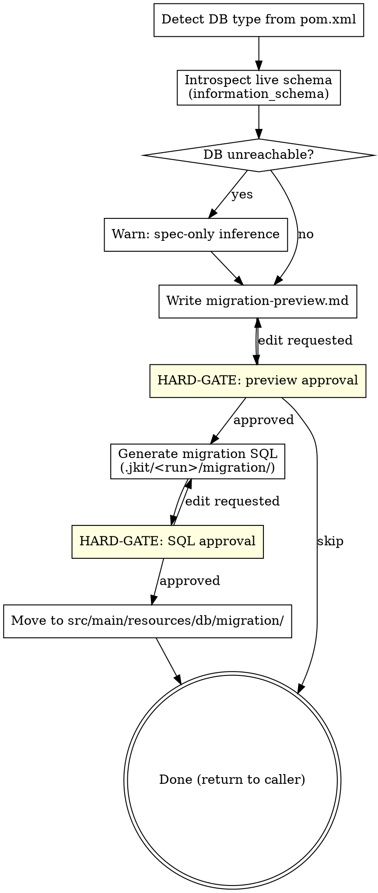

**Announcement:** At start: *"I'm using the sql-migration skill to generate the Flyway migration for the schema changes."*

## Checklist

- [ ] Introspect live schema
- [ ] Write migration-preview.md
- [ ] Get preview approval
- [ ] Generate migration SQL
- [ ] Get SQL approval
- [ ] Move to Flyway directory

## Process Flow



## Detailed Flow

**Step 1: Introspect live schema**

Detect DB type from `pom.xml` JDBC driver artifact (e.g., `postgresql`, `mysql`). Run a read-only `information_schema` query using `$DATABASE_URL` from environment (loaded by direnv):

```bash
psql "$DATABASE_URL" -t -c \
  "SELECT column_name, data_type FROM information_schema.columns \
   WHERE table_name = '<table>' ORDER BY ordinal_position;"
```

Fallback order:
1. Env vars not in environment → read `.env/local.env` directly
2. DB unreachable → warn: *"DB not reachable — inferring schema changes from spec only. Review migration-preview.md carefully."* Continue with spec-only inference.

**Step 2: Write migration-preview.md**

Write `.jkit/<run>/migration-preview.md`. Omit columns already present in the live DB:

```markdown
## Migration Preview: <feature>

| Change | Type | Detail |
|--------|------|--------|
| `bulk_invoice` | CREATE TABLE | id, tenant_id, status, created_at |
| `invoice.bulk_id` | ADD COLUMN | FK to bulk_invoice(id), nullable |
```

Tell human: `"Written to .jkit/<run>/migration-preview.md"`

```
A) Approve as-is (recommended)
B) Edit preview first
C) Skip migration
```

<HARD-GATE>
Do NOT generate migration SQL until the human approves migration-preview.md.
</HARD-GATE>

On C: return to caller immediately (no SQL generated).

**Step 3: Generate migration SQL**

Generate `.jkit/<run>/migration/V<YYYYMMDD>_NNN__<feature>.sql` from the approved preview. `NNN` = next sequential index in `src/main/resources/db/migration/` (padded to 3 digits).

Tell human: `"Migration SQL written to .jkit/<run>/migration/<file>.sql"`

```
A) Looks good — move to src/main/resources/db/migration/ (recommended)
B) Edit the SQL first
C) Abort
```

<HARD-GATE>
Do NOT move the SQL file until the human approves it.
</HARD-GATE>

**Step 4: Move to Flyway directory**

On approval: move SQL file to `src/main/resources/db/migration/`. The file will be included in the caller's implementation commit.

Return to caller.
