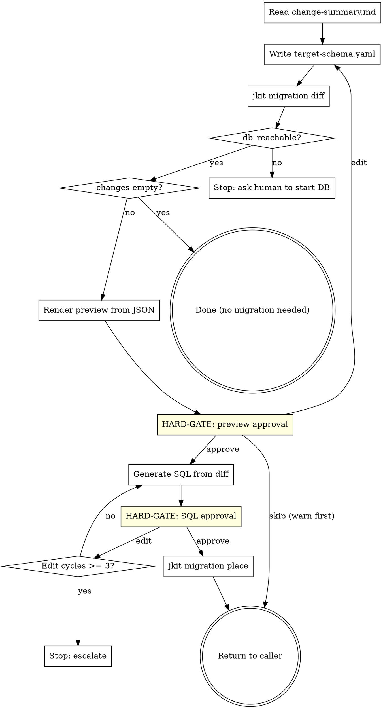

**Announcement:** At start: *"I'm using the sql-migration skill to generate the Flyway migration for the schema changes."*

## Iron Law

Never move a SQL file into `src/main/resources/db/migration/` without (a) live DB introspection and (b) explicit human approval at both gates. Spec-only inference produces migrations that fail at apply time — refuse it unless the human has explicitly opted in.

## Rationalization Table

| Excuse | Reality |
|--------|---------|
| "DB isn't reachable, just infer from spec" | You'll propose columns that already exist or skip ones that don't. Bring the DB up. |
| "I'll fix the `git add` later" | The caller's commit is task-scoped; if you don't stage now, the migration is silently missed. |
| "ADD COLUMN NOT NULL is fine, table is small" | Backfill is required for any non-empty table. Write the backfill in the same migration. |
| "One more edit cycle, the SQL is almost right" | After 3 cycles, escalate — the spec or the target-schema is wrong, not the SQL. |

## Checklist

- [ ] Read change-summary.md to identify affected tables
- [ ] Write `target-schema.yaml` from spec analysis
- [ ] Run `jkit migration diff --run <dir>`
- [ ] Render preview from diff JSON; HARD-GATE: preview approval
- [ ] Generate migration SQL from approved diff
- [ ] HARD-GATE: SQL approval (max 3 edit cycles)
- [ ] Run `jkit migration place --run <dir> --feature <slug>`
- [ ] Return to caller

## Process Flow



## Detailed Flow

**Step 0 — Identify scope.** The run directory is passed by the caller. Read `<run>/change-summary.md` to identify affected tables (first column of `## Domains Changed` plus any explicit schema notes). If invoked without a run dir → stop and ask the caller.

**Step 1 — Write `target-schema.yaml`.** Synthesise the post-migration schema from the spec docs (api-spec.yaml, plan.md, any domain schema documents). Write to `<run>/target-schema.yaml`. Append-only: only enumerate tables/columns relevant to this run. See `docs/jkit-migration-prd.md` for the schema format.

**Step 2 — Run schema diff.**

```bash
jkit migration diff --run <run>
```

Read the JSON. Three branches:

- `db_reachable: false` → stop and report (`"DATABASE_URL not resolved or DB unreachable; bring the DB up and re-run"`). Do **not** retry with `--no-db` unless the human explicitly accepts the risk in writing.
- `changes: []` → no migration needed. Return to caller with a one-line summary.
- `changes: [...]` → continue.

**Step 3 — Render preview, gate.** Render `<run>/migration-preview.md` from the JSON:

```markdown
## Migration Preview: <feature>

| Change | Detail |
|---|---|
| CREATE TABLE `bulk_invoice` | id (uuid PK), tenant_id (uuid), status (varchar(32)), created_at (timestamptz) |
| ADD COLUMN `invoice.bulk_id` | uuid, nullable, FK → bulk_invoice(id) |

**Warnings**
- ADD COLUMN bulk_invoice.foo NOT NULL — backfill required
```

Announce: `"Preview written to <run>/migration-preview.md."`

```
A) Approve and generate SQL (recommended)
B) Edit target-schema.yaml and re-diff
C) Skip migration (warn first — caller's impl will reference nonexistent columns)
```

<HARD-GATE>Do NOT generate SQL until the human approves.</HARD-GATE>

On C: explicitly tell the human *"skipping will leave the impl referencing schema that doesn't exist; confirm?"* before honouring.

**Step 4 — Generate SQL.** Write `<run>/migration/V<YYYYMMDD>_pending__<slug>.sql` from the approved diff JSON. The date placeholder + `pending` index are placeholders — `migration place` will rewrite them at move-time.

`<slug>` = lower-kebab-case feature name derived from the run / spec.

For each `change` in the JSON: emit the corresponding DDL. Hand-author backfills, complex constraints, and index strategies — the binary surfaces the *requirement*; the SQL is your judgment.

Announce: `"SQL written to <run>/migration/<file>.sql."`

```
A) Approve and place in Flyway directory (recommended)
B) Edit SQL and re-show
C) Abort (return without placement)
```

<HARD-GATE>Do NOT place the file until the human approves.</HARD-GATE>

**Edit-loop bound:** max 3 edit cycles. After 3, stop and escalate — the spec or `target-schema.yaml` is likely wrong, not the SQL.

**Step 5 — Place.**

```bash
jkit migration place --run <run> --feature <slug>
```

Reads `git_staged` from output. If `false`, run `git add <destination>` manually and warn the human.

**Step 6 — Return.** The caller (typically java-tdd) commits the staged migration as part of its impl commit. Do not commit here.
