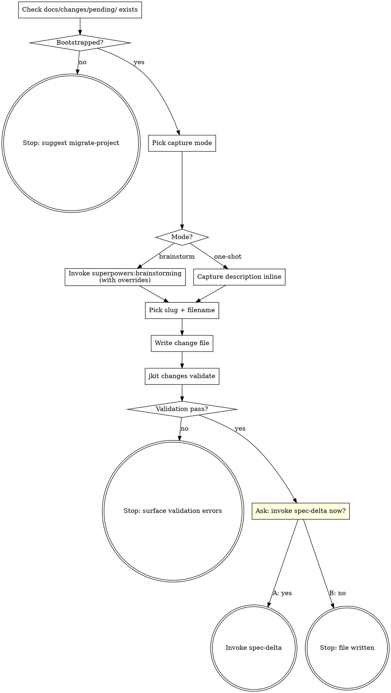

**Announcement:** At start: *"I'm using the write-change skill to author a new change file in docs/changes/pending/."*

## What it does

Helps the human capture **what they want to build** as a short markdown file in `docs/changes/pending/`, which is the input to `spec-delta`. The change file is intentionally lightweight — one sentence to a few paragraphs of plain prose, optionally with `domain:` frontmatter. Formal-doc structure (entities, endpoints, schemas) happens later in `spec-delta`, not here.

This skill does **not** update `docs/domains/*/`, run `jkit changes init`, or invoke `java-tdd`. Its only output is the change file.

## Checklist

- [ ] Confirm `docs/changes/pending/` exists (else suggest `migrate-project`)
- [ ] Pick capture mode: brainstorm vs. one-shot
- [ ] (brainstorm) Invoke `superpowers:brainstorming` with overrides
- [ ] (one-shot) Capture description from the human in this thread
- [ ] Pick slug + filename
- [ ] Write `docs/changes/pending/YYYY-MM-DD-<slug>.md`
- [ ] `jkit changes validate --files <path>`
- [ ] Ask whether to hand off to `/spec-delta`

## Process Flow



## Detailed Flow

### Step 1 — Check bootstrap

```bash
test -d docs/changes/pending/
```

If missing, stop:
> *"`docs/changes/pending/` doesn't exist. Run `/migrate-project` first to bootstrap the spec-delta workflow, then come back."*

### Step 2 — Pick capture mode

Ask the human:

> "How do you want to draft this change file?
> A) Brainstorm — I'll ask a few questions to clarify intent before writing (recommended if the idea is still vague)
> B) One-shot — you tell me the description, I write the file as-is (recommended if you already know exactly what you want)"

Pick the path based on the answer. Default to **A** if the human's initial request was a single short phrase ("add bulk invoice"); default to **B** if they already gave a paragraph of detail in the same turn.

### Step 3a — Brainstorm path

**REQUIRED SUB-SKILL: invoke `superpowers:brainstorming`**, passing the human's initial framing of the change.

Adjustments to brainstorming defaults:

1. **Output is a change file, not a design doc.** Save to `docs/changes/pending/YYYY-MM-DD-<slug>.md` (not `docs/superpowers/specs/`). The file is short prose — one to a few paragraphs covering *what behavior changes* (new/modified/removed). Do NOT include architecture / components / data flow / error handling / testing sections — those belong to `spec-delta` and downstream skills, not to the change file.
2. **Frontmatter:** if the change is unambiguously scoped to a single existing domain under `docs/domains/<name>/`, prepend `---\ndomain: <name>\n---`. Otherwise omit frontmatter and let `spec-delta` infer.
3. **Scope check:** if brainstorming reveals two or more independent changes (different domains, or unrelated user-facing behaviors), stop and propose splitting into multiple change files. One change file = one cohesive change.
4. **Skip the writing-plans handoff.** Brainstorming's terminal step invokes `superpowers:writing-plans`; do not let it. Return control to write-change immediately after the change file is written, so Step 5 can run.

If brainstorming wants to write the design doc to its default location, redirect to the change-file path instead.

### Step 3b — One-shot path

Ask the human for the change description in this thread. Accept whatever they give — one sentence is enough. Do not ask follow-up questions; that's `spec-delta`'s Step 8.

### Step 4 — Pick slug and filename

- **Date:** today, `YYYY-MM-DD`.
- **Slug:** short kebab-case noun phrase that names the change (e.g., `bulk-invoice`, `payment-refund`, `user-soft-delete`). Derive from the change content; do not include the domain name unless the change touches a single domain and the slug would be ambiguous without it.
- **Filename:** `docs/changes/pending/YYYY-MM-DD-<slug>.md`.

If the filename collides with an existing file in `pending/` or `done/`, append `-2` (or `-3`, …) until unique.

### Step 5 — Write the file

Use the Write tool. Format:

```markdown
---
domain: <name>          # optional — omit if cross-domain or unclear
---

# <Short imperative title>

<One sentence to a few paragraphs of plain prose. State what new behavior is added,
what existing behavior changes, what gets removed. Avoid YAML/schemas/code blocks —
spec-delta will derive those.>
```

Keep it short. If the prose is growing past ~10 lines, that's a smell — the change is probably too big and should be split.

### Step 6 — Validate

```bash
jkit changes validate --files docs/changes/pending/<basename>.md
```

On `ok: false`, surface the errors and ask the human to fix the file (or apply the fix in-thread if it's a typo in the slug or frontmatter).

### Step 7 — Hand off (or stop)

Tell the human: `"Change file written to docs/changes/pending/<basename>.md."`

Then ask:

> "Run /spec-delta now to start the implementation pipeline?
> A) Yes — invoke spec-delta now
> B) No — stop here (you can run /spec-delta later, or write more change files first)"

**On A:** invoke the `spec-delta` skill.
**On B:** stop. Do not stage or commit the file — the human owns that.

## Notes

- This skill **never** edits `docs/domains/*/`, runs `jkit changes init`, or touches `.jkit/`. All of that belongs to `spec-delta`.
- This skill **never** stages or commits. The change file is just an unstaged working-tree edit until the human decides what to do with it.
- Idempotent in spirit but not enforced: re-running on a fresh idea creates a fresh file. To revise an unimplemented change, edit the file in `pending/` directly — no need to re-run write-change.
- If the human is clearly trying to *implement* an existing pending change, redirect them to `/spec-delta` instead of writing a new change file.
